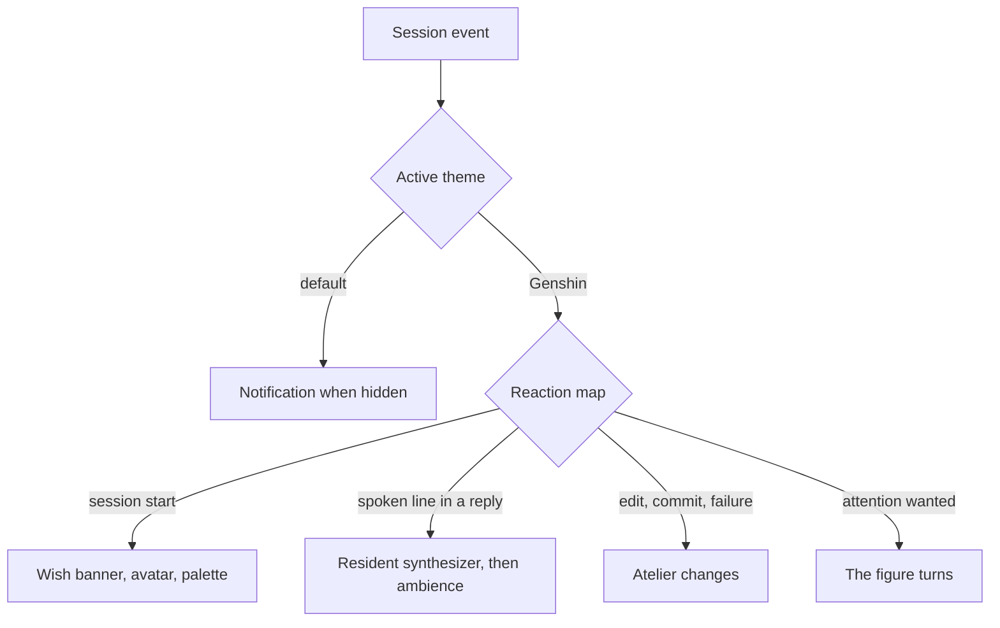

# Themes

The [agent console](/docs/proposals/infra/agent-console) works the same in every theme; a theme changes how it feels. It is a registry entry in the app, not a package: an object naming its palette and, optionally, a scene component, an avatar and a set of reactions. The default theme sets none of the optional parts, so the default console is the work surface alone — quiet, fast, and the one every parity test runs against.

## What a theme may set

| Part      | What it is                                                                             | Default theme          |
| :-------- | :------------------------------------------------------------------------------------- | :--------------------- |
| Palette   | a Vuetify theme — the app's own theming, so every component follows                    | the app's theme        |
| Scene     | a TresJS component rendered behind the work surface, receiving the session's events    | none                   |
| Avatar    | who the session is presented as — a name, a colour, a portrait — read from the session | none                   |
| Reactions | a map from session event to what the theme does — a pose, a sound, a notification tone | a browser notification |
| Voice     | how the agent's spoken lines are heard                                                 | none                   |

A theme never replaces or reorders the work surface ([terminal parity](/docs/proposals/infra/agent-console/terminal-parity)); it may only dress it and draw behind it. That is what keeps a theme cheap to write and impossible to make a downgrade.

## The Genshin theme

Built from what the [persona plugin](/docs/infra/claude-interface/persona-plugin) already produces:

- **Avatar** from the session-start hook's output, which the SDK driver passes through as a hook event; the plugin adds one machine-readable line naming the character so the theme does not parse prose.
- **Palette** from the character's element.
- **Voice** from the plugin's resident synthesizer, which the theme calls on the loopback with each spoken line it finds in a reply, since the terminal's message-display hook has no display to fire on in the console.
- **Scene and reactions** from the sub-specs: the [wish banner](/docs/proposals/infra/agent-console/wish-banner), the [voxel atelier](/docs/proposals/infra/agent-console/voxel-atelier), the [element ambience](/docs/proposals/infra/agent-console/element-ambience) and, as an option, [spatial chat](/docs/proposals/infra/agent-console/spatial-chat).



```text
apps/web/app/services/agentConsole/themes/
  AgentConsoleThemeMap.ts        ← the registry: default, genshin
apps/web/app/models/agentConsole/
  AgentConsoleTheme.ts           ← palette, scene, avatar, reactions, voice
apps/web/app/components/AgentConsole/Theme/Genshin/
```

## Key files

| File                                        | Role                                                      |
| :------------------------------------------ | :-------------------------------------------------------- |
| `packages/genshin-persona/scripts/pick.ts`  | The session-start hook whose output names the character   |
| `packages/genshin-persona/scripts/speak.ts` | The resident synthesizer the Genshin theme speaks through |

## Notes

- A theme is chosen per browser and per session: the Genshin theme on one session and the default on a parallel one is a supported state, not an edge case.
- A second persona set — another game, another cast — is another theme reading another plugin's hook line, and nothing in the console changes for it.
