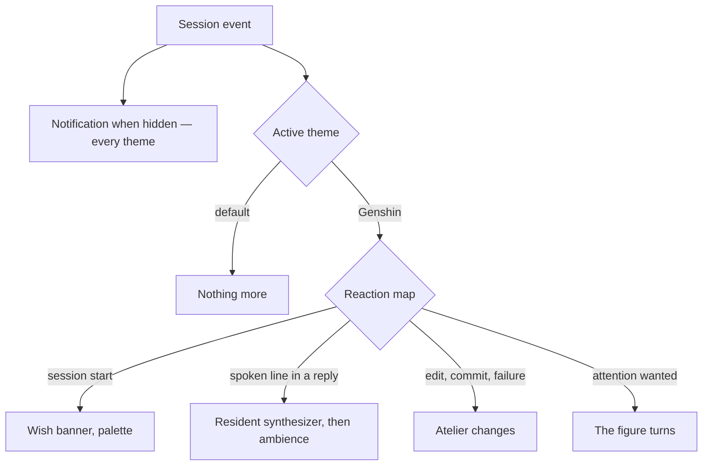

# Themes

The [agent console](/docs/infra/claude-interface/agent-console) already has a theme registry. It holds the default and the Genshin theme, and the parts a theme sets are its reactions — the default's is a browser notification for a hidden session — and its avatar, which the Genshin theme reads off the persona plugin's line in the session-start context ([as built](/docs/infra/claude-interface/agent-console)). This proposal is the rest of what a theme may set, and the rest of the Genshin theme. Here the hidden-tab notification moves out of the default's reactions and into the console, so every theme gets it.

## What a theme may add

| Part      | What it is                                                                                                                                               | Default theme         |
| :-------- | :------------------------------------------------------------------------------------------------------------------------------------------------------- | :-------------------- |
| Palette   | the world's materials, and the tokens inside the console's theme scope for its panels                                                                    | the world's own, dusk |
| Scene     | the rooms and props of the voxel world, receiving the session's events                                                                                   | a bare room           |
| Reactions | a map from session event to what the theme does — a pose, a sound, a notification tone — on top of the console's own notification when the tab is hidden | none                  |
| Voice     | how the agent's spoken lines are heard                                                                                                                   | none                  |

A theme never removes a part of the [voxel world](/docs/infra/claude-interface/agent-console/voxel-world) that [terminal parity](/docs/infra/claude-interface/agent-console/terminal-parity) needs. It may only dress the world and furnish it, which is what keeps a theme cheap to write and impossible to make a downgrade. Each part is added to `AgentConsoleTheme` with the first theme that sets it, never ahead of one.

## The Genshin theme

Built from what the [persona plugin](/docs/infra/claude-interface/persona-plugin) already produces:

- **Palette** from the character's element.
- **Voice** from the plugin's resident synthesizer, which the theme calls on the loopback with each spoken line it finds in a reply. The terminal's message-display hook has no display to fire on in the console. The theme is the console's one producer of spoken lines: the synthesizer, the [element ambience](/docs/proposals/infra/agent-console/element-ambience) and [spatial chat](/docs/proposals/infra/agent-console/spatial-chat) all take the lines it finds, so no line is synthesized twice.
- **Scene and reactions** from the sub-specs: the [wish banner](/docs/proposals/infra/agent-console/wish-banner), the [voxel atelier](/docs/proposals/infra/agent-console/voxel-atelier), the [element ambience](/docs/proposals/infra/agent-console/element-ambience) and, as an option, [spatial chat](/docs/proposals/infra/agent-console/spatial-chat).



## Key files

| File                                                                | Role after the change                                          |
| :------------------------------------------------------------------ | :------------------------------------------------------------- |
| `apps/web/app/services/agentConsole/themes/AgentConsoleThemeMap.ts` | The registry the Genshin theme is added to                     |
| `apps/web/app/models/agentConsole/AgentConsoleTheme.ts`             | The theme interface, grown by the parts the Genshin theme sets |
| `packages/genshin-persona/scripts/speak.ts`                         | The resident synthesizer the Genshin theme speaks through      |

```text
apps/web/app/components/AgentConsole/Theme/Genshin/
```

## Notes

- Each session keeps the look of the theme whose plugin began it, as the avatar already does, so the Genshin theme on one session and the default on a parallel one is the ordinary state, not an edge case. Each part added here reads the session's theme the same way.
- A second persona set — another game, another cast — is another theme reading another plugin's hook line, and nothing in the console changes for it.
