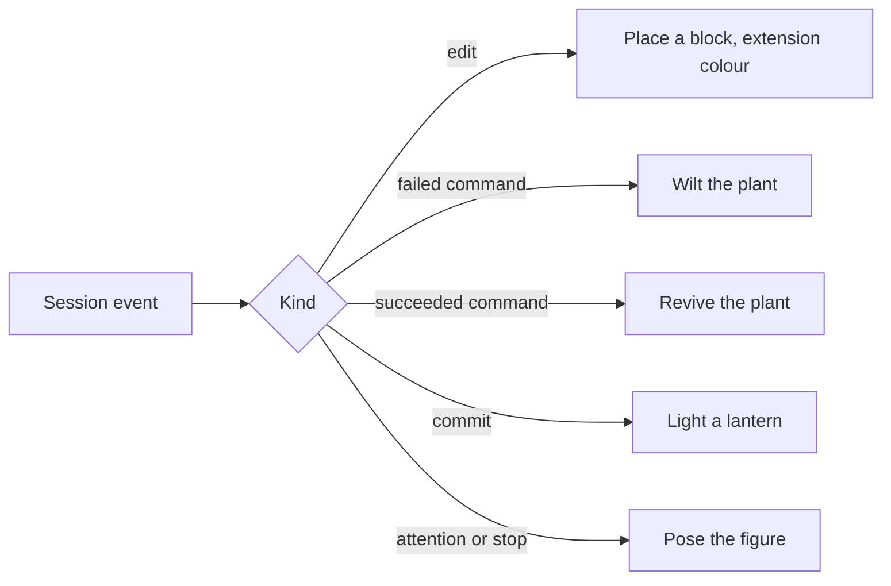

# Voxel atelier

A terminal session leaves a diff and a scrollback. The atelier gives it a room: a voxel floor and walls in the character's region's palette — Fontaine's blue stone, Sumeru's greens — with the character's voxel figure at its centre, and every event on the [agent console](/docs/proposals/infra/agent-console)'s stream changing the room a little. At the end of a session the room is a picture of it.

## Scope

**Today:** the work surface lists what the session did, and nothing pictures it.

**This adds** one mapping from event to object, and nothing else:

| Session event               | What appears                                             |
| :-------------------------- | :------------------------------------------------------- |
| A file edited or written    | a block on the shelf, coloured by the file's extension   |
| A command that failed       | a plant by the window wilts; the next success revives it |
| A commit                    | a lantern lit on the wall                                |
| The session wants attention | the figure turns to face the viewer                      |
| A turn ends                 | the figure sits                                          |

The room's state is the session's events replayed, so a reopened page rebuilds it; nothing is stored beyond the session.

## How it works



```text
apps/web/app/components/AgentConsole/Theme/Genshin/
  AgentConsoleAtelier.vue            ← the room, the figure, the event-to-object mapping
apps/web/app/services/agentConsole/
  getRegionPalette.ts        ← floor and wall colours per region
```

**Rendering:** TresJS, with cientos `Instances` for the room's voxels and `Levioso` for the figure's idle sway; nothing needs raw Three.js.

## Key files

| File                                               | Role                                               |
| :------------------------------------------------- | :------------------------------------------------- |
| `packages/genshin-persona/src/models/Character.ts` | Region and element, which the room's palette reads |

## Notes

- The figure is built from voxels in the element's colour and the region's palette, not from the character's art — it is a token of the character, and it needs no asset anyone owns.
- Blocks are capped per shelf and wrap onto the next; a long session fills the room rather than growing it without end.
