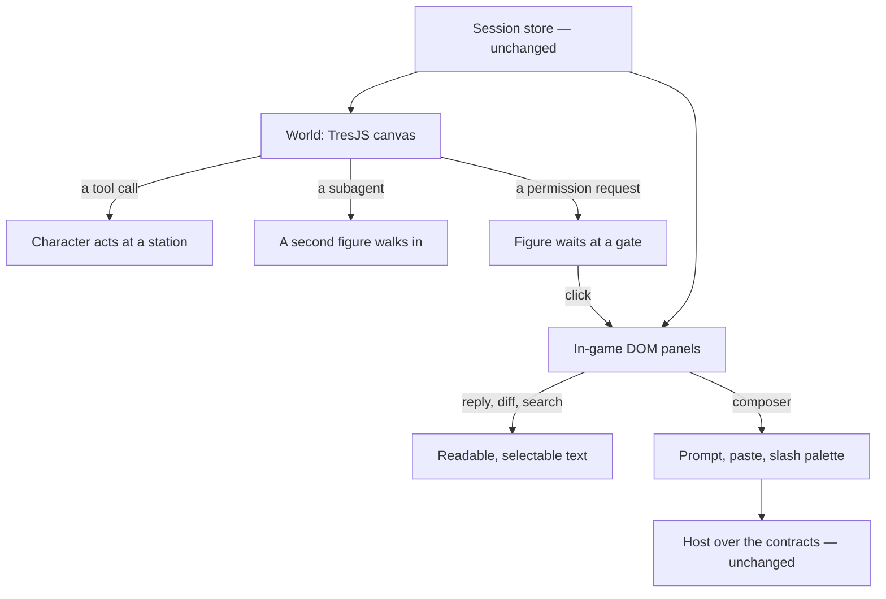

# Voxel surface

The first phase shipped the [agent console](/docs/infra/claude-interface/agent-console) as an ordinary app page. It sits under the app bar and is built from Vuetify cards, lists and chips. That was the fastest way to reach [terminal parity](/docs/infra/claude-interface/agent-console/terminal-parity), and it proved the host, the driver and the stores. The second phase keeps all three and replaces only what the person sees. The console becomes a place: a voxel world the session happens in, played full screen. It stops being a page of the app that has a scene added to it.

## Decisions

- **Its own layout, and no app bar.** The page uses a dedicated full-screen layout with no app bar, drawer or footer. A way out is still needed. It is part of the world, a door plus a key, and leads back to the app. With this, nothing on the page is shared with the rest of the app, so the console can look however it wants without a stylesheet or layout change reaching another page.
- **No Vuetify on the page.** Every control is drawn by the world or is a bespoke in-game panel. The Vuetify components under `components/AgentConsole/Work/` are deleted in the change that brings the voxel surface to parity with them. The two surfaces never ship side by side.
- **TresJS first, and a canvas only where a canvas is better.** The world is drawn in TresJS: the room, the character, subagents as figures, tool calls as actions, and a turn as the character working. Four jobs stay in DOM because a canvas does them worse:
  - typing, which needs IME input, pasting and a caret
  - long reading text, such as a reply, a diff or a thinking block, which has to be selectable and copyable
  - search
  - screen readers

  Those are DOM panels laid over the canvas and styled as in-game UI: a pixel font, voxel-framed edges and the world's own palette, in scoped styles that reach nothing outside the page.

- **The data layer does not change.** The session and connection stores and the services that derive views from events stay as they are, and the voxel surface reads them the same way the Vuetify one does:
  - tool calls, file edits and diff rows
  - timeline lanes and pending permissions

  The host and the contracts do not change either. The work in this phase is components only.

- **Parity is still the gate.** Every row on the terminal-parity page has to hold on the voxel surface before the Vuetify surface is deleted. Some rows are harder in a game: the permission card, the context gauge, the slash palette, and a diff of a hundred lines. Each of those gets an in-game form, such as a figure asking at a gate or a gauge that fills a vessel, and the panel behind it holds the full detail.

## How it works



## Scope and order

1. **The shell.** A full-screen layout, a canvas and a door out. Pairing and the session list become the world's first room. After this, the page no longer imports Vuetify.
2. **The composer and the conversation panel**, so a prompt can be sent and read. This gets a live turn working inside the game.
3. **Tool calls, subagents and the permission gate** in the world, each with its panel.
4. **Diffs, the context gauge, cost and model and mode** as in-game objects.
5. **Delete the Vuetify surface.** The visual suite's baselines are captured again against the voxel surface and handed over for approval.

The [Genshin theme](/docs/proposals/infra/agent-console/themes) then dresses this world rather than the Vuetify one. The [voxel atelier](/docs/proposals/infra/agent-console/voxel-atelier) and the [wish banner](/docs/proposals/infra/agent-console/wish-banner) become rooms and events inside it.

## Key files

| File                                           | Role after the change                                                       |
| :--------------------------------------------- | :-------------------------------------------------------------------------- |
| `apps/web/app/pages/agent-console.vue`         | Declares the full-screen layout and mounts the world                        |
| `apps/web/app/store/agentConsole/session.ts`   | The session store both surfaces read, unchanged                             |
| `apps/web/app/components/Visual/Gem/Index.vue` | The app's existing TresJS scene, the pattern the world follows              |
| `apps/web/visual/agent-console.visual.test.ts` | The visual suite, whose states are captured again against the voxel surface |

```text
apps/web/app/layouts/immersive.vue
apps/web/app/components/AgentConsole/World/
apps/web/app/components/AgentConsole/Panel/
```

## Notes

- Readable text stays DOM on purpose. Text drawn into a canvas can't be selected, copied, searched or found by the browser, and a console where a person can't copy an error message would send them back to the terminal. That fails the one test this proposal is judged by.
- Removing the app bar also removes the app's account menu and notifications from this page. That trade is deliberate: the door out is the way to reach them.
