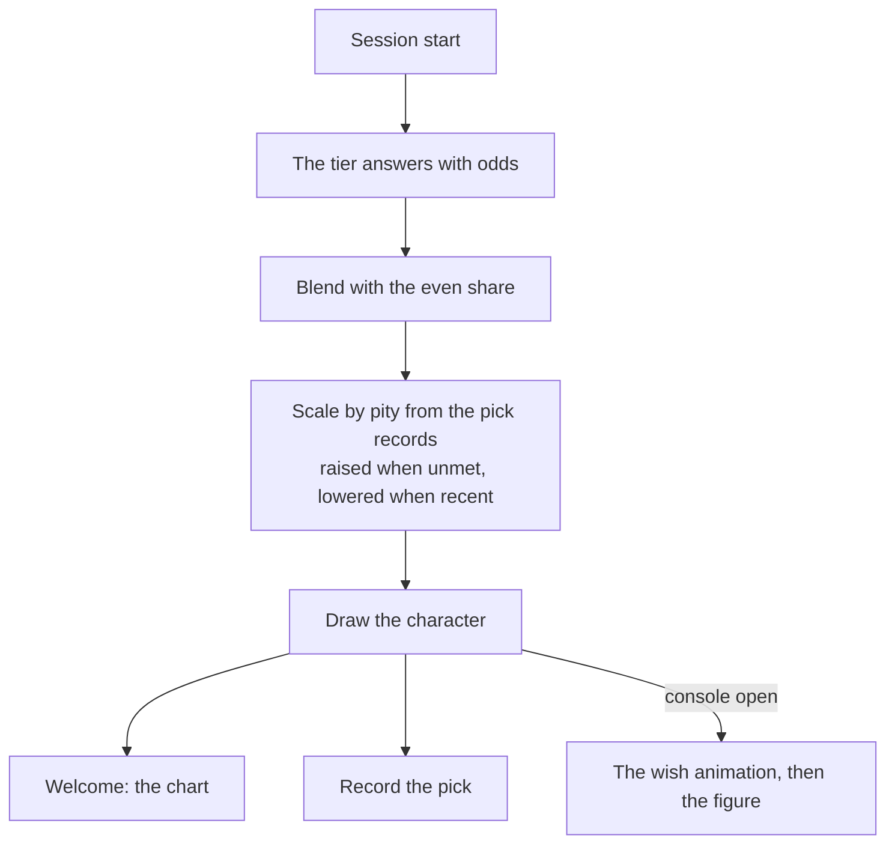

# Wish banner

The lore pick already draws the session's character from the tier's odds blended with an even share ([persona plugin](/docs/infra/claude-interface/persona-plugin)), and the welcome prints those odds as a bar chart. A wish is the game's own picture of exactly that: a draw from published rates. So the first view of the [agent console](/docs/proposals/infra/agent-console) replays the session start as a wish — the star falling in the colour of the character's rarity, the voxel figure landing, the rates one tap away — and adds the one mechanic the draw lacks, **pity**.

## Scope

**Today:** the draw is memoryless; the same character can come up several sessions running, and the chart is text in the welcome.

**This adds:**

1. **The animation.** When the page opens on a session whose character was drawn by lore, a star falls and resolves into the character's nameplate and figure. Four-star characters fall purple, five-star gold — the rarity is already in the roster data.
2. **The rates.** The same rows the welcome chart shows, as the banner's details page: the drawn character first, the runners-up by probability, the even share stated as the base rate every character carries.
3. **Soft pity.** The pick records the plugin already keeps say who each past session met. A character not met for a while is lifted — their weight scaled up by how long it has been, capped — and one met in the last few sessions is lowered. The draw stays a draw: pity shifts weights, it never guarantees.

## How it works



```text
packages/genshin-persona/src/services/
  getPityWeights.ts          ← weights from the pick records: days since each character was last met
apps/web/app/components/AgentConsole/Wish/
  AgentConsoleWishBanner.vue         ← the fall, the landing, the rates panel
```

**Rendering:** TresJS, with cientos `Sparkles` for the star's trail and `Instances` for the voxel figure; nothing needs raw Three.js.

## Key files

| File                                                       | Role                                          |
| :--------------------------------------------------------- | :-------------------------------------------- |
| `packages/genshin-persona/src/services/drawLoreChoice.ts`  | Takes the pity weights beside the tier's odds |
| `packages/genshin-persona/src/services/readPickRecords.ts` | The history pity reads                        |
| `packages/genshin-persona/src/services/formatLoreChart.ts` | The rows the rates panel shows                |

## Notes

- Pity is the only part that changes what the terminal does, so it ships first and on its own; the animation needs the page, pity does not.
- A pinned character skips the draw, and so skips the banner — the page shows the figure without the fall.
