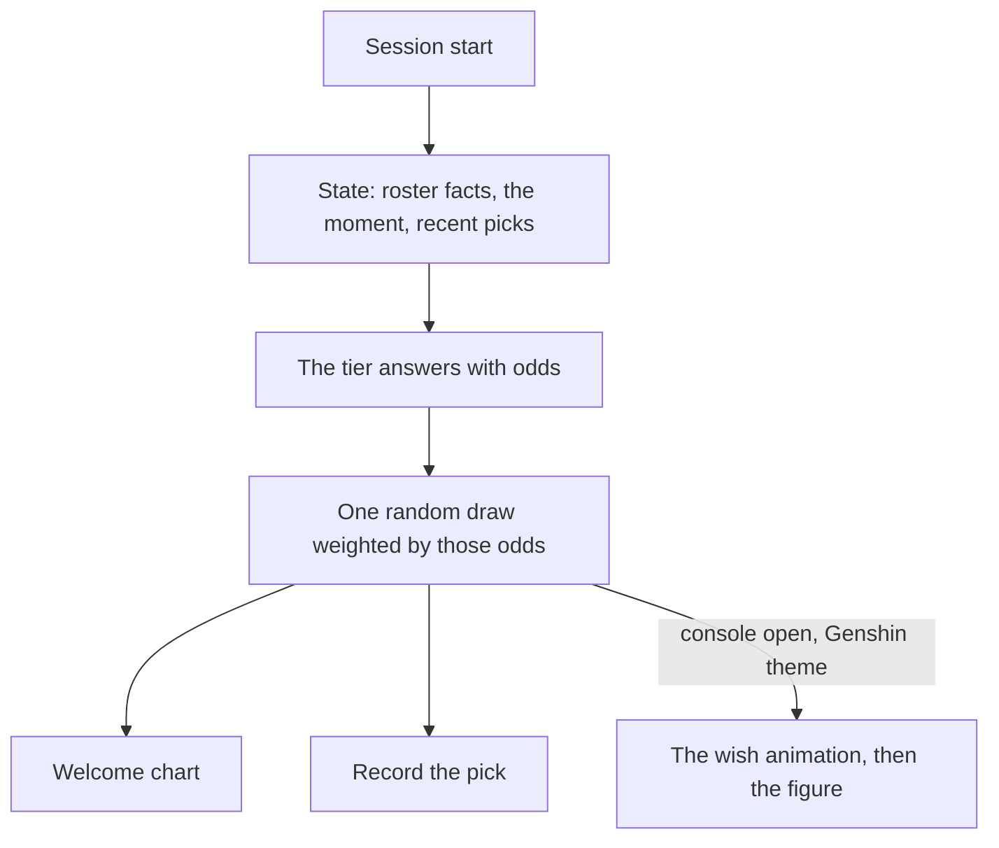

# Wish banner

The lore pick draws the session's character at random, weighted by exactly the odds the tier returns ([persona plugin](/docs/infra/claude-interface/persona-plugin)), and the welcome prints those odds as a bar chart. A wish is the game's own picture of exactly that: a draw from published rates. So in the [Genshin theme](/docs/proposals/infra/agent-console/themes), a session opens as a wish — a star falling in the colour of the character's rarity, the figure landing, the rates one tap away.

## Scope

**Today:** the draw is weighted by the tier's odds alone, and knows nothing of the sessions before it.

**This adds:**

1. **The animation.** When a session whose character was drawn by lore opens, a star falls and resolves into the character's nameplate and figure — purple for four stars, gold for five, the rarity already in the roster data.
2. **The rates.** The rows the welcome chart shows, as the banner's details: every character with the probability the tier gave them. No rate is ours.
3. **History as state.** The characters met in recent sessions — the pick records the plugin already keeps — join the state the tier reads, so if variety matters the tier weighs it in its own odds. Nothing in the code scales a weight.

## How it works



```text
apps/web/app/components/AgentConsole/Theme/Genshin/
  AgentConsoleWishBanner.vue     ← the fall, the landing, the rates panel
```

**Rendering:** TresJS, with cientos `Sparkles` for the star's trail and `Instances` for the voxel figure; nothing needs raw Three.js.

## Key files

| File                                                          | Role                               |
| :------------------------------------------------------------ | :--------------------------------- |
| `packages/genshin-persona/src/services/getLorePickRequest.ts` | The state recent picks join        |
| `packages/genshin-persona/src/services/readPickRecords.ts`    | The history the state is read from |
| `packages/genshin-persona/src/services/formatLoreChart.ts`    | The rows the rates panel shows     |

## Notes

- Recent picks are the one part that changes the terminal's behaviour too, and it needs no console, so it ships first and on its own.
- A pinned character skips the draw, and so skips the banner: the figure appears without the fall.
