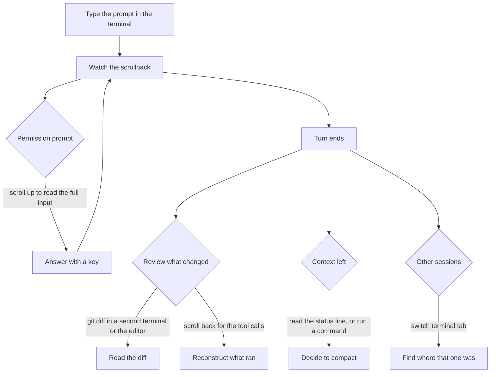
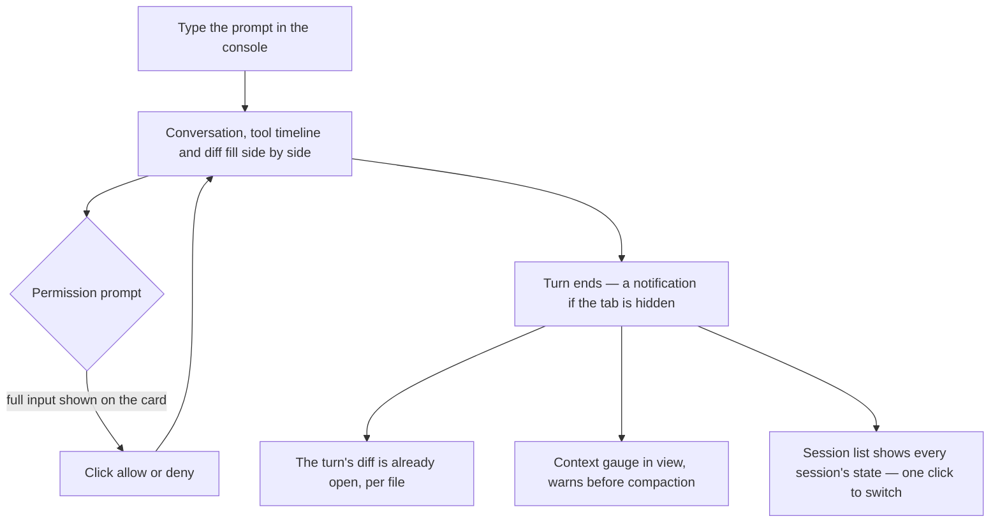

# Workflow comparison

The [agent console](/docs/proposals/infra/agent-console) claims to be an upgrade, which is a claim about steps: what a person does to get a thing done today, and what they do with the console. This page draws both, so the claim can be checked the day the console runs — every row below is a thing to time with a stopwatch in a real session, and a row the console loses is a defect.

## One turn, today

## One turn, in the console

## Task by task

| Task                                   | Today                                                         | In the console                                                              |
| :------------------------------------- | :------------------------------------------------------------ | :-------------------------------------------------------------------------- |
| Start work                             | open a terminal, `cd`, run `claude`                           | open the page, type the repository path, or pick one a session already used |
| Read a long tool input before allowing | scroll the prompt, the input often truncated                  | the card shows it whole, formatted                                          |
| Review an edit                         | a second terminal or the editor, `git diff`                   | the turn's diff beside the conversation, per file                           |
| Find what a command printed earlier    | scroll back, or search the scrollback if the terminal can     | the timeline, each call collapsible, and a search over the session          |
| Know how much context is left          | the status line, if configured                                | a gauge, with a warning before automatic compaction                         |
| Run two sessions at once               | two terminal tabs, their state invisible from each other      | the session list, each with its state, one click apart                      |
| Stop a runaway turn                    | escape                                                        | the stop button, or escape in the page                                      |
| Hand a session to the terminal         | —                                                             | `claude --resume` on the same session id; nothing is lost either way        |
| Undo a turn's edits                    | rewind, which can restore the files from its checkpoints      | rewind the conversation only; the files stay as the later turns left them   |
| Follow the review collector            | the Actions tab, the release pull request and commit comments | the harbour view                                                            |
| Hear the character                     | the persona plugin's hooks                                    | the Genshin theme, with the scene reacting                                  |

## What the console costs

The comparison is only honest with the other column filled in. The console adds:

- **A process to run.** The host must be running before the page is useful; the terminal needs nothing. It is one command today, run by hand. Installing it as a login item, so the step is paid once rather than per boot, is still to do.
- **A tab to keep.** The work is in a browser tab rather than a terminal window. Anything the person does from the terminal around a session — a quick `git` command, a test run — still happens in a terminal, or in the console's shell panel once one exists.
- **Surface to maintain.** A host, a wire, a page and a theme layer, against a terminal someone else maintains. Every Claude Code release that changes the SDK's messages is a change the driver has to follow.
- **A dependency on the SDK's billing.** Today the SDK runs on the subscription's own limits; if that changes, the SDK driver changes cost and the terminal-mirror driver is the fallback that keeps the console free ([drivers](/docs/proposals/infra/agent-console/terminal-mirror-driver)).

- **A browser prompt, once.** The deployed page reaching a host on the loopback passes the private-network preflight the host answers, and current Chrome also asks once to allow local network access for the site. The local dev server needs neither.
- **A header that fills in on the first turn.** The SDK reports a session's model and mode with the first turn's init message, so a session opened and not yet prompted shows the defaults until it runs.

## How the comparison is used

Once terminal parity ships, one working day is done in the console alone, and every time the terminal had to be opened is written down as a row here with the reason. The console is not taken further — no theme, no view — while that list is non-empty.
