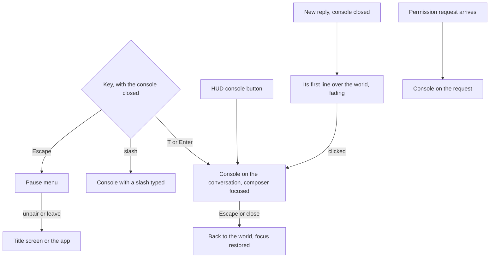

# Console overlay

Part of [world first](/docs/proposals/infra/agent-console/world-first). Today the [voxel world](/docs/infra/claude-interface/agent-console/voxel-world) shares the page with a column of panels, and a heads-up display (HUD) over the world carries a button for each panel an object in the room opens. This stage makes the world the whole page and puts everything a person types or reads into one overlay, the console, called up over the world as a game calls up its chat.

## What it adds

- **The world fills the page.** The panel column and the button that hid it are gone. The HUD keeps one bar along the top: the session's title, its state, its context and its cost, and a button that opens the console with its key written on it.
- **The console opens on a key.** T or Enter opens it on the conversation with the composer focused. The slash key opens it with a slash already typed, so a slash command is one key away, as a game's command line is. Its button opens it for a mouse or a touch screen. Escape closes it, and focus returns to where it was before, which is the world.
- **One overlay, with tabs.** The console holds the conversation and composer, then Sessions, Timeline, Changes and Usage as tabs along its top. It remembers the tab it was on. On a wide screen it is a sheet down one side, so the world and the figures stay in view beside it. On a narrow screen it covers the page.
- **It is a modal dialog.** The console is a native `<dialog>` opened as a modal, so the browser traps focus inside it, puts the world behind it out of reach, and closes it on Escape. It is the pattern the WAI-ARIA authoring practices describe for a modal dialog, with a visible close button in its tab order. While it is open no key walks the player.
- **The latest lines show over the world.** With the console closed, each new reply's first line appears at the foot of the world and fades after a few seconds, as a game's chat lines do. A person watching the room sees what the agent said without opening anything, and a click on a line opens the console at it.
- **A question from the agent opens the console.** A permission request opens the console on the request. Its lantern in the room lights and the HUD button carries a mark until it has a verdict, so a request is never waiting where nobody looks.
- **A pause menu.** Escape with the console closed opens a small menu over the world: back to the world, the sessions, unpair, and leave to the app. Unpair and the way out leave the HUD bar, which keeps only what describes the session.
- **Clicking the room is removed.** The room, the figures and the gauges stop answering clicks, and the cursor no longer changes over them. What each one opened is a tab in the console, and [interaction](/docs/proposals/infra/agent-console/world-first/interaction) gives them back to a player standing at them.

## How it works



## Scope

- The camera stays the one the page has today until the [player](/docs/proposals/infra/agent-console/world-first/player) replaces it.
- The loading screen and the pairing title screen are unchanged, over the world as they are now.
- The keys are read only while nothing editable has focus and no modifier is held, so a browser shortcut or a field is never taken over.

## Key files

| File                                                                  | Role after the change                                                    |
| :-------------------------------------------------------------------- | :----------------------------------------------------------------------- |
| `apps/web/app/components/AgentConsole/Index.vue`                      | The world at full size, with the HUD, the console and the pause menu     |
| `apps/web/app/components/AgentConsole/Panel/Hud.vue`                  | One bar: the session's title, state, context and cost, and the console   |
| `apps/web/app/components/AgentConsole/Panel/Opened.vue`               | Its panels become the console's tabs                                     |
| `apps/web/app/store/agentConsole/panel.ts`                            | Whether the console is open and on which tab, in place of the open panel |
| `apps/web/app/models/agentConsole/AgentConsolePanelType.ts`           | The console's tabs                                                       |
| `apps/web/app/components/AgentConsole/World/Room.vue`                 | The room with no click or pointer handlers                               |
| `apps/web/app/components/AgentConsole/World/Figure.vue`               | A figure with no click handler                                           |
| `apps/web/app/components/AgentConsole/World/Scene.vue`                | The gauges with no click handlers                                        |
| `apps/web/app/services/agentConsole/world/getWorldObjectType.ts`      | Removed, with the click lookup it served                                 |
| `apps/web/app/services/agentConsole/world/WorldObjectPanelTypeMap.ts` | Kept for interaction, which opens the same tabs from a prompt            |

```text
apps/web/app/components/AgentConsole/
  Console.vue      ← the modal dialog: tabs, the conversation and composer, the panels
  PauseMenu.vue    ← back, sessions, unpair, leave
  ChatLines.vue    ← the latest replies' first lines over the world, fading
```

## Notes

- A modal console means the world cannot be walked while it is open. That is the trade a game's chat makes too, and it is what keeps a typed W in the composer from walking the player. The world keeps drawing behind it, so the figures still move while a person reads.
- The fading lines are the one piece of the conversation the world shows unasked. They are its first lines only, and a line never holds a diff or a permission, which always open the console.

## Sources

- [Dialog (modal) pattern](https://www.w3.org/WAI/ARIA/apg/patterns/dialog-modal/), WAI-ARIA Authoring Practices Guide: focus moved into the dialog on opening and trapped there, Escape closing it, focus returned to what opened it, and a visible close button in its tab order.
- [Controls](https://minecraft.wiki/w/Controls), Minecraft Wiki: chat on T and a command on the slash key opening the chat with the slash typed, and Escape as the pause menu — the keys the console takes.
