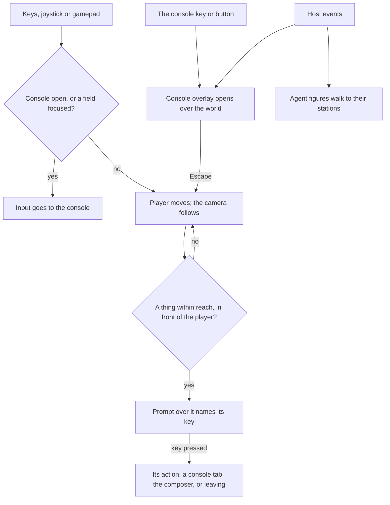

# World first

The [voxel world](/docs/infra/claude-interface/agent-console/voxel-world) is the page, and the console — the conversation, the composer and the panels — is an overlay called up over it the way a game calls up its chat. The person walks the room as a player figure, with a camera following behind. Nothing in the room answers a click, so for now a thing in it is only looked at.

This proposal lets the person use what they walk up to: a thing in reach shows a prompt naming the key that uses it.

## Decisions

- **A thing is used by standing at it.** The nearest thing within reach shows a prompt naming its key, and the key does what the prompt says. There are no invisible click targets left ([interaction](/docs/proposals/infra/agent-console/world-first/interaction)).
- **Nothing is only in the world.** Every action the world offers is also in the console's tabs, so a keyboard, a screen reader or a person who never walks reaches all of it.
- **The figure is ours, in the proportions a player expects.** The player has the blocky head, body, arms and legs that Minecraft made the shape of a voxel person, built from our palette's boxes. It is not Mojang's model and not its skin.

## What this replaces

- **A room that is only watched.** Each object's panel is a console tab today and nothing more; standing at the object reaches it again.

## How it works

## Scope and order

The console overlay, which made the world the page, and the player, walked with a camera following, have shipped and are described on the [voxel world](/docs/infra/claude-interface/agent-console/voxel-world) page.

1. **Interaction.** Prompts at the things in the room, so walking up to the board, a station, the gauges, the agent or the door does what clicking them did, visibly.

The [codebase city](/docs/proposals/infra/agent-console/codebase-city) walks the same player through the repository, so it builds on stage 2 rather than on a figure of its own.

## What this does not propose

- **First person with pointer lock.** A locked pointer fights every DOM surface the console is made of, and the room is small enough that a first-person view shows mostly walls. The camera stays behind the player.
- **Click to walk as the main input.** It is the one mouse-only way to move and it reintroduces a click on the room to mean something. Touch gets a joystick instead.
- **Building.** The room is the session's, not the player's to change.
- **The player as a collider for the agents.** The agent figures walk through the player, so a person standing in a doorway never stalls the session's picture of itself.

## Key files

| File                                                         | Role after the change                                                        |
| :----------------------------------------------------------- | :--------------------------------------------------------------------------- |
| `apps/web/app/components/AgentConsole/World/Index.vue`       | The canvas and the follow camera in place of the orbit camera                |
| `apps/web/app/components/AgentConsole/World/Scene.vue`       | The room, the agent figures and the gauges, now joined by the player         |
| `apps/web/app/services/agentConsole/world/WorldObjectMap.ts` | Where each thing stands, which the prompts read for reach instead of a click |

## Notes

- The inversion keeps everything the panels do today, so terminal parity is untouched. What changes is where each part is reached from, and the cost is one more mode to know: whether the keys are walking or typing. The console key and Escape are the whole of that, as they are in a game.
- The overlay makes the panels a place a person goes to, rather than the default. That is right for watching a session and wrong for a long stretch of reading and replying, so the console stays open until it is closed and remembers which tab was open.

## Sources

- [Controls](https://minecraft.wiki/w/Controls), Minecraft Wiki: the default keys this design keeps where a person will already reach for them — movement on W, A, S and D, chat on T, a command on the slash key, and a joystick with drag-to-look on touch screens.
- [Game accessibility guidelines](https://gameaccessibilityguidelines.com/full-list/): every part of the interface reachable with the same input as the play, more than one input device supported, and controls that can be remapped — the rule behind nothing being only in the world.
