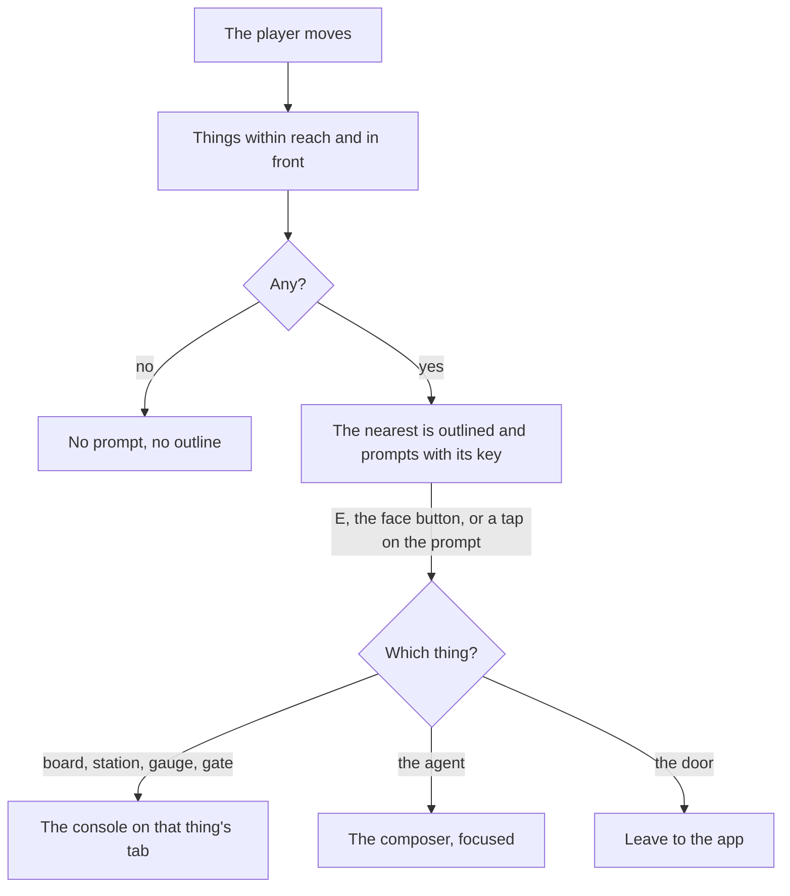

# Interaction

Part of [world first](/docs/proposals/infra/agent-console/world-first). The [voxel world](/docs/infra/claude-interface/agent-console/voxel-world) answers no click, and the [player](/docs/proposals/infra/agent-console/world-first/player) gives the person a figure to walk. This stage connects the two. A thing in the room does something again, but only for a player standing at it, and only after the world has shown what it will do.

## What it adds

- **Reach.** Each thing in the room has a spot a figure stands at to use it. That spot is already recorded, since the agent figures walk to it. A thing is within reach when the player stands within a voxel and a half of its spot and faces it, so a thing behind the player never prompts.
- **One prompt at a time.** Of the things within reach, the nearest one prompts. Its outline is drawn around it, the way a voxel game outlines the block a player is looking at, and a label above it names the key and the action, such as "E Timeline". The label stays facing the camera and is ordinary HTML, so a screen reader announces it as it appears.
- **The key does what the prompt says.** E, or the gamepad's face button, uses the thing. On a touch screen the prompt itself is a button.

  | Thing                         | Its prompt | What it opens                                                  |
  | :---------------------------- | :--------- | :------------------------------------------------------------- |
  | The board                     | Sessions   | The console on the sessions                                    |
  | A station                     | Timeline   | The console on the timeline, at that station's calls           |
  | The context vessel, the coins | Usage      | The console on the usage                                       |
  | The pages                     | Changes    | The console on the changes                                     |
  | The gate                      | Answer     | The console on the waiting permission request, while one waits |
  | The main agent's figure       | Talk       | The console's composer, focused                                |
  | The door                      | Leave      | The app                                                        |

- **The world still acts the session out.** The agents keep walking to their stations and the gauges keep filling. A prompt is how a person asks about what they see, and the console is where the answer is read.

## How it works



## Scope

- The room holds a handful of things, so reach is a scan of them on each step the player takes. A lookup by grid cell is the [runtime budget](/docs/proposals/infra/agent-console/runtime-budget)'s technique for the codebase city, where there are thousands.
- Every action here is also a tab or a button in the console, so none of it needs the world.

## Key files

| File                                                                  | Role after the change                                                  |
| :-------------------------------------------------------------------- | :--------------------------------------------------------------------- |
| `apps/web/app/services/agentConsole/world/WorldObjectMap.ts`          | Each thing's spot, which reach is measured from                        |
| `apps/web/app/models/agentConsole/world/WorldObject.ts`               | A thing's record, which gains the prompt it shows                      |
| `apps/web/app/models/agentConsole/world/WorldObjectType.ts`           | The things in the room                                                 |
| `apps/web/app/services/agentConsole/world/WorldObjectPanelTypeMap.ts` | Each thing's console tab, now reached from a prompt instead of a click |
| `apps/web/app/services/agentConsole/world/ToolWorldObjectTypeMap.ts`  | Which station a tool is used at, which a station's timeline filters by |

```text
apps/web/app/
  components/AgentConsole/World/Prompt.vue          ← the outline and the label over the nearest thing
  services/agentConsole/world/findReachableObject.ts ← the nearest thing within reach and in front
  services/agentConsole/world/findReachableObject.test.ts
```

## Notes

- Facing is part of reach so that a player walking past a station with their back to it is not offered it. It costs one comparison of the player's heading against the direction to the thing.
- The prompt names its key rather than an icon, because the key is what the person has to press and a key cap is read faster than a symbol that stands for one.

## Sources

- [Proximity prompts](https://create.roblox.com/docs/ui/proximity-prompts), Roblox Creator Hub: a prompt that appears as a person comes within a set distance of an object, names the input that uses it for keyboard, gamepad and touch, and triggers the object's action.
