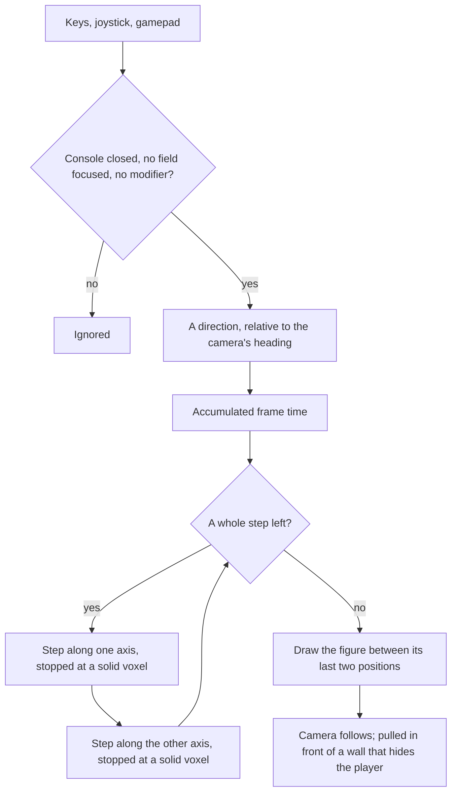

# Player

Part of [world first](/docs/proposals/infra/agent-console/world-first). The [voxel world](/docs/infra/claude-interface/agent-console/voxel-world) is already the page, with the console an overlay over it, and this stage puts the person in it. The room already has figures, one for the main agent and one for each subagent, walking to the station of the tool each one is waiting on. The player is one more figure, and the only one a person moves.

## What it adds

- **A figure in the shape a player expects.** A head, a body, two arms and two legs as six separate boxes, in the proportions Minecraft made the shape of a voxel person. In its units of one sixteenth, the head is eight on a side, the body eight by twelve by four, and each limb four by twelve by four. It is built from our palette's colours, not from Mojang's model or skin, and it stands as tall as an agent figure, two voxels of the room.
- **A walk that reads as walking.** The arms and legs swing in opposite pairs, their phase advancing with the distance covered rather than with time, so the feet never slide. Standing, the figure breathes as the agents do. With reduced motion asked for, the limbs do not swing.
- **Free movement relative to the camera.** W, A, S and D or the arrow keys move the player forward, left, back and right as the camera sees it, which is how a third-person game moves, and the figure turns to face the way it walks. Diagonals are normalised, so walking diagonally is no faster. The walking speed is a constant, set near Minecraft's walk of a little over four blocks a second and tuned by eye in the room.
- **Touch and gamepad.** On a touch screen, a joystick in the lower corner moves the player and a drag anywhere else turns the camera, which is how Minecraft's joystick mode works on a phone. A gamepad's left stick moves and its right stick turns the camera, through the browser's Gamepad API, so the page supports more than one input device.
- **Only when nothing else wants the keys.** A key moves the player only while the console is closed, nothing editable has focus and no modifier is held.
- **Collision with the room.** The player is a box, narrower than a voxel and as tall as the figure, and it cannot walk into a wall, a station or any solid voxel of the room. Movement is resolved one axis at a time against the room's grid: the step along one axis is taken and cut short at the first solid voxel, then the step along the other. A player walking into a wall at an angle slides along it instead of stopping dead. At walking speed a frame's step is far shorter than a voxel, so the per-axis resolution cannot tunnel. The floor is flat, so there is no gravity and no jump.
- **A fixed timestep.** Movement advances in fixed steps of a sixtieth of a second, with the time a frame took accumulated and spent in whole steps. The figure is drawn between its last two positions, so the walk is the same on a slow screen and a fast one and a stutter never throws the player through a wall.
- **A camera that follows.** The camera sits behind and above the player. A drag, or the right stick, turns it around the player and tilts it within limits, and the wheel brings it closer or pushes it back within limits. It follows the player with a little lag that reads as weight. A reduced-motion setting and the operating system's own reduce-motion preference make it follow rigidly instead, since a camera that moves differently from the input is a known cause of motion sickness. Where a wall would stand between the camera and the player, the camera is pulled in to just in front of it, as a spring arm does in a third-person game, and it eases back out once the wall is behind.

## How it works



## Scope

- The player spawns at the door, where the main agent walks in, and is not kept across a reload.
- The agent figures keep their own walk and do not collide with the player, so the session is never held up by where the person stands.
- The follow camera replaces the orbit camera. It keeps that camera's limits: it stays above the floor and no further out than where it starts.
- Interaction with the things in the room is [the next stage](/docs/proposals/infra/agent-console/world-first/interaction).

## Key files

| File                                                           | Role after the change                                                     |
| :------------------------------------------------------------- | :------------------------------------------------------------------------ |
| `apps/web/app/components/AgentConsole/World/Scene.vue`         | The room, the agents and the gauges, with the player among them           |
| `apps/web/app/components/AgentConsole/World/Index.vue`         | The canvas and the follow camera, which replaces the orbit camera         |
| `apps/web/app/services/agentConsole/world/createRoomGrid.ts`   | The room's voxels, which collision reads to tell solid from open          |
| `apps/web/app/services/agentConsole/world/createFigureGrid.ts` | The agent figure, whose height the player matches                         |
| `apps/web/app/services/agentConsole/world/constants.ts`        | The walking speed, the timestep, the player's box and the camera's limits |

```text
apps/web/app/
  components/AgentConsole/World/Player.vue          ← the six-part figure, its walk and its breath
  components/AgentConsole/World/FollowCamera.vue    ← behind the player, turned by a drag, pulled in by a wall
  components/AgentConsole/Joystick.vue              ← the touch joystick
  composables/agentConsole/world/usePlayerInput.ts  ← keys, joystick and gamepad as one direction, gated
  services/agentConsole/world/moveThroughGrid.ts    ← one step, resolved one axis at a time
  services/agentConsole/world/moveThroughGrid.test.ts
```

## Notes

- The per-axis resolution is the simple form, and it is correct only while a step stays well under a voxel. A faster player, or a larger world such as the [codebase city](/docs/proposals/infra/agent-console/codebase-city), moves to sweeping the box along its leading corner through the grid, which is exact at any speed.
- cientos's keyboard controls move a camera from its own eyes, behind a locked pointer, so they are the first-person control this design turns down. The player's input is its own, read from the keys, the joystick and the gamepad in one composable.
- The same six-part figure can later replace the agents' single-box figures, so every person in the room walks alike, and the Genshin theme gives each a character's colours through the [themes](/docs/proposals/infra/agent-console/themes) avatar.

## Sources

- [Skin](https://minecraft.wiki/w/Skin), Minecraft Wiki: the player model's parts and their sizes — the head eight on a side, the body eight by twelve, each limb four wide and twelve tall — the proportions the figure takes.
- [Player](https://minecraft.wiki/w/Player), Minecraft Wiki: a player box six tenths of a block wide and a little under two tall, and a walk of about four and a third blocks a second, the reference the player's box and speed start from.
- [Controls](https://minecraft.wiki/w/Controls), Minecraft Wiki: movement on W, A, S and D, and the touch joystick mode — a joystick to move and a drag anywhere else to look.
- [Fix your timestep!](https://gafferongames.com/post/fix_your_timestep/), Glenn Fiedler: simulation in fixed steps spent from an accumulator of frame time, and the render drawn between the last two states.
- [voxel-aabb-sweep](https://github.com/fenomas/voxel-aabb-sweep), Andy Hall: why sweeping a box along each axis in turn is inaccurate for large steps, and the exact alternative that walks the box's leading corner through the grid — the upgrade the notes name.
- [Using spring arm components](https://dev.epicgames.com/documentation/en-us/unreal-engine/using-spring-arm-components), Unreal Engine: a third-person camera held at a length from its target, drawn in when a collision test finds a wall between them and returned to its length once clear.
- [Gamepad API](https://developer.mozilla.org/en-US/docs/Web/API/Gamepad_API), MDN: reading a gamepad's sticks and buttons in the browser.
- [Game accessibility guidelines](https://gameaccessibilityguidelines.com/full-list/): support for more than one input device, and no difference between the input's movement and the camera's where a person asks for none.
