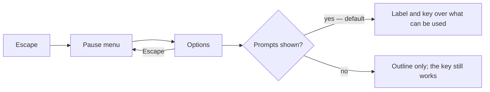

# World settings

The [voxel world](/docs/infra/claude-interface/agent-console/voxel-world) shows a prompt over each thing the player can act on, such as the door: a label and the key that uses it, so a person new to the world learns what it does. The console is reached from its own button and keys, never through a prompt. A person who already knows it may want the room without them. The world has no settings yet, and this proposal gives it a place for them, as a game does.

## Decisions

- **Options live in the pause menu.** Minecraft's pause menu holds Options beside Back to Game, and the console's pause menu already holds the way back to the world and the way out, so an Options entry sits between them. It opens a panel of settings, and Escape returns to the pause menu.
- **The first setting is the prompts.** Shown by default, as they are today. When they are off, a thing is still used by looking at it and pressing its key, so turning the prompts off never takes an action away.
- **A setting is added only when something needs it.** The panel starts with the prompts and grows one entry at a time as a feature asks for one, such as a key the [building](/docs/proposals/infra/agent-console/building) hotbar moves. No panel of settings is built ahead of a need.
- **Settings are per browser.** They are a viewer's convenience, so they are kept in local storage, and a missing or unreadable value falls back to the default.

## How it works

## Key files

| File                                                 | Role after the change                                    |
| :--------------------------------------------------- | :------------------------------------------------------- |
| `apps/web/app/components/AgentConsole/PauseMenu.vue` | Gains the Options entry                                  |
| `apps/web/app/store/agentConsole/panel.ts`           | Whether the options panel is open, beside the pause menu |

## Sources

- [Options](https://minecraft.wiki/w/Options), Minecraft Wiki: the Options entry in the pause menu, and settings changed there taking effect at once.
