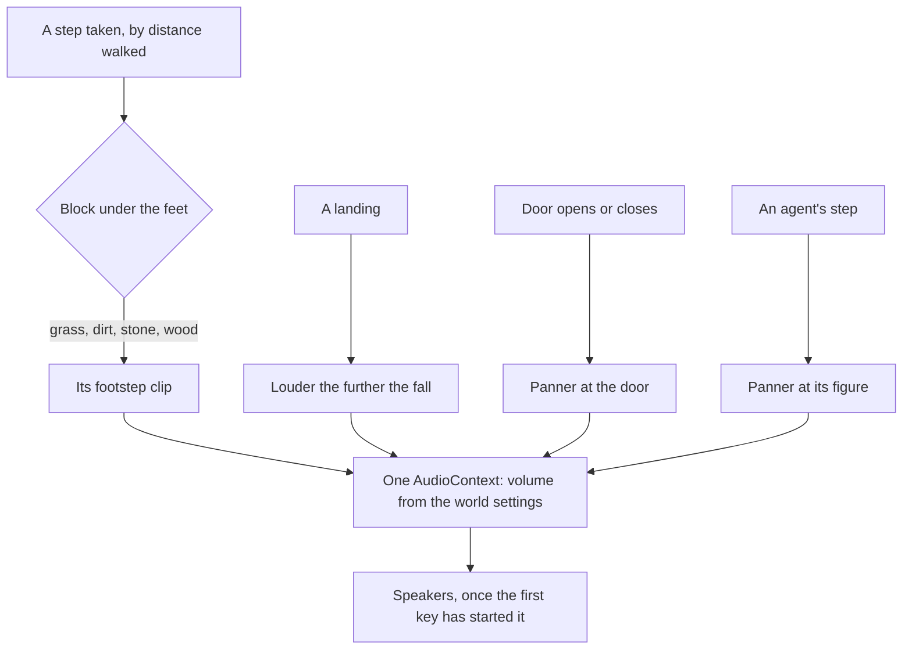

# World sound

The [voxel world](/docs/infra/claude-interface/agent-console/voxel-world) is silent: the player walks, jumps and swings the door without a sound. In Minecraft half of what a block is comes through the ear — grass rustles underfoot, stone clicks, a door clunks shut behind you — and a silent world reads as a model rather than a place. This proposal gives the console's world its sounds. The character's spoken lines are not among them: those are the persona's, played through its own player ([element ambience](/docs/proposals/infra/agent-console/element-ambience) is where the world answers them).

## Decisions

- **Footsteps by the block underfoot.** A step sounds as the voxel under the player's feet is made: grass, dirt, stone or wood, read from the palette colour the voxel holds through one map from colour to material. Steps are timed by the distance walked, as the limbs' swing is, so a sprint steps faster and a sneak sounds softer, as Minecraft's are. A landing after a fall sounds once, louder the further it fell.
- **Things sound where they are.** The door's opening and closing are placed at the door, through a panner at its position with the listener at the camera, so the door is heard behind the player when it is behind them. An agent's footsteps are placed at its figure, so a subagent is heard walking in.
- **The sounds are our own.** Every sound is recorded or synthesized for this world, or taken from a public-domain library, and credited in the sources of the page that ships it. Minecraft's sound files are Mojang's to license and none is used, as none of its models or textures is.
- **One graph, started on the first key.** One `AudioContext` holds every sound, each short clip decoded once and played as a new buffer source each time, so a step allocates only its source. A browser lets audio start only after a gesture, and the first key or tap that walks the player is one, so the world is silent only until it is first moved.
- **A volume in the world settings.** [World settings](/docs/proposals/infra/agent-console/world-settings) gains one slider for the world's sound, zero muting it. A hidden tab plays nothing, as it draws nothing.

## How it works

## Scope and order

1. **The player's footsteps, the landing and the door,** with the volume setting.
2. **The agents' footsteps,** placed at their figures.
3. **Ambience by biome** — wind on the hills, birds in the forest, water by the river — once the [open world](/docs/proposals/infra/agent-console/open-world) has biomes to hear.

## What this does not propose

- **Music.** Minecraft's music is its own and a person working with the console usually has their own playing.
- **A sound for every tool call.** The session is followed in the console and the gauges, and a clip per tool call would turn a busy session into noise.

## Key files

| File                                                    | Role after the change                                            |
| :------------------------------------------------------ | :--------------------------------------------------------------- |
| `apps/web/app/components/AgentConsole/World/Player.vue` | Plays a footstep by the distance walked, and the landing         |
| `apps/web/app/components/AgentConsole/World/Door.vue`   | Plays its opening and closing through a panner at the door       |
| `apps/web/app/components/AgentConsole/World/Figure.vue` | Plays an agent's footsteps at its figure                         |
| `apps/web/app/models/agentConsole/PaletteColor.ts`      | The colours the map from colour to footstep material is keyed by |

## Sources

- [Sound](https://minecraft.wiki/w/Sound), Minecraft Wiki: a block's sound group sounding its steps, and step sounds timed by distance.
- [Web Audio API](https://developer.mozilla.org/en-US/docs/Web/API/Web_Audio_API), MDN: one context, buffer sources played once, and a panner placing a sound in space.
- [Autoplay guide](https://developer.mozilla.org/en-US/docs/Web/Media/Guides/Autoplay), MDN: audio allowed to start only after a user gesture.
