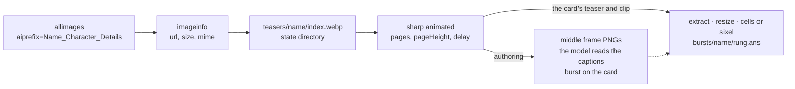
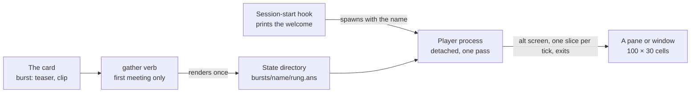

# Burst Animation

The [persona plugin](/docs/infra/claude-interface/persona-plugin) opens every session with a three-line welcome naming the character. This proposal shows them: the character's elemental burst, the four-second official clip, played once beside the welcome as it prints. Every piece was probed before it was written down, and the numbers below are the probe's.

## What the terminal allows

The tool's hook surfaces were read off the running build, because the docs do not say how much a hook may print:

| Surface                       | What it is                                                                            | What it means here                                                                                                                                             |
| :---------------------------- | :------------------------------------------------------------------------------------ | :------------------------------------------------------------------------------------------------------------------------------------------------------------- |
| The welcome (`systemMessage`) | One string, capped at 4000 characters, painted as a plain text node in the transcript | Static, and far too small for a picture: one 60×18-cell frame costs ten times the cap. Colour should survive, since the node treats escape codes as zero width |
| `terminalSequence`            | An escape sequence the tool emits on the hook's behalf                                | Allow-listed to OSC 0/1/2/9/99/777 and BEL — window titles and desktop notifications. Nothing moves a cursor                                                   |
| The status line               | A command re-run when the message list changes                                        | Event-driven, never a timer; it cannot play frames                                                                                                             |
| The spinner                   | Verbs and tips, text                                                                  | No frame glyphs are configurable                                                                                                                               |

So nothing inside the tool's frame can move, and the welcome cannot carry a picture of any size. Motion lives **beside** the welcome: the start hook that prints it also opens a pane and hands it the character's name, the way the Stop hook hands a player a WAV. The pane holds no session, sends nothing, and closing it breaks nothing. This is not the deferred [companion window](/docs/infra/deferred/companion-window) — that page waits on the subscription being allowed behind an SDK, and a pane that plays a file needs no model at all.

## The footage

The community wiki hosts, for every playable character back to the first patches, the official **Character Details** teasers — three to six per character, one per talent, each the game's own _Talents_ infographic with the gameplay clip embedded and the talent's name captioned above it. They are 100 frames at 40 ms, served by the wiki's CDN as animated WebP of four to nine megabytes.

The clip is a band of the infographic — on the 600-wide template, the 345 rows from row 225 — but the templates differ in size from one teaser to the next (400×633, 400×1050, 600×1402 for one character), so the band is not one box for the roster. The caption names the talent, so which teaser is the burst is readable off a frame rather than guessed from its index.

The footage is the publisher's, and the plugin's rule stands: nothing lifted from the game enters the repository, tracked or ignored. Every asset lives in the plugin's state directory beside the roster cache, gathered on the machine that plays it. What the repository ships is the gatherer, the player, and per character two numbers and a box.

## The card carries the label

The reference-and-tuning half — the part that answered the per-character voice with a `pitch` and a `rate` — is a `burst` field on the persona card:

```ts
burst: { teaser: 6, clip: { left: 0, top: 225, width: 600, height: 345 } }
```

It is authored through the `genshin-author` flow: the gatherer's first step exports the middle frame of each teaser as a PNG, and the model reads the frames — it can read an image — names the burst by its caption, measures the clip band, and writes the field. The person confirms both by eye once. A card without the field plays nothing, which is the whole of the fallback.

## Resolution — the ladder, and what pre-computing buys

Nothing is computed at play time. The pane is the plugin's own, so its size is fixed, and every frame is rendered once into a file the player only paces out. That removes the one reason to render small, and makes the ceiling a question of what the terminal can draw:

| Rung                             | Where                                                                                       | What a 100×30 pane shows                                                                                         |
| :------------------------------- | :------------------------------------------------------------------------------------------ | :--------------------------------------------------------------------------------------------------------------- |
| Pixels — kitty graphics protocol | kitty, Ghostty, WezTerm, Konsole                                                            | The clip at its own 600×345, as PNG frames the terminal itself animates once they are sent                       |
| Pixels — sixel                   | Windows Terminal 1.22+, WezTerm, foot, xterm                                                | The clip at its own size, 256 colours — one palette quantised over the whole clip, so the colours do not flicker |
| Sextants `🬀`                     | Any terminal whose font has _Symbols for Legacy Computing_ (Cascadia Code, most Nerd Fonts) | 200×90 in shape, two colours per cell: the best-fit of 64 patterns per cell, chosen by least error               |
| Half-blocks `▀`                  | Everything                                                                                  | 100×60, two colours per cell, no fit needed                                                                      |

The probe, on the teaser of Clorinde's skill _Hunter's Vigil_, at the bottom rung: at 60×18 cells the element and a silhouette read and the figure does not; at 100×30 the character, the ring, the strike and the damage numbers all do. A half-block frame at 100×30 is 114 KB, because photographic frames have few colour runs; a sextant frame is the same bytes with three times the shape, since bytes are spent per cell, not per pixel. The best-fit that chooses the sextant is the brute-force pixel match — for each of 64 patterns, split the cell's six pixels into two sets, take each set's mean colour, score the error, keep the least — and at 3000 cells a frame it is nothing to run once. The glyph converters (`chafa`) do the same and more, and are a native binary with no one-command Windows install; the plugin owns its own few dozen lines instead.

The player takes the top rung the terminal answers for — `KITTY_WINDOW_ID` or `TERM_PROGRAM` for the kitty protocol, a `;4` in the primary device attributes reply for sixel — and the gatherer renders that rung and the half-block rung, so a cache is never useless on a different terminal. Pre-rendered at 100×30, a burst is six megabytes of cells or fifteen of sixel, and the cache holds only the characters this machine has met.

## Gathering

The gatherer is a verb of the plugin's own script, `gather <name>`, runnable from a shell on any machine with the plugin installed, and run by the player itself on the first meeting of a character. It is the whole recipe, and every call in it was made by hand for this page:

1. **List the teasers.** `GET https://genshin-impact.fandom.com/api.php?action=query&list=allimages&aiprefix=<Name>_Character_Details&format=json&ailimit=50` — the file names, spaces as underscores (`Clorinde_Character_Details_5.gif`).
2. **Resolve them.** `action=query&prop=imageinfo&iiprop=url|size|mime&titles=File:<a>|File:<b>|…` — one call for all of a character's files, each with its `url`, dimensions and size. Every request carries the plugin's `WIKI_USER_AGENT`; the CDN answers a bare client with an HTML page instead of the file.
3. **Download** each `url` to `teasers/<name>/<index>.webp` in the state directory. The CDN serves the GIF re-encoded as animated WebP, four to nine megabytes.
4. **Read the frames** with `sharp(file, { animated: true })`: `pages` is the frame count, `pageHeight` the frame height, `delay` the per-frame milliseconds; `sharp(file, { page: k })` is frame `k`.
5. **Label** — authoring only: export the middle frame of each teaser as PNG for the model to read, and write `burst` on the card.
6. **Render** every other frame of the burst teaser: `extract(clip)`, `resize` to the rung's pixel size, then cells or sixel, into `bursts/<name>/<rung>.ans` — frames joined by a cursor-home sequence, so the player writes one slice per tick.



`sharp` is the one dependency the plugin gains: prebuilt per platform, no lifecycle script, already in this workspace. Once the verb exists this recipe moves into the `genshin-author` skill beside the voice steps, and this page is deleted with the rest of the proposal.

## The pane



The hook spawns the player detached and returns at once, so the start path pays nothing; the first meeting of a character gathers inside the player, so its pane opens a few seconds late that once. The player takes the alternate screen, hides the cursor, writes a slice per tick, plays one pass and exits, restoring both. Where it opens is the terminal's business: a split of the current window under Windows Terminal (`WT_SESSION` set) or tmux (`TMUX` set), else a new console window — which is what the desktop app gets, since it has no split to offer. It is opted in by `setup`, like the status line, and `teardown` removes it.

## What this is not

- **Not the normal attack or the skill.** A burst is recognisable at 100 columns; an attack string is not. The teasers for those exist and the card field could name them, and it does not.
- **Not a picture in the welcome.** The welcome stays three lines; the most it can take is the nameplate in its element's colour, which the status line already paints and this change may add.
- **Not a companion.** No avatar, no model, no session; a file played once.

## To verify before building

1. Colour in the welcome — a coloured nameplate in the `systemMessage`, checked by eye on a `/clear`.
2. Throughput — 114 KB of cells fifteen times a second to Windows Terminal, and a sixel frame at the same rate, without tearing; the tick drops to 10 fps where it tears.
3. `sharp` under the plugin's frozen install — the one-minute ceiling with lifecycle scripts off, on a cold machine.
4. The sextant glyphs in the desktop app's font — the rung falls to half-blocks where they render as boxes.
