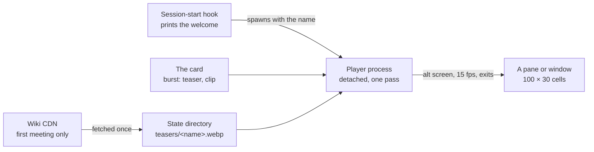

# Burst Animation

The [persona plugin](/docs/infra/claude-interface/persona-plugin) opens every session with a three-line welcome naming the character. This proposal shows them: the character's elemental burst, the four-second official clip, played once as coloured terminal cells at the moment the welcome prints. It is the smallest visual the persona can have, and every piece of it was probed before it was written down here.

## What the terminal allows

The tool's own hook surfaces were read off the running build, not the docs, because the docs do not say how much a hook may print:

| Surface                       | What it is                                                                            | What it means here                                                                                                                                             |
| :---------------------------- | :------------------------------------------------------------------------------------ | :------------------------------------------------------------------------------------------------------------------------------------------------------------- |
| The welcome (`systemMessage`) | One string, capped at 4000 characters, painted as a plain text node in the transcript | Static, and far too small for a picture: one 60×18-cell frame costs ten times the cap. Colour should survive, since the node treats escape codes as zero width |
| `terminalSequence`            | An escape sequence the tool emits on the hook's behalf                                | Allow-listed to OSC 0/1/2/9/99/777 and BEL — window titles and desktop notifications. Nothing moves a cursor                                                   |
| The status line               | A command re-run when the message list changes                                        | Event-driven, never a timer; it cannot play frames                                                                                                             |
| The spinner                   | Verbs and tips, text                                                                  | No frame glyphs are configurable                                                                                                                               |

So nothing inside the tool's frame can move, and the welcome cannot carry a picture of any size. Motion lives **beside** the welcome: the start hook that prints it also opens a pane and hands it the character's name, the way the Stop hook hands a player a WAV. The pane holds no session, sends nothing, and closing it breaks nothing. This is not the deferred [companion window](/docs/infra/deferred/companion-window) — that page waits on the subscription being allowed behind an SDK, and a pane that plays a file needs no model at all.

## The footage

The community wiki hosts, for every playable character back to the first patches, the official **Character Details** teasers — three to six per character, one per talent, each the game's own _Talents_ infographic with the gameplay clip embedded and the talent's name captioned above it. They are 100 frames at 40 ms, served by the wiki's CDN as animated WebP of four to nine megabytes.

The clip is a band of the infographic — on the 600-wide template, the 345 rows from row 225 — but the templates differ in size from one teaser to the next (400×633, 400×1050, 600×1402 for one character), so the band is not one box for the roster. The caption names the talent, so which teaser is the burst is readable off a frame rather than guessed from its index.

The footage is the publisher's, and the plugin's rule stands: nothing lifted from the game enters the repository. The teaser is fetched **on the machine**, the first time the character is met, into the plugin's state directory beside the roster cache, and read from there on every later start. What the repository ships is the player, and per character two numbers and a box.

## The card carries the label

The reference-and-tuning half — the part that answered the per-character voice with a `pitch` and a `rate` — is a `burst` field on the persona card:

```ts
burst: { teaser: 6, clip: { left: 0, top: 225, width: 600, height: 345 } }
```

It is authored the way a card's voice is, through the `genshin-author` flow: an author command fetches the character's teasers, exports the middle frame of each as a PNG, and the model reads the frames — it can read an image — names the burst by its caption, measures the clip band, and writes the field. The person confirms both by eye once. A card without the field plays nothing, which is the whole of the fallback.

## Rendering

Each terminal cell is the upper-half-block glyph `▀` with a 24-bit foreground for the top pixel and background for the bottom, so a pane of `columns × rows` cells shows a `columns × 2·rows` pixel frame. That is averaging, not matching: the glyph-search converters (`chafa` and its kin) choose among sextants and braille per cell by least error against the source, which is the brute-force fit — and it buys detail at a size this pane does not have, for a native binary with no one-command install on Windows. Half-blocks are the whole renderer, in a few dozen lines.

The probe, on the teaser of Clorinde's skill _Hunter's Vigil_ at three frames:

| Pane           | Pixels | What it shows                                           | Bytes per frame |
| :------------- | :----- | :------------------------------------------------------ | --------------: |
| 60 × 18 cells  | 60×36  | The element and a silhouette; the figure does not read  |           41 KB |
| 100 × 30 cells | 100×60 | The character, the ring, the strike, the damage numbers |          114 KB |

The pane is therefore **100 columns by 30 rows**, and the bytes decide the shape of the cache: a burst pre-rendered at that size is six megabytes and fits one pane width, so nothing is pre-rendered. The cache holds the source teaser; the player decodes it, crops by the card's box, resizes to the pane it was given and emits cells, every other frame, at 15 fps — `sharp` does the decoding and resizing, installs as a prebuilt binary per platform with no lifecycle script, and is already in this workspace. Writing 114 KB fifteen times a second is 1.7 MB/s to one terminal; the modern ones are built for that and it is the one number below still to measure.

## The pane



The hook spawns the player detached and returns at once, so the start path pays nothing; the first meeting of a character downloads the teaser inside the player, so its pane opens a few seconds late that once. The player takes the alternate screen, hides the cursor, writes a frame per tick from the home position, plays one pass and exits, restoring both. Where it opens is the terminal's business: a split of the current window under Windows Terminal (`WT_SESSION` set) or tmux (`TMUX` set), else a new console window — which is what the desktop app gets, since it has no split to offer. It is opted in by `setup`, like the status line, and `teardown` removes it.

## What this is not

- **Not the normal attack or the skill.** A burst is recognisable at 100 columns; an attack string is not. The teasers for those exist and the card field could name them, and it does not.
- **Not a picture in the welcome.** The welcome stays three lines; the most it can take is the nameplate in its element's colour, which the status line already paints and this change may add.
- **Not a companion.** No avatar, no model, no session; a file played once.

## To verify before building

1. Colour in the welcome — a coloured nameplate in the `systemMessage`, checked by eye on a `/clear`.
2. Throughput — 1.7 MB/s of cells to Windows Terminal at 15 fps, without tearing; the tick drops to 10 fps if it tears.
3. `sharp` under the plugin's frozen install — the one-minute ceiling with lifecycle scripts off, on a cold machine.
