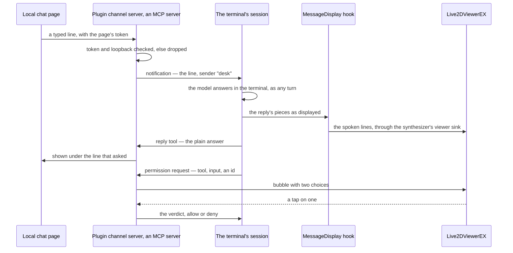

# Chat into the session

The second half of the desktop stage is input: a line typed at the character rather than at the terminal. Every companion that has one owns a session of its own to send it to, which is the shape [rejected](/docs/infra/rejected/sdk-driven-companion) here because its turns spend the limits the work needs and it holds none of the work. What changed the answer is **channels**: an MCP server that declares the "claude/channel" capability pushes events into the session already open in the terminal, the model reads each as a channel tag in its context, and the reply is the same reply, displayed in the same terminal — so it flows through the [message display hook](/docs/infra/claude-interface/spoken-replies) and the [viewer sink](/docs/proposals/infra/viewer-stage) unchanged. The chat window is a channel, the session is the terminal's, and the cost is zero tokens beyond the turn itself.

## Scope

**Today:** the terminal and its push-to-talk dictation are the input; the persona plugin ships hooks, skills and an output style, and no MCP server.

**This adds:**

1. **A channel server in the plugin** — one node script the plugin's manifest declares as an MCP server, so it is started with the session — serving a small page on the loopback: a text box, the reply below it, the character's nameplate above.
2. **Two-way replies.** The character's spoken lines reach the viewer through the existing pipeline; the plain half of an answer reaches the page through a reply tool the server exposes, which the server's instructions tell the model to call when the ask came from the channel.
3. **A permission answered on the model.** The server declares the permission relay, so a tool approval the terminal would ask for is a bubble on the model with two choices, and a tap on either is the verdict.

## The facts this rests on

- Channels are a research preview. They need a claude.ai login or a Console key, so this machine qualifies; Pro and Max users without an organization skip the enterprise switch entirely and opt in per session.
- Only Anthropic's allow-listed plugins register under "--channels". Any other — this plugin included, published to its own marketplace as it is — registers only under "--dangerously-load-development-channels plugin:genshin-persona@esposter", which asks a confirmation at every launch. The [official plugin directory](/docs/infra/rejected/official-plugin-directory) was declined and stays declined: the community marketplace it would land in is not on the channel allowlist either, so a listing would buy nothing here.
- The server needs one dependency, the MCP SDK, and any node-compatible runtime; the pre-built channels use Bun, and this one does not have to. The plugin cache's frozen install carries the dependency from the plugin's lockfile, the way the game-data package arrives today.
- Events queue in the session and arrive in order; while the model is busy, several arrive together on the next turn. The server is not told when an event was read, so a reply tool is the only confirmation.

## How it works



**The server.** One script, declared in the plugin's manifest as an MCP server over stdio, started by the tool with the session and ended with it. It serves the page on a loopback port with a random token in the URL, printed once to the terminal at start; a line posted without the token, or from anywhere but the loopback, is dropped, which is the sender gate every channel owes. A line that passes becomes a notification with the text as its content and the sender as its meta, and the model sees it as a channel tag naming the plugin's scoped server. The instructions string handed to the model when the server connects says three things: what arrives, that the character's spoken lines need no forwarding because the viewer already hears them, and that the plain half of an answer to a channel ask goes back through the reply tool.

**The page.** The smallest thing that holds a text box and a list: static markup served by the same process, the reply tool's calls pushed to it over a server-sent stream. The nameplate at the top is the session's character in the element's colour, read the way the status line reads it. No framework, no build step: the plugin is copied into the tool's cache as files, and a page that needs building is a page that needs a build in the cache.

**Where the flag goes.** The flag is on the invocation, so a shell alias carries it; whether the desktop app can be handed it is a probe, and until it can, the chat page is the terminal's feature.

**The permission on the model.** The tool forwards an approval prompt to a channel that declares the relay, with the tool name, its input and a request id, and takes the verdict back as a notification carrying that id. The channel server renders it as a bubble on the model with two choices through the viewer's socket, and a tap on either is the verdict — provided the viewer reports which choice was tapped, which its documentation shows only for a hit area and is the second probe after the [viewer stage's](/docs/proposals/infra/viewer-stage) first; if it does not, the two choices are the page's buttons and the bubble only announces the prompt. Anyone who can tap the model can approve a tool call in the session, which on one person's desk is the person; the relay is declared only when the viewer is on file, so a machine with no viewer never sees a prompt it cannot answer.

```text
packages/genshin-persona/
  .mcp.json                        ← the channel server, declared for the plugin
  scripts/
    channel.ts                     ← the MCP server: the capability, the reply tool, the page, the permission relay
  src/services/
    createChannelPage.ts           ← the markup and the event stream the page listens to
    forwardPermissionPrompt.ts     ← a prompt as a two-choice bubble, a tap as the verdict
```

## What this does not propose

- **A session of the companion's own.** The reply is the coding session's or the feature is a chatbot beside the work — [rejected](/docs/infra/rejected/sdk-driven-companion).
- **A bridge to a chat service.** Telegram, Discord and iMessage channels exist and are Anthropic's; they are for asking from a phone, not for a face on the desk, and any of them runs beside this one under the same flag.
- **Speech in.** Dictation is the terminal's and costs nothing; the page takes typed text only.
- **A page that renders the model.** The viewer renders it; the page is words. A model in the page is the [own renderer](/docs/infra/deferred/own-live2d-renderer), deferred.

## Key files

| File                                                       | Role                                                                          |
| :--------------------------------------------------------- | :---------------------------------------------------------------------------- |
| `packages/genshin-persona/.claude-plugin/plugin.json`      | The plugin manifest; the MCP server is declared beside the hooks              |
| `packages/genshin-persona/package.json`                    | The MCP SDK joins the dependencies the plugin cache installs                  |
| `packages/genshin-persona/scripts/status.ts`               | The nameplate the page's header reuses                                        |
| `packages/genshin-persona/src/services/formatNameplate.ts` | The character's name in the element's colour, rendered once more for the page |

## Notes

- The flag's confirmation on every launch is the whole cost of the preview, and it is paid by whoever types `claude`; the trigger that removes it is the preview ending with the allowlist opened to any marketplace, and if the allowlist stays curated the alias stays, which is acceptable for one machine and not for a published plugin — the README says so.
- A permission relay is authority: the allowlist is the loopback and the token, and the page's URL is printed to the terminal alone, never written to a file another process reads.
- An event pushed while the model is mid-turn arrives with the next; the page shows the line as sent and the reply when it comes, and nothing in between, because the server is told nothing in between.
