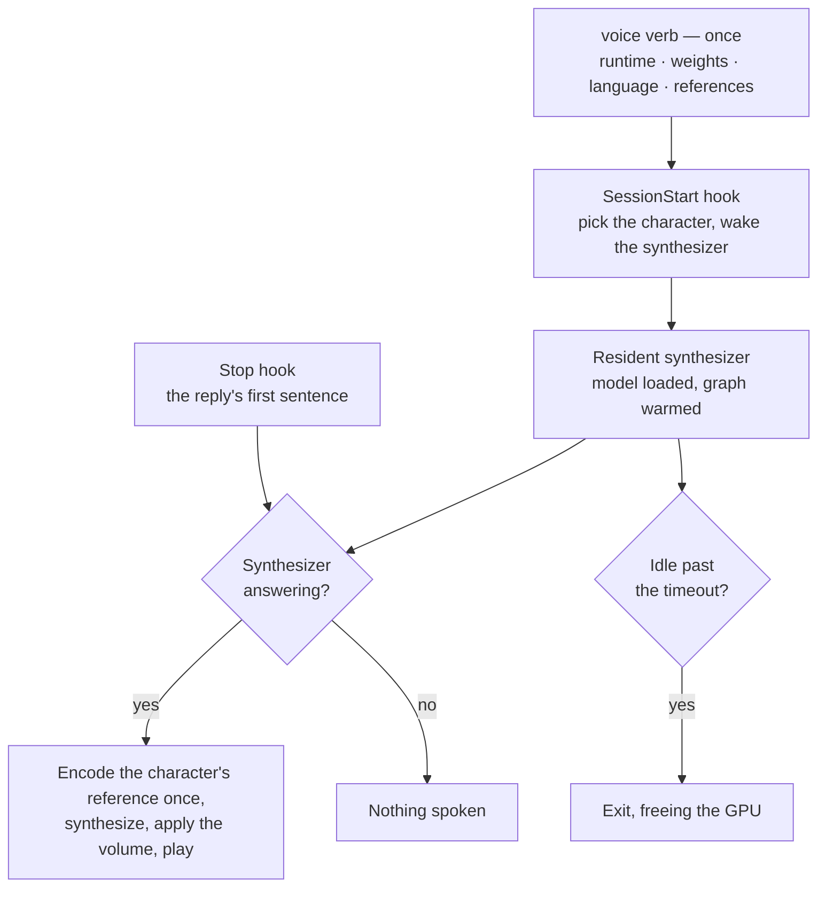

# Character voice

Stage 3 of the [Claude interface](/docs/infra/claude-interface). [Spoken replies](/docs/infra/claude-interface/spoken-replies) read every character through a catalogue voice bent by pitch and rate, because a cloned voice needed an inference engine with a Python environment to keep alive. That gate is closed: Transformers.js v4 ships Chatterbox — an MIT zero-shot voice cloner — as a native model class, so a character's own performance becomes their voice from one reference clip, in the plugin's own runtime, on this machine's GPU through the WebGPU provider and with no service behind it. **Azure goes entirely**: the account, the key, the markup, the catalogue benchmark and the generated voice table, since every one of them existed to approximate what the clone now does directly.

## The decision, and the evidence for it

One spike, run against Clorinde's own lines decoded from the game install, on the RX 7900 XT:

| Measured                                                 | Turbo, fp16 language model, WebGPU                                                  |
| :------------------------------------------------------- | :---------------------------------------------------------------------------------- |
| Load the engine in a cold process                        | seconds — under ten                                                                 |
| Encode a ten-second reference into speaker tensors       | well under a second                                                                 |
| Synthesize a seven-second sentence, warm                 | under two thirds of real time; under two fifths with the q4f16 language model       |
| The same sentence on the first call of a process         | roughly twice that                                                                  |
| DirectML provider                                        | rejects the speech encoder's attention op and the language model's slice — unusable |
| Likeness — the benchmark encoder's cosine to her profile | clone 0.78 · her own clip 0.98 · the catalogue's best 0.91                          |
| The same, from a second reference and from q4f16         | 0.78 both — the number is the model's, not the reference's                          |

Three things follow, and each is a sub-spec:

1. **The engine keeps ahead of speech once warm, and a cold process does not.** A process that loads the model per reply spends its first fifteen-odd seconds before the first sentence plays, so the hook cannot own the model — a resident synthesizer does, and the session-start hook warms it: [resident synthesizer](/docs/proposals/infra/character-voice/resident-synthesizer).
2. **The runtime and the weights cannot ship in the plugin.** The ONNX runtime's binaries alone are a few hundred megabytes and the plugin install runs a frozen `npm ci` under a one-minute ceiling; the weights are a gigabyte or two on top. Both are installed by a `voice` verb into the plugin's own state directory, beside the pick records — the same split the benchmark already draws, a model being a dependency and not an output: [voice setup](/docs/proposals/infra/character-voice/voice-setup).
3. **The likeness number is not yet the ear's answer.** The catalogue voice out-scoring the clone on the encoder is Turbo trading similarity for speed — a second reference and a quantized language model moved it by nothing — and the same row for the 0.5B original is the first thing the implementation measures, since it decides which weights the `voice` verb fetches. Which line of a character's own performance is the reference is a measurement the benchmark already knows how to make; it is remade over the wiki's clips — the same files the plugin fetches — and its result is committed as one map: [reference selection](/docs/proposals/infra/character-voice/reference-selection).

The fourth sub-spec is the subtraction: [Azure removal](/docs/proposals/infra/character-voice/azure-removal) — every file, option, resource and page that goes, in the order it can go.

## Scope

**Today:** the Stop hook posts the reply's first sentence as SSML to an Azure Speech free-tier account, in the catalogue voice a generated module names for the character with the pitch and rate the [voice match benchmark](/docs/infra/claude-interface/voice-match-benchmark) fitted; three plugin options carry the endpoint, the key and a fallback voice; `mute`, `unmute` and `volume` shape the hook.

**This adds:**

- A local synthesizer: Chatterbox through Transformers.js, on the WebGPU provider, held by one resident process per machine that the hooks talk to over a local socket.
- A `voice` verb that installs the runtime and the weights, chooses the reference language, and fetches one reference clip per character from the wiki the plugin already reads cards from — cached, never committed.
- One generated map naming, per character, the line the measurement chose and the likeness it scored.
- A card field for the ear: the reference line, and the engine's one expressiveness lever.

**This removes:** the Azure account and its key output, the three speech options, the markup builder and its catalogue check, the generated voice table, and the whole voice match benchmark with its game-install reader. Volume stays, as a gain on the samples.

## How it works

The gate in front of speaking is the same shape it always was: today an empty endpoint keeps replies silent, tomorrow a state directory without a runtime does. A reply that cannot be spoken is not spoken, and nothing waits.

## What the character's voice is, and where it lives

The voice is the actor's, and the game's publisher requires written consent from both the company and the artist for any generative use of it. What makes this stage defensible is unchanged from the deferred page it replaces: the reference audio is fetched to this machine and stays here, the plugin ships nothing lifted from the game, and what is committed per character is a line's **title** and a number. The wiki hosting the clip is its exposure; a public Apache-2.0 package committing the same clip would be ours, copied to every installer's machine — so the clip is not committed, however convenient that would be.

## Key files

The existing files the work touches, with the role each plays after the change; everything created is in the sub-specs.

| File                                                  | Role                                                                |
| :---------------------------------------------------- | :------------------------------------------------------------------ |
| `packages/genshin-persona/scripts/speak.ts`           | The Stop hook: gate, first sentence, one request to the synthesizer |
| `packages/genshin-persona/scripts/pick.ts`            | The SessionStart hook, now also waking the synthesizer              |
| `packages/genshin-persona/scripts/genshin.ts`         | Gains the `voice` verb; loses `voices`                              |
| `packages/genshin-persona/src/services/playAudio.ts`  | Unchanged: the stock player, handed the synthesizer's WAV           |
| `packages/genshin-persona/src/services/constants.ts`  | The state directory's new children; the speech constants go         |
| `packages/genshin-persona/src/models/PersonaCard.ts`  | The `voice` field becomes the reference line and the expressiveness |
| `scripts/src/voiceMatch/reference/index.ts`           | Replaced by the wiki-fed runner that writes the reference map       |
| `packages/genshin-persona/.claude-plugin/plugin.json` | Loses the three speech options                                      |

## Notes

- Chatterbox's JavaScript port runs the English checkpoint only; the multilingual one needs classifier-free guidance the port has not shipped. Replies are English, so this costs nothing — and a Japanese reference reading English is exactly cross-lingual cloning, which the model does from the reference alone. The accent that comes out is the ear's to judge.
- Turbo is the smallest model that clones at all: the two smaller engines with a JavaScript path speak fixed voices. If the ear prefers the 0.5B original, the cost is the load and the synthesis time, both measured in the same spike before the choice is made.
- The AMD card rules the Python engines out as much as the install ceiling does: none of the CUDA toolchains run on it under Windows, and the WebGPU provider is the one route that reaches it from Node.
