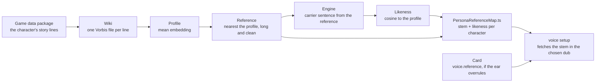

# Reference selection

A zero-shot clone is only as good as its reference, and a character has tens of lines to choose from — one-second interjections and minute-long stories, in registers from a whisper to a shout. Which one represents the voice is a measurement, not a guess. The [voice match benchmark](/docs/infra/claude-interface/voice-match-benchmark) already makes it from the game install; this proposal makes it from the wiki instead, because the wiki is where the plugin fetches the clip from, and a measurement over the same file the plugin will use is the only one that measures the right thing.

## What the measurement computes

For every character on the roster, in one dub:

1. **Their lines.** The character's story lines from the game data the plugin already depends on — the friendship lines, whose register is the one a reply is spoken in; the combat lines are left out. Each title is resolved to the wiki's file for it, fetched, and decoded with the plugin's own Vorbis decoder, into a temporary folder that is never committed.
2. **The profile.** One unit embedding per clip through the speaker-verification encoder the benchmark already runs in process, averaged and renormed — the centre of the character's voice.
3. **The reference.** The clip nearest that centre by cosine among those at least a configured number of seconds long and at or above a configured signal-to-noise floor: the clip that is most typically the character, which is what a clone should be conditioned on.
4. **The likeness.** The reference trimmed to the engine's reference length, encoded into speaker tensors, one fixed carrier sentence synthesized from them, and the output's embedding against the profile. Same encoder, carrier and trim for every character, so the numbers compare across the roster.

The profile is a working value and is not written anywhere. The run is minutes over the roster — the clips are a few hundred kilobytes each and the encoder is fast — so there is no memory of past runs to keep; every run measures the roster whole.

## What it writes

One generated map, read by the plugin and by nobody else:

```text
packages/genshin-persona/src/generated/
  PersonaReferenceMap.ts    ← { Clorinde: { likeness: 0.78, stem: "More About Clorinde - 03" }, ... }
```

The `stem` is the line's file name on the wiki without its language prefix and extension — the string the wiki's voice-over template gives the line, which is the same in every dub. [Voice setup](/docs/proposals/infra/character-voice/voice-setup) composes the file title from it and the chosen dub and asks the wiki for the file's URL in one call. The `likeness` is what the roster's numbers are read from: a character whose clone scores low is a character whose reference the ear should look at, and the card is where the ear's answer goes.

One map rather than a module per character, which is the shape the [generated artifacts](/docs/architecture/generated-artifacts) page prescribes for the voice table today: the map is a hundred-odd one-line entries the plugin reads whole in one import, a re-run still changes one line per character that moved, and the rule's other reason — a consumer that loads one entity's module as it loads one card — buys nothing at this size. That page's example changes with the table it describes.

Precedence is resolved in code, never by copying: the card's `voice.reference` where the ear wrote one, else the map's entry.

## The runner

It lives in `scripts` beside the benchmark it replaces, since the plugin package declares no devDependencies and the encoder and the engine are both heavy: one command, `--write` to regenerate the map, the dub as an argument defaulting to English. It reuses what the benchmark measures per clip — the encoder, the resampling, the frame analysis that reads a clip's speech seconds and noise floor — and drops the rest: the package index, the hash, the Wwise decoder, the transcriber, the catalogue fit and the composite.



## Notes

- The measurement runs on one dub and its stem serves every dub. Whether the Japanese performance of the _same_ line is the best Japanese reference is a refinement the runner can make by running per dub and keying the map by it; it starts with English, the language the ear settled on.
- The likeness is a validation number, not a ranking: there is no catalogue to rank any more, and one character's score is compared with their own next run, not with another character's.
- A character none of whose lines qualify, or whose wiki page spells a name the game data does not, is reported and gets no entry; the plugin then speaks them in the longest story line the wiki lists — spoken, never silent — and the `voice` verb says the choice was a rule's.
