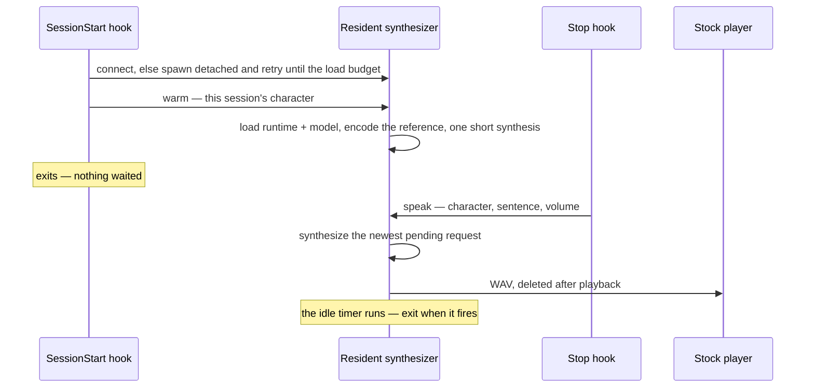

# Resident synthesizer

Loading the engine costs seconds and the first synthesis in a process costs seconds more, while a warm synthesis runs faster than speech. The Stop hook is a fresh process per reply, so it cannot hold the model — a resident process does, and every hook is a client of it.

## The process

One `voice` server script in the plugin, run detached with its standard streams closed, that:

1. **Loads the runtime from the state directory**, not from the plugin's own `node_modules`: the package the `voice` verb installed under `~/.claude/genshin-persona/runtime/` is resolved from that directory's manifest and imported by the resolved path, so the plugin's manifest never names it ([voice setup](/docs/proposals/infra/character-voice/voice-setup)).
2. **Loads the model** with a device per component — the speech encoder on the CPU, since the WebGPU provider is where it runs and the encoder runs once per character; the language model and the vocoder on WebGPU, with the CPU as the fallback when no adapter is found. The device that actually loaded is what the `voice` verb reports, because a CPU fallback speaks several times slower than real time and the person should know that is what they have.
3. **Listens on a local socket** — a named pipe on Windows, a socket file in the state directory elsewhere; node's `net` serves both from one path constant, and there is no port to collide on. A second server finding the address taken exits at once, so a race between two hooks leaves exactly one.
4. **Speaks a request**: the reference for the request's character in the current language is decoded from its cached clip, trimmed to the engine's reference length and encoded once per process; the sentence is synthesized from those tensors; the volume is applied as a gain on the samples; the WAV is played through the same stock player the hook plays through today.
5. **Exits when idle** past a configured timeout, freeing the GPU memory the loaded model holds. The next hook wakes it again, at the cold cost.

## Only the newest reply is spoken

Two replies can land while one sentence is being synthesized — a fast turn, a hook re-fired on resume. The server keeps **one** pending request: a new one replaces it. A reply spoken after the next has already arrived is noise, and the plugin already speaks a first sentence rather than a whole reply for the same reason. Playback in progress finishes; nothing interrupts a sentence half-said.

## The hooks as clients

The Stop hook keeps its gate — muted, or no voice set up, means nothing happens — then connects and sends one request and exits. If the server is not running it spawns one and retries the connection for as long as a load takes, then gives up silently; the plugin's rule that a reply that cannot be spoken is simply not spoken holds unchanged. The SessionStart hook does the same with a `warm` request instead, so the load and the first-synthesis cost are paid while the person reads the card and types, not on the first reply.

## Failure semantics

- **The server cannot load** (a missing runtime, a corrupt weight, a provider that rejects the graph): it writes the reason to a log file in the state directory and exits. Every hook then finds no server, spawns one, watches it die, and stays silent — the same behaviour as today's declined synthesis, with a diagnosis on disk where there was none.
- **A synthesis throws** mid-request: the request is dropped, the reason logged, and the server keeps serving. A model that throws on one sentence does not have to be reloaded for the next.
- **A stale socket file** (a server killed without cleanup) is removed before binding when nothing answers on it.

## What it does not do

- **Streaming.** The port synthesizes the whole sentence and then runs the vocoder once over every token, so the first sample arrives after the last token; splitting a sentence into clauses to overlap synthesis with playback is a refinement the warm number does not yet demand.
- **Serve the app.** It is a personal machine's process for a personal plugin; nothing in the estate knows it exists, exactly as the deferred page promised.

## Notes

- The client's whole protocol is one JSON line in and one status line back, so a person can test the server from a shell with nothing but the socket path.
- The idle timeout and the load budget are the two constants a person might tune; the plugin declares both and nothing else about the server is configurable, because the `voice` verb is where the choices are made.
