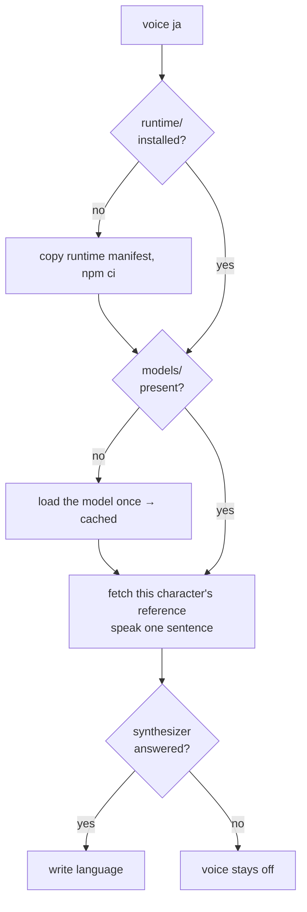

# Voice setup

The plugin ships code and cards. The engine's runtime is a few hundred megabytes of native binaries, the weights a gigabyte or two, and the plugin install runs a frozen `npm ci` with a one-minute ceiling — so none of it can be a dependency of the plugin, and all of it is installed by one verb into the directory the plugin already owns for its state, the way a project's `node_modules` is installed beside the project rather than shipped with it.

## The verb

```bash
node "${CLAUDE_PLUGIN_ROOT}/scripts/genshin.ts" voice ja   # set up, or switch the reference language
node "${CLAUDE_PLUGIN_ROOT}/scripts/genshin.ts" voice      # report what is installed and which device loads
```

Run with a language, it does four things in order, each skipped when already done:

1. **The runtime.** The plugin carries a second, tiny manifest — `runtime/package.json` with its own npm lockfile — naming the one package the engine needs. The verb copies both into `~/.claude/genshin-persona/runtime/` and runs `npm ci` there, with lifecycle scripts off, since the ONNX runtime's Windows binaries ship in the package and its only script fetches a CUDA build on Linux. The manifest is a manifest, so Renovate moves its version like every other, and a bumped lockfile is picked up by the next `voice` run. The plugin's own manifest never names the package; the hooks resolve it from the state directory's manifest and import it by the resolved path.
2. **The weights.** The runtime's own loader fetches what it is asked to load into a cache directory the verb points at `~/.claude/genshin-persona/models/`, so "download the weights" is "load the model once": the verb instantiates it with the component dtypes and devices the plugin declares, which fetches exactly those files and no other variant, and reports the device that loaded — WebGPU on this machine, or the CPU fallback and the warning that comes with it.
3. **The proof.** The verb fetches the current session's character's reference in that language and speaks one sentence through the [resident synthesizer](/docs/proposals/infra/character-voice/resident-synthesizer), so the person hears the voice they set up before the first reply does.
4. **The language.** One file, `~/.claude/genshin-persona/language`, holding the dub's code: `en`, `ja`, `zh` or `ko` — the four the wiki hosts. Every request the hooks send carries it, so a running synthesizer honours a switch without a restart. The choice is one for the whole roster: the file is one value, and a mixed roster is not a state this design holds. It is written **last**, because its presence is the gate in front of every spoken reply: a run whose synthesizer never answered the proof leaves no file behind, so the replies stay silent rather than reaching a voice that cannot speak — and a session with no character to prove against writes it on its own way out, having nothing left to fail at.

## Where a reference clip comes from

The community wiki the plugin's card authoring already reads hosts every voice line as plain Ogg Vorbis, one file per line per dub, under one name with a language prefix. The [reference selection](/docs/proposals/infra/character-voice/reference-selection) measurement commits each character's chosen file **stem**; the plugin composes the file title from the stem and the dub, asks the wiki's API for that file's URL in one call, and fetches it.

The clip lands at `references/<language>/<character>.ogg` and is decoded by the one small Vorbis decoder the plugin gains as a real dependency. It is fetched **when first needed**, by the synthesizer on the session-start hook's warm request — the hook that already reaches the network for the lore pick — so a setup never downloads the roster, and a character who never gets picked never gets fetched. A file the wiki no longer has under that name is reported by the verb rather than guessed around.

## The state directory after setup

```text
~/.claude/genshin-persona/
  picks.tsv · pin · muted · volume     ← as today
  language                             ← the dub's code
  runtime/                             ← the engine's package, npm-installed here
  models/                              ← the weights, the runtime's own cache layout
  references/<language>/<name>.ogg     ← one clip per character fetched so far
  voice.log                            ← why the synthesizer last refused, if it did
```



## Teardown

The existing `teardown` verb, which removes the status line and the spinner, also removes this directory's voice half — runtime, models, references, language and log — because a setup that leaves gigabytes behind after the plugin is gone is a setup whose lifecycle was half-written. The pick records and the pin are the persona's, not the voice's, and stay.

## Notes

- Muting is unchanged and orthogonal: `mute` keeps a fully set-up voice silent, and an absent runtime keeps replies silent with nothing to mute.
- `npm` is present wherever the plugin installed, since the plugin install ran it; the verb runs it as a child process rather than reimplementing an install.
- The clip is cached and not committed for the reason the [index](/docs/proposals/infra/character-voice) gives, and the cache is the person's to delete: nothing in the repository knows a clip exists.
