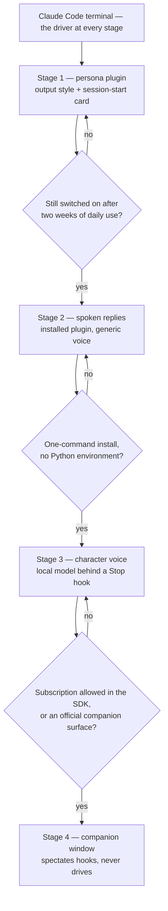

# Claude interface

The wish list is personality (a Genshin character rather than caveman, rotating), a spoken voice in that character, and eventually a companion on the desktop rather than a terminal. The constraint is maintenance: nothing that has to be re-implemented when the tool moves under it. Those two pull against each other, and the survey below says where they meet — **the terminal already exposes every hook the wish list needs, so the plan is a small plugin now and a gate in front of everything else**, with each gate naming the thing outside our control that has to move first.

## What the terminal already offers

Everything here is a shipped Claude Code feature, so it costs nothing to keep. What matters about each is the one fact that shapes the stages.

| Surface                    | The fact that matters                                                                                                                                                                                                                    |
| :------------------------- | :--------------------------------------------------------------------------------------------------------------------------------------------------------------------------------------------------------------------------------------- |
| Output styles              | Alive again after being removed once and restored. A style file sets voice and tone every turn; "keep-coding-instructions" keeps the engineering behaviour; a plugin can force its own style on. Reminded to the model mid-conversation. |
| Session-start hook         | Its stdout becomes context the model sees. This is all caveman is — a script printing rules at start. It also fires on clear and compact, so what it prints survives a compaction.                                                       |
| Stop hook                  | Receives the final reply text directly, so a script can speak or summarise it with no transcript parsing.                                                                                                                                |
| Status line                | Any script, fed session JSON on stdin, rendered as one or more lines with colour; the JSON includes the active output style.                                                                                                             |
| Spinner verbs and tips     | Two settings replace the built-in verbs and tips with our own lines — the cheapest flavour there is.                                                                                                                                     |
| Voice dictation            | Built in, push-to-talk, no tokens and no cost, on Windows. Input is solved without building anything.                                                                                                                                    |
| Desktop app                | Windows build, reads the same settings, hooks and plugins as the CLI. A visual shell already exists; it changes the frame, not the personality.                                                                                          |
| Agent SDK and ACP adapters | The only way to drive a real session from a custom window. Both bill through an API key: the subscription login is not permitted for a third-party product, so a home-built driver pays API prices.                                      |

The last row is the one that decides the shape of everything after stage 1.

## The stages and their gates



A stage only opens when the gate before it answers yes, and the answer is a fact about use or about the platform, never a wish. What sits behind a closed gate is not built early because it looks fun.

## Stage 1 — the persona plugin

Built now. It replaces caveman outright: the caveman plugin is disabled and its marketplace entry dropped in the same step.

**Where it lives.** A plugin is installed per user and follows the person into every repository, so it is its own small public repository with a marketplace manifest, installed the way caveman is today. Nothing about it belongs in this monorepo.

**What it holds.**

```text
<plugin>/
  .claude-plugin/plugin.json      the manifest; "force-for-plugin" points the output style at itself
  output-styles/traveler.md       the voice rules, short, with coding instructions kept
  characters/<name>.md            one card per character, under fifty tokens each
  hooks/hooks.json                one session-start hook
  scripts/pick.js                 picks the day's character and prints its card
  skills/genshin/SKILL.md         "/genshin" lists the roster, pins a character, or clears the pin
```

**How a session gets its character.** The session-start script picks by day of year against the roster, so one character fronts the whole day across every session — the game's own featured-banner rhythm, and deterministic, so a compaction or a resume prints the same card again. A pin file written by the skill overrides the day's pick until cleared. The script prints the card; the card is the whole persona. The status line shows the name by reading the same pin file — a status-line script of a few lines in user settings, since none is configured today and a plugin cannot ship one.

**Why the card is small.** An output style already carries the standing voice rules, and the published comparisons of persona prompts agree that a long character sheet degrades the engineering output while a functional identity of a few lines does not. A card is a name, the element and region, three speech habits and a sign-off. The character colours the prose; the coding instructions stay the default ones. The card costs on the order of a hundred cached input tokens a turn, which is noise.

**Why a hook picks and not the model.** A skill the model chooses from would spend a decision every session on a question with a fixed answer. That is the [typed decisions](/docs/infra/typed-decisions) rule applied to the terminal: nothing the code can answer is asked of a model, and a day-of-year lookup is code.

**Maintenance.** Markdown files and one script of a few dozen lines. The one dependency on the platform is the output style, which has been removed and restored once already; if it goes again, the rules text moves into the session-start script beside the card, which is exactly how caveman works today, so the fallback is proven.

## Stage 2 — spoken replies

Installed, not built. Several published plugins already speak each reply from a Stop hook; on Windows the one to try first runs Microsoft's free neural voices through a small daemon, needs no account, and ships a skill to switch voice, mute and interrupt. A locally-run neural model is the alternative when the network is not wanted in the loop. The voice is generic; the point of the stage is to learn whether a spoken reply is something that stays on, because the gate in front of stage 3 is that question and nothing else. Setup is one install command and a restart.

## Stage 3 — the character voice

Behind the gate. The open-source few-shot voice toolkit that the character-voice community has settled on is MIT-licensed, has an ONNX inference engine with an HTTP server, and fine-tunes from minutes of reference audio. The plugin side is a Stop hook that posts a one-sentence summary of the reply to that server and plays the result, and that hook is generic: it speaks to any HTTP text-to-speech endpoint and knows nothing about whose voice answers.

The character-specific half stays local and unpublished. The publisher of the game requires written consent from both the company and the voice artist for any generative use of a character voice, sued a commercial voice-cloning service over it and won, and asks the community to report unauthorised use. Personal use on one machine, from reference audio never redistributed and a model never committed anywhere, is the only defensible shape, and the plan does not cross that line: the public plugin ships the adapter, and the voice is a file on this machine.

This is also the first stage with real maintenance — a Python environment, model formats that change with the toolkit, a GPU-or-not question the machine answers — which is why its gate is technical rather than about taste: it opens when an inference engine installs in one command on Windows with no Python environment to keep alive. That is what the next generation of these engines is converging on, and waiting for it is cheaper than owning the current one.

## Stage 4 — a companion on the desktop

Behind the platform. The open-source companion closest to what is imagined is an Electron, Vue and Pinia app under MIT with a Live2D or 3D avatar, speech in and out, and a provider layer that already includes Claude — the same stack as this repository, so nothing about it is foreign. The catch is the last row of the survey: it talks to a model through an API key, and so does every SDK or ACP bridge that could put a real Claude Code session behind it. A companion that drives Claude therefore pays API prices for every turn, on top of the subscription the terminal already uses.

The shape that stays cheap is a **spectator**: the terminal keeps driving, and the companion window subscribes to the hooks — the Stop hook for what was said, the notification hook for when attention is needed — and reacts by speaking through the stage 3 voice and animating. It holds no session, sends no tokens, and breaks nothing when it is closed. That is the version this proposal points at, and its gate is either of two platform moves: the subscription becoming permitted for personal SDK or ACP use, or Anthropic shipping a companion or avatar surface of its own. Until one happens, the desktop app is the visual shell, and it already runs stage 1 unchanged.

## Not taken

- **Replacing the terminal with a home-built interface** over the Agent SDK: API billing on every turn and a rewrite every time the harness changes shape, against a terminal that costs nothing to keep. The whole plan is built to avoid this.
- **Third-party graphical front-ends**: every one surveyed solves parallel sessions and diff review, which the desktop app now does, and none carries personality. They are a different answer to a different complaint.
- **A caveman-style terseness plugin kept alongside**: two forces on the voice at once is how a persona becomes a long prompt. If terseness is wanted, it is one line in the output style.

## Notes

- Voice dictation is on today for the cost of one command and spends no tokens; it is the input half of the companion vision, already shipped.
- A stage that closes its gate goes back one step, not to zero — the arrows in the diagram are the whole rollback plan, because every stage adds a file and removes none.
