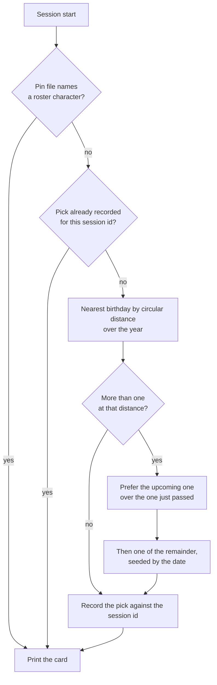

# Persona plugin

Stage 1 of the [Claude interface](/docs/proposals/infra/claude-interface). The plugin replaces caveman outright and is designed so that a new game patch costs one dependency bump and nothing hand-written.

## Where it lives

A plugin is installed per user and follows the person into every repository, so it is its own small public repository with a marketplace manifest, installed the way caveman was. Nothing about it belongs in this monorepo; this page is the spec a session builds it from.

```text
<plugin>/
  .claude-plugin/plugin.json        the manifest; "force-for-plugin" points the output style at itself
  output-styles/traveler.md         the standing voice rules, short, with coding instructions kept
  data/roster.json                  generated: every playable character, from the game-data package
  cards/<name>.md                   optional, authored: the voice card a character has earned
  hooks/hooks.json                  one session-start hook, one stop hook (stage 2)
  scripts/pick.js                   picks the session's character and prints its card
  scripts/roster.js                 regenerates data/roster.json from the game-data package
  skills/genshin/SKILL.md           "/genshin": the roster, today's pick, pin and unpin
  skills/genshin-author/SKILL.md    how a card is written, and which characters still lack one
```

## The roster is generated

The game-data package the community maintains under MIT ships every playable character as bundled JSON — name, title, element, region, affiliation, constellation, birthday and the patch that introduced them — and follows each game patch within days. The plugin never depends on it at runtime, because a plugin install is a clone with no dependency install: a script reads the package and writes the small "roster.json" the hook actually loads, and that file is committed.

A new patch is therefore one event: Renovate opens the bump, a workflow on that pull request reruns the roster script and commits the result, and the new characters exist the moment it merges. Nothing is scheduled and nothing is authored. A character with no card is fully usable — the data alone is a persona — which is what makes "every playable character" a property of the pipeline rather than a backlog.

## How a session gets its character

The pick is **whoever's birthday is nearest to today**, so the character changes with the calendar rather than by a counter, and the card can say why — "it is Hu Tao's birthday" or "Furina's birthday is in three days" — which gives every session a line of context that is true today and false next week.



The edge cases, each decided:

- **Several share the nearest birthday.** First the upcoming one wins over the one just passed, because anticipation reads better than aftermath. Among what is left the choice is seeded by the date, so it feels random day to day and is identical for every session started that day.
- **The session crosses midnight.** The pick is recorded against the session id at startup and reused on every later start event — clear, compact, resume — so a compaction after midnight never swaps the character mid-conversation. Records older than a week are pruned on each start.
- **Year wrap and leap day.** Distance is circular over the year, so late December and early January are neighbours, and a 29 February is measured like any other day.
- **A character with no birthday** — the Traveler — is never picked by distance, and is the fallback card when the roster cannot be read, because the one character who is the player is the right one to have when the data is gone.
- **A pin names a character the roster does not hold.** The pin is ignored and the day's pick stands; the skill reports the stale pin the next time it runs.
- **Anything fails.** The script exits zero with no output. A session start is never blocked by its own decoration.

The hook reads one JSON file and one state directory, no network, well under the timeout. The status line shows the current name by reading the same per-session record — a status-line script of a few lines in user settings, since none is configured today and a plugin cannot ship one.

**Why a hook picks and not the model.** A skill the model chooses from would spend a decision every session on a question with a fixed answer. That is the [typed decisions](/docs/infra/typed-decisions) rule applied to the terminal: nothing the code can answer is asked of a model, and a nearest-birthday lookup is code.

## The card is small, and authored last

The card the hook prints is a name, title, element and region, the birthday line, and — when the character has one — the authored voice card: three speech habits and a sign-off, under fifty tokens. The output style carries the standing rules ("stay in character in prose, never in code, commits or error text"), and the published comparisons of persona prompts agree that a long character sheet degrades engineering output while a functional identity of a few lines does not. The card costs on the order of a hundred cached input tokens a turn, which is noise.

The authoring skill is what keeps the hand-written half honest. It states the card shape and its ceiling, the sources a habit may be drawn from (the character's own in-game lines and story, never invented mannerisms), and the rule that a card describes how the character speaks and never what the assistant should do. Its one command lists the characters that have no card yet, most recently released first, so authoring is a queue that is drained when someone feels like it and never a gate on a patch.

## Caveman is removed

The plugin is uninstalled and its marketplace entry removed, not just disabled. Nothing of it is carried over: if terseness is wanted, it is one line in the output style, and the reason there is no second plugin pulling on the voice is in the [not-taken list](/docs/proposals/infra/claude-interface#not-taken).

## Maintenance

Markdown files, one script of a few dozen lines, one generator, and one Renovate dependency. The one dependency on the platform is the output style, which has been removed and restored once already; if it goes again, the rules text moves into the session-start script beside the card — exactly how caveman worked — so the fallback is proven.
