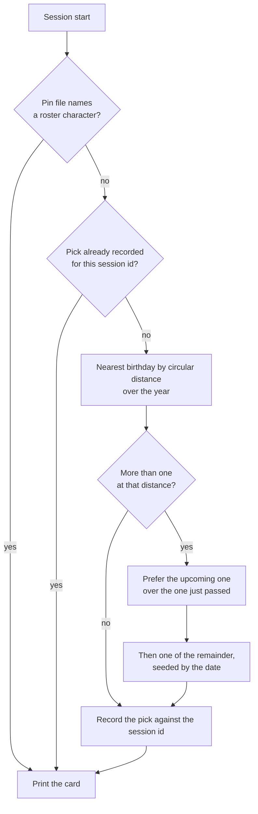

# Persona plugin

Stage 1 of the [Claude interface](/docs/proposals/infra/claude-interface). The plugin replaces caveman outright and is designed so that a new game patch costs one dependency bump this repository already automates, and nothing hand-written.

## Where it lives

Inside this monorepo, as a private workspace package that is also a plugin — because a plugin is a directory with a manifest, and a marketplace is a repository with one file at its root naming where its plugins are. Everything a separate repository would need — dependency updates, formatting, lint, tests, the review pipeline — this one already runs, so a second repository is a second copy of all of it for one folder.

```text
.claude-plugin/marketplace.json       the repository as a marketplace: one entry, pointing at the package
packages/genshin-persona/
  .claude-plugin/plugin.json          the manifest; "force-for-plugin" points the output style at itself
  package.json                        private; one devDependency, the game-data package, on the catalog
  output-styles/traveler.md           the standing voice rules, short, with coding instructions kept
  cards/<name>.md                     optional, authored: the voice card a character has earned
  hooks/hooks.json                    one session-start hook, one stop hook (stage 2)
  scripts/pick.ts                     picks the session's character and prints its card
  scripts/speak.ts                    stage 2: speaks a one-line summary of the reply
  skills/genshin/SKILL.md             "/genshin": the roster, today's pick, pin and unpin, mute and unmute
  skills/genshin-author/SKILL.md      how a card is written, and which characters still lack one
```

The root manifest is the one file outside the package, and it is the one path the tool fixes: it must be ".claude-plugin/marketplace.json" at the repository root, so it lives beside the agent tree rather than inside it, and the [agent configuration](/docs/architecture/agent-configuration) page records it when this ships.

On this machine the checkout is added as a **local marketplace**, and a plugin whose source is a relative path inside a local marketplace is loaded in place — not copied — so every pull of the repository is the plugin's update and there is no install step to repeat. The same manifest serves any other machine through the repository's GitHub source.

## The roster is a dependency

The game-data package the community maintains under MIT ships every playable character as bundled JSON — name, title, element, region, affiliation, constellation, birthday and the patch that introduced them — in its own language folders, loaded lazily, and follows each game patch within days. Because the plugin runs in place from a workspace that has its dependencies installed, the hook reads that package directly: there is no generated roster, no generator, and no test that the two agree. A new patch is a Renovate bump like any other, and the new characters exist the moment it lands and the workspace is installed.

A character with no card is fully usable — the data alone is a persona — which is what makes "every playable character" a property of the dependency rather than a backlog. The cost of this choice is one JSON read of a few megabytes at session start, well inside the hook's timeout and far below anything a session notices.

## How a session gets its character

The pick is **whoever's birthday is nearest to today**, so the character changes with the calendar rather than by a counter, and the card can say why — "it is Hu Tao's birthday" or "Furina's birthday is in three days" — which gives every session a line of context that is true today and false next week.



The edge cases, each decided:

- **Several share the nearest birthday.** First the upcoming one wins over the one just passed, because anticipation reads better than aftermath. Among what is left the choice is seeded by the date, so it feels random day to day and is identical for every session started that day.
- **The session crosses midnight.** The pick is recorded against the session id at startup and reused on every later start event — clear, compact, resume — so a compaction after midnight never swaps the character mid-conversation. Records older than a week are pruned on each start.
- **Year wrap and leap day.** Distance is circular over the year, so late December and early January are neighbours, and a 29 February is measured like any other day.
- **A character with no birthday** — the Traveler — is never picked by distance, and is the fallback card when the data cannot be read, because the one character who is the player is the right one to have when the data is gone.
- **A pin names a character the roster does not hold.** The pin is ignored and the day's pick stands; the skill reports the stale pin the next time it runs.
- **The workspace is not installed** — a fresh clone before the first install — or **anything else fails.** The script exits zero with the Traveler card or with nothing. A session start is never blocked by its own decoration.

The hook reads one package and one state directory, no network. The status line shows the current name by reading the same per-session record — a status-line script of a few lines in user settings, since none is configured today and a plugin cannot ship one.

**Why a hook picks and not the model.** A skill the model chooses from would spend a decision every session on a question with a fixed answer. That is the [typed decisions](/docs/infra/typed-decisions) rule applied to the terminal, and a nearest-birthday lookup is code.

## The card is small, and authored last

The card the hook prints is a name, title, element and region, the birthday line, and — when the character has one — the authored voice card: three speech habits and a sign-off, under fifty tokens. The output style carries the standing rules ("stay in character in prose, never in code, commits or error text"), and the published comparisons of persona prompts agree that a long character sheet degrades engineering output while a functional identity of a few lines does not. The card costs on the order of a hundred cached input tokens a turn, which is noise.

The authoring skill is what keeps the hand-written half honest. It states the card shape and its ceiling, the sources a habit may be drawn from (the character's own in-game lines and story, never invented mannerisms), and the rule that a card describes how the character speaks and never what the assistant should do. Its one command lists the characters that have no card yet, most recently released first, so authoring is a queue that is drained when someone feels like it and never a gate on a patch.

## Caveman is removed

The plugin is uninstalled and its marketplace entry removed, not just disabled. Nothing of it is carried over: where terseness goes instead, and why no second plugin pulls on the voice, are both in the [not-taken list](/docs/proposals/infra/claude-interface#not-taken).

## Maintenance

Markdown files, two scripts of a few dozen lines, and one Renovate-owned dependency in a workspace that already has hundreds. The one dependency on the platform is the output style, which has been removed and restored once already; if it goes again, the rules text moves into the session-start script beside the card — exactly how caveman worked — so the fallback is proven.
