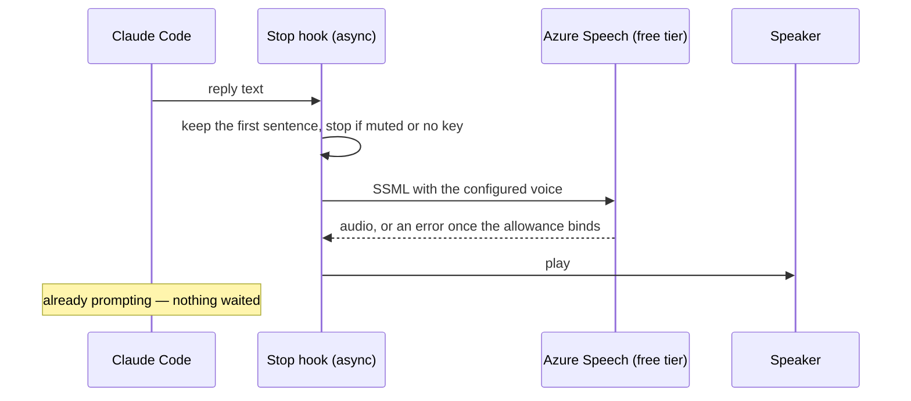

# Spoken replies

Stage 2 of the [Claude interface](/docs/proposals/infra/claude-interface): a generic neural voice, through a supported API, on a resource that costs nothing. Its purpose is to learn whether a spoken reply is something that stays switched on, because that is the gate in front of the character voice and nothing else is.

## Scope

**Today:** the Pulumi estate holds no speech resource, and the terminal has no notion of audio output. The Stop hook already hands a script the final reply text.

**This adds:**

1. **One Pulumi resource** — a Cognitive Services account of the speech kind on the free tier, one file under the provider namespace it belongs to per the [Pulumi layout](/docs/infra/azure-pulumi-layout), with a parent and no alias like every other new resource. The free tier gives half a million neural characters a month and never expires; a one-line summary is on the order of a hundred characters, so the allowance covers thousands of replies before it binds, and when it binds the service returns an error the hook swallows rather than a bill. It sits inside the estate's cost guard like everything else.
2. **One hook in the persona plugin** — a Stop hook, run asynchronously so the prompt never waits on it, that takes the reply text, keeps its first sentence, posts it to the speech endpoint with the voice the plugin's user configuration names, and plays the audio. The endpoint and key come from the plugin's user configuration, the key marked sensitive so it lands in the credential store and never in a settings file. With no key configured the hook is a no-op, so the plugin works on a machine that never set stage 2 up.
3. **A skill verb** — the existing "/genshin" skill gains mute and unmute, which write a flag the hook honours.

The key reaches the machine once, read from the stack output after the first deploy; it is a personal credential for a personal machine and is not a repository secret, so it never enters ESC or the GitHub environment.

## Why Azure and not a published plugin

The published voice plugins that cost nothing reach the same Microsoft neural voices through an unofficial endpoint that has changed under them more than once, and every break is somebody else's fix to wait on. The same voices through the supported API, on a resource provisioned the way every other resource here is, is fewer moving parts we do not own. The hook itself is small enough that "install, don't build" bought nothing.

## What this stage does not do

The voice is one of the catalogue voices, chosen once in user configuration. Azure's custom and personal voice features are structurally unavailable for a game character — they require the voice talent's recorded consent — so the character voice is stage 3 on the [index page](/docs/proposals/infra/claude-interface), which reuses this hook against a local endpoint and adds nothing to the estate.

## Notes

- The hook speaks a summary, not the reply: a reply is often a table or a diff, and the point is to know the turn ended and what it said, not to hear code read aloud.
- Free-tier speech resources are limited to one per subscription; the estate has none, so this is it.
