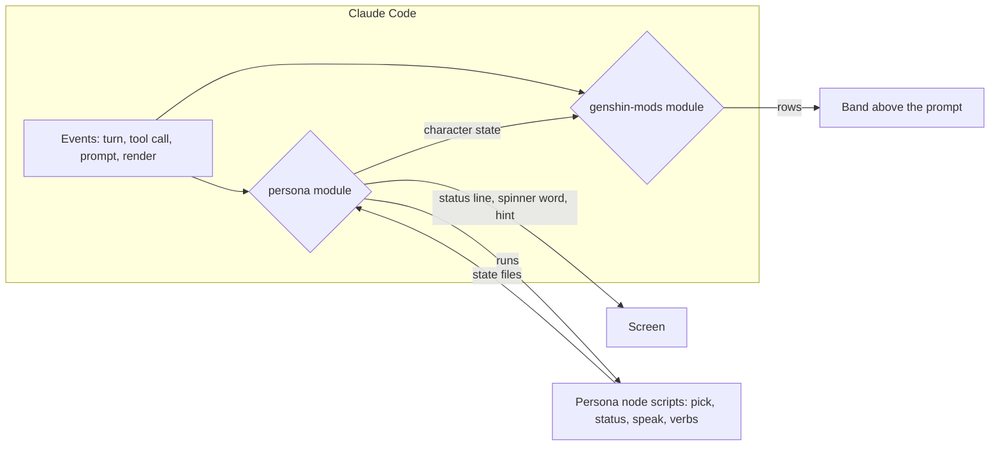

# Claude Code mods

Claude Code now loads **mods**: plugins whose hooks run inside the engine's own process as a TypeScript module, rather than as shell commands it spawns. A mod can draw a band above the prompt, a pane, the status line and the spinner, show toasts, register slash commands, ask the person a question, rewrite a tool call before it runs and read the session's usage. The [persona plugin](/docs/infra/claude-interface/persona-plugin) was built before any of that existed, and much of its code exists to get around its absence. This proposal adds a second plugin of five mods and moves the persona onto the same hooks.

## Scope

**Today:** the persona plugin is the repository's one plugin with a surface of its own. It writes the status line, the spinner and a reply-reading hook into the person's user settings through `setup`, `teardown` and `voice`, re-aims launchers in its state directory on every session start, and wraps each verb in a skill of its own. Nothing shows the cache, the usage limits, the task list of a long goal or another session's edits.

**This proposal adds:**

- **A `genshin-mods` plugin**, a sibling of the persona under `packages/`, carrying five mods in one hooks module. They are [waypoints](/docs/proposals/infra/claude-mods/waypoints) (the next steps, one click each), [resin](/docs/proposals/infra/claude-mods/resin) (cache, context, limits and cost, with warm, compact and a one-click handoff), [veil](/docs/proposals/infra/claude-mods/veil) (recording mode), [commission](/docs/proposals/infra/claude-mods/commission) (a goal's task list and clock) and [ward](/docs/proposals/infra/claude-mods/ward) (a question before editing a file another session just changed).
- **The persona on function hooks** ([persona function hooks](/docs/proposals/infra/claude-mods/persona-function-hooks)): the status line, a spinner per session, the spoken replies and one command, none of them written into user settings, so `setup`, `teardown`, the launchers and the verb skills are deleted.

The five come from a public walkthrough of mods one person built for their own work (Sources). Each is kept where it answers something this repository's sessions do every day: several sessions share one checkout, long turns run task lists, and the context of a long session is what costs.

## Decisions

- **One plugin, one module, one band.** The engine gives each plugin one hooks module and one band above the prompt. The five mods register from one module, and the band draws one row per mod whose state has something to say, so they never compete for the space.
- **Themed by the session character.** Labels use the game's own vocabulary, such as resin for spendable capacity and a waypoint for where to go next, so each name says what it does in a word a player knows. The accent is the colour the persona already reads off the character's art. The persona publishes its character as state, so the mods follow a switch made inside a session, and the game's interface gold stands in where the persona is not installed.
- **A mod is read on its own.** Every mod works with the other four switched off, and none needs the persona except for its colour.
- **Nothing a mod draws is held in a module variable.** The engine re-runs the module on every reload, so anything the drawing reads is session state, and anything kept past the session goes into the plugin's store.
- **Free.** A mod that calls the model asks through a fork of the session, which the API serves from the prompt cache the session already paid for, or not at all. No mod adds a service.

## The engine's constraints

The engine enforces a rule set of its own when it loads a mod: relative imports alone, one unmatched hook per event, `$` and every state reference kept in the file that uses them, no Node. Each rule, the shape it forces and the authoring loop are the [Claude Code mods](/docs/architecture/claude-mods) standard, so the persona's game data and voice stay in its node scripts, which its module runs as commands.

## Installing and switching

Both plugins install from the repository's own marketplace, and a checkout enables them at project scope through `.agents/settings.json` as it already does the persona. Each mod switches with its own slash command where one exists (`/veil`, `/resin`, `/waypoints`, `/commission`, `/ward`, each taking `on` or `off` and remembered across sessions), and the band hides a row the person dismissed until it has something new to say. Development loads the working tree with `--plugin-dir` while the installed copy is disabled, which is the persona's rule for the same reason.

## Key files

| File                                                  | Role                                                              |
| :---------------------------------------------------- | :---------------------------------------------------------------- |
| `.claude-plugin/marketplace.json`                     | Lists the new plugin beside the persona and the follow-ups        |
| `.agents/settings.json`                               | Enables it at project scope for every checkout                    |
| `oxlint.config.ts`                                    | Lets a mod's tree use the relative imports the engine requires    |
| `packages/genshin-persona/hooks/hooks.json`           | Gains the persona's hooks module beside its session-start command |
| `packages/genshin-persona/.claude-plugin/plugin.json` | Names the persona's state contract, which the mods' colour reads  |
| `AGENTS.md`                                           | Lists the new package                                             |

## Notes

- The agent console does not show mods. It drives sessions through the Agent SDK and draws its own page, so a band or a spinner a mod draws reaches the terminal and the desktop app alone. The console reads the same session facts directly.
- The mods API is labelled early access and changes between releases. Its declarations name the engine version that wrote them, and `claude plugin validate` is run on both plugins whenever the engine updates, which is where a breaking release shows first.

## Sources

- [Claude Code Mods Are Game Changers. Set Up These 5 NOW.](https://www.youtube.com/watch?v=9hetShMMp2s) (Nate Herk): the five mods, what each shows and how each is switched. The names here are our own.
- [etding/cache-keeper](https://github.com/etding/cache-keeper): a published build of the cache mod, taken for its row of figures and its warning before the cache goes cold.
