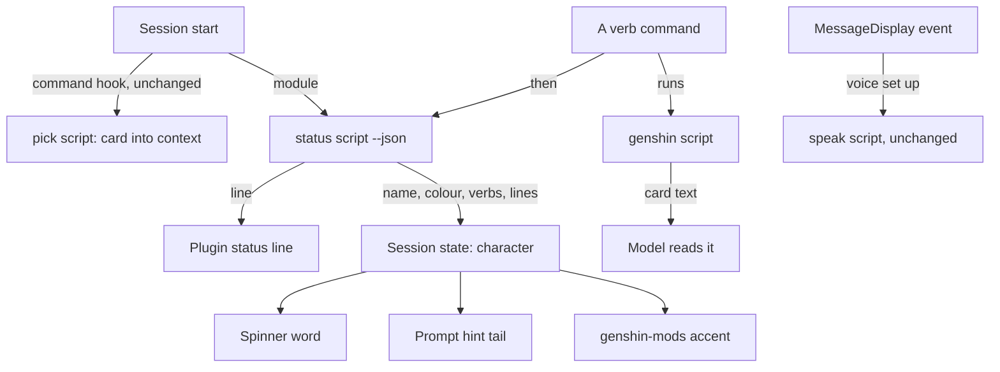

# Persona function hooks

Part of [Claude Code mods](/docs/proposals/infra/claude-mods). The [persona plugin](/docs/infra/claude-interface/persona-plugin) writes three of its surfaces into the person's user settings, because a plugin could not ship them, and its page names the condition for undoing that: a plugin able to ship those keys itself, or to pick its own spinner for each session. A hooks module does both, so this is that revisit.

## What moves

| Surface        | Today                                                                                            | After                                                                                                                                  |
| :------------- | :----------------------------------------------------------------------------------------------- | :------------------------------------------------------------------------------------------------------------------------------------- |
| Status line    | A user setting running a launcher that imports the status script                                 | The module runs the status script at session start and after any verb, and pins its line as the plugin's status                        |
| Spinner verbs  | Two user settings rewritten by a detached script, shared by every session, read once per process | The module rewrites the spinner's word from this session's character's verbs, so each session shows its own and a switch shows at once |
| Spinner tips   | The same settings' tips, the character's own lines under their name                              | One of those lines at the dim tail of the prompt hint, a new one each turn                                                             |
| Spoken replies | A MessageDisplay hook in user settings, written by `voice`, through a launcher                   | The module hooks the same event, gated on the voice being set up, and hands the same input to the unchanged speak script               |
| Verbs          | One skill per verb, each a command and a relay rule                                              | One command per verb, registered by the module from the verb enum, each running the verb script and relaying its lines                 |
| The character  | Read only by the plugin's own scripts                                                            | Also published as session state (name, localized name, colour), which the mods draw their accent from                                  |

The session-start command hook stays as it is. Its output is the card the model reads, and a module adds nothing to that. The output style stays too, since output styles are already a plugin feature.

The module is a thin shell: it imports only the plugin's own dependency-free files, such as the verb enum, by relative path, and runs everything that reads game data, state files or audio through the plugin's existing node scripts. Each script's input is what its hook received before, so the scripts change only where they wrote settings.

## What is deleted

- **The verbs `setup` and `teardown`** and their commands: there is nothing left to write or remove.
- **Every service that reads, edits or writes user settings**: the status line, spinner and speak-hook settings builders, the plugin-entry checks and the entry remover, the launcher writer, the speak-hook, spinner and session-spinner writers, and the settings reader and writer, with their tests.
- **The models those services spoke in**: the user settings and user hooks shapes, the hook entry and hook command, the status line setting, and the spinner settings shapes the tool reads.
- **The launcher paths** in the constants, and the detached spinner script with the spawn helper it was the last user of.
- **The per-verb skills**: every skill under the plugin's `skills/` but `genshin`, which still routes a request made in words (who is this, louder, be Furina) to a verb, and `genshin-author`, which drives the authoring verbs.

`status` stops reporting whether the settings are the plugin's, since none are. `voice` stops writing a hook and only installs the runtime.

## Moving an existing install

A machine that ran `setup` or `voice` holds settings that point at launchers. The person runs `teardown` once from the release before this one, which removes exactly what the plugin wrote. The plugin is installed only from this repository's marketplace, so no migration code ships for anyone else.

## Key files

| File                                                             | Role after the change                                                            |
| :--------------------------------------------------------------- | :------------------------------------------------------------------------------- |
| `packages/genshin-persona/hooks/hooks.json`                      | The session-start command and the hooks module side by side                      |
| `packages/genshin-persona/.claude-plugin/plugin.json`            | Names the state contract the mods read                                           |
| `packages/genshin-persona/scripts/status.ts`                     | Prints the nameplate, or the character as JSON for the module                    |
| `packages/genshin-persona/scripts/spinner.ts`                    | Deleted, its lines read by the status script's JSON instead                      |
| `packages/genshin-persona/scripts/speak.ts`                      | Unchanged: the same input, now handed over by the module                         |
| `packages/genshin-persona/src/models/GenshinVerb.ts`             | Loses `setup` and `teardown`, and is the list the module registers commands from |
| `packages/genshin-persona/src/services/cli/getStatusReport.ts`   | Drops the settings provenance                                                    |
| `packages/genshin-persona/src/services/readSpinner.ts`           | Reads the verbs and lines the JSON carries                                       |
| `packages/genshin-persona/skills/genshin/SKILL.md`               | The one routing skill, its table pointing at the commands                        |
| `apps/web/content/docs/infra/claude-interface/persona-plugin.md` | "The settings a plugin cannot ship" rewritten as the module, and its diagrams    |

## Notes

- The status line's colour is a 24-bit escape the terminal paints. Whether the engine draws escapes in a plugin's status text is checked first. If it does not, the line is the plain localized name and the colour lives in the mods' accent and the band.
- The display waits on the MessageDisplay event as it did on the settings hook, so a session with no voice set up pays nothing: the module's gate is a file read the engine makes, not a node start.
