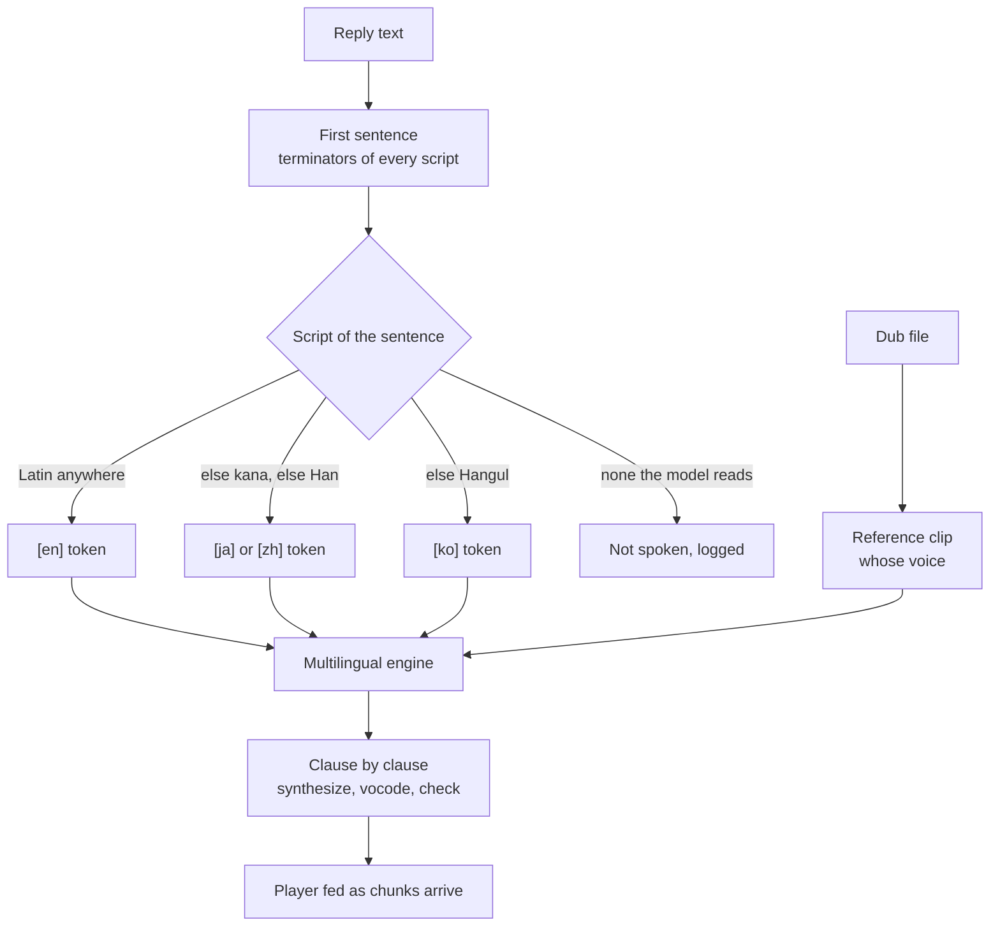

# Multilingual spoken replies

Today the dub picks **whose** voice reads a reply and nothing else: `ja` clones the Japanese actor, and the engine still reads English, because Chatterbox Turbo is an English-only model. A reply written in Japanese would reach a tokenizer with no Japanese in it and come back as the near-silence the [device ladder](/docs/infra/claude-interface/spoken-replies) takes for a provider fault, so today it is not sent at all. This proposal makes the language a property of the text rather than a limit of the engine, and shapes both ends of the pipe for the model that allows it.

## Scope

**Today:** one engine, Chatterbox Turbo, loaded by model id through the Transformers.js `ChatterboxModel` class; a reply's first sentence found by ASCII sentence terminators and dropped when no Latin letter is in it; the dub code carried on every request and used for one thing, the reference clip's wiki file prefix; a whole sentence synthesized, then vocoded once, then played as one WAV.

**This adds:**

1. **The model** — Chatterbox Multilingual, the 0.5B checkpoint trained on 23 languages including `ja`, `zh` and `ko`, the three dubs beside English the wiki hosts. Its ONNX export exists; what does not yet exist is a Transformers.js release that loads it. That release is the gate, below.
2. **The input** — the text's language detected from its script and handed to the model as its language token, sentence terminators of every script the roster speaks, and a sentence in a script no model reads dropped before it can be mistaken for a broken device.
3. **The output** — the sentence synthesized and vocoded in clauses so playback starts before the last token, because the original architecture read at half Turbo's speed when both were measured, and the warm number that made streaming unnecessary will not survive the swap.
4. **The measurement** — every precision choice and every reference likeness re-measured against the new engine, since all of them were measured against Turbo.

Nothing here touches what the dub means to the user: `voice ja` still says whose voice, and the `VoiceLanguage` codes stay the ISO ones because the model's language tokens are spelled the same way.

## The gate

Transformers.js loads Chatterbox Turbo and no other Chatterbox. The multilingual checkpoint fails at load — no "config.json" in any public export — and would fail at generation if it loaded, because it needs classifier-free guidance the JavaScript generation loop does not implement (Transformers.js issue 1656). The open pull request 1705 adds the guidance path, "min_p" sampling and the processor ordering the Python reference uses, and demonstrates French and German on WebGPU; it also notes that the community exports ship a malformed "post_processor" and that no official export with complete configs exists.

The work below starts when a **released** version of the runtime manifest's one dependency loads the multilingual checkpoint from a repository that ships its configs — checked the way the `voice` verb already proves an engine, by speaking one sentence. It does not start on the pull request's branch, and it does not start by writing the four-session generation loop by hand against the ONNX runtime: that loop with guidance, sampling and language tokens is precisely the upstream work, and a copy of it here is a second engine to maintain.

## How it works

The two inputs that were one are now two: the dub decides the clip, the text decides the token. English prose in the Japanese actor's voice — today's behaviour — is `[en]` with the `ja` clip, and stays the default, since replies are English unless asked otherwise. A Japanese reply is `[ja]` with the same clip, and native.

### The model

- `VOICE_MODEL_ID` moves to the multilingual export; Turbo's id goes with it, not kept beside — the rollback is git, as it was for the Azure path.
- `VOICE_MODEL_DTYPE` starts from Turbo's choices (half-precision speech encoder, 4-bit language model, full-precision vocoder) as hypotheses, and each is re-measured on one character before it stands.
- Generation gains the two options the checkpoint needs — the guidance scale and "min_p" — as named constants beside `UNBOUNDED_SPEECH_TOKENS`, at the values the model card's reference loop uses. Guidance runs the language model over a batch of two, so the memory a rung needs doubles; the ladder's mechanism is unchanged, and whether the top rung still fits is a fact the first load reports.
- Chinese needs the Cangjie character mapping the export ships; whether the runtime's processor applies it or the request has to is a question the release answers, and the `[zh]` path is not declared working until a Chinese sentence has been heard.

### The input

- **Script detection**, one function over the sentence with Unicode script properties, in one precedence a mixed sentence is resolved by: Latin anywhere → `en`; else Hiragana or Katakana → `ja`; else Han → `zh`; else Hangul → `ko`; else nothing the model reads → the sentence is not spoken and `voice.log` says why. The token is `[<code>]` prefixed to the text, the format the model card gives. Latin is first because replies are English unless asked otherwise, so a reply that quotes one Japanese phrase inside English prose is English; the cost is the converse, a Japanese sentence carrying one English word read as `[en]`, and a rule that weighs the scripts rather than ranking them waits for a reply somebody has heard go wrong.
- **Sentence terminators.** `getFirstSentence` stops on `.`, `!` and `?` followed by white space; the fullwidth `。`, `！` and `？` join them, with no white-space requirement, because those scripts put none after a sentence. Without this a Japanese reply is spoken whole.
- **The interim gate already in place** — `getFirstSentence` returns nothing for a sentence with no Latin letter, so the engine never sees text it cannot read and the ladder never moves for it. The script detection above replaces that gate rather than sitting beside it.

### The output

- **Clauses, not sentences.** The synthesizer splits the sentence at clause punctuation — commas, semicolons, dashes, their fullwidth forms — synthesizes each in turn and hands each vocoded chunk to the player as it lands, so the first sound arrives after the first clause's tokens rather than the last sentence's. The speech check runs per chunk with the same two thresholds; a chunk that fails moves the ladder exactly as a sentence does.
- **A player that takes a stream.** The stock player plays one file; streaming needs either a sequence of files queued back to back or a process reading PCM from a pipe. The choice is the player's per desktop and is made when the first chunk exists to play — the split above is worth having even into a queue of files.
- **The one pending request** keeps its meaning across chunks: a newer reply replaces a reply still waiting, and a reply whose first chunk is playing finishes.

### The measurement

`pnpm ai:voice-match` re-runs per dub against the new engine, `--write` regenerates the map's likeness column, and the dtype comparison the [reference selection](/docs/infra/claude-interface/reference-selection) notes record is redone on the same one character. The stems do not move — a reference is chosen from the wiki's clips before any engine speaks — so the re-run costs synthesis time and nothing else. The regenerated map commits with the trailer a generated artifact carries.

## Failure semantics

Every rule on the [spoken replies](/docs/infra/claude-interface/spoken-replies) page stands — a reply that cannot be spoken is not spoken, nothing waits — with one added and one sharpened:

- **A script no model reads** is a decision, not a fault: the request is dropped before synthesis, logged once, and the ladder does not move. The interim gate already applies this rule to everything but Latin, silently; the log line is what this adds.
- **Silence** keeps meaning a provider fault, because the only text that reaches the engine is text it can read. The check's two thresholds are unchanged.
- **The release loads but the top rung does not fit** the doubled batch: the load rejects, and the ladder moves down as it does for any rejection. The `voice` verb's report names the rung.

## Key files

The existing files the work touches, with the role each plays after the change.

| File                                                              | Role                                                                                          |
| :---------------------------------------------------------------- | :-------------------------------------------------------------------------------------------- |
| `packages/genshin-persona/runtime/package.json`                   | The one dependency whose release is the gate                                                  |
| `packages/genshin-persona/src/services/constants.ts`              | The model id, the dtypes re-measured, the guidance and sampling constants                     |
| `packages/genshin-persona/src/services/createVoiceSynthesizer.ts` | Generation with guidance; clauses synthesized and checked one at a time                       |
| `packages/genshin-persona/src/services/getFirstSentence.ts`       | Terminators of every script the roster speaks                                                 |
| `packages/genshin-persona/src/services/getSpeechRequest.ts`       | The script detected and the language token attached; the unreadable dropped                   |
| `packages/genshin-persona/src/models/SpeechRequest.ts`            | The text's language beside the dub, two fields where there was one                            |
| `packages/genshin-persona/src/models/VoiceLanguage.ts`            | Unchanged codes — the dub's and the model's tokens are the same ISO spelling                  |
| `packages/genshin-persona/src/services/playAudio.ts`              | A player fed chunks rather than one file                                                      |
| `packages/genshin-persona/scripts/voice.ts`                       | The resident synthesizer streaming chunks under the one-pending-request rule                  |
| `scripts/src/services/voiceMatch/measureCharacterReference.ts`    | The likeness re-measured through the new engine                                               |
| `apps/web/content/docs/infra/claude-interface/spoken-replies.md`  | Rewritten as-built: the engine section, the ladder's memory, streaming no longer a "does not" |

## Notes

- The spelling question is settled: `ja` is the wiki's clip prefix, the ISO code and the model's token; "jp" is a country and would be a fourth spelling between the user and three systems that agree.
- The original architecture carries two inputs Turbo lacks — an exaggeration and a guidance weight per request. A per-character exaggeration read off the card is the obvious use and is out of this proposal's scope; it is a persona feature, and it waits for the ear to say the default reads flat.
- Whether the session **replies** in the dub's language is the output style's question, not the engine's: this proposal makes a Japanese sentence audible, and says nothing about who writes one.
