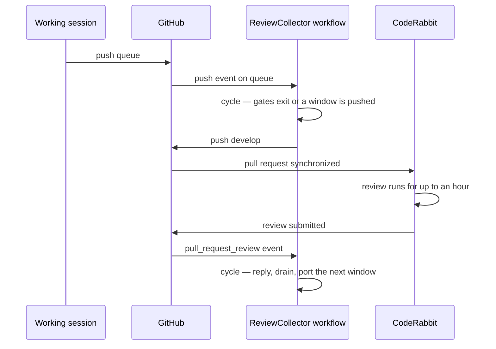

# Runner

The [collection cycle](/docs/proposals/infra/review-collector/collection-cycle) is a script; this page is the thing that runs it when nobody is at a keyboard. It is a GitHub Actions workflow, `ReviewCollector.yaml`, because the two facts the cycle needs to react to — a branch push and a review submission — are webhooks GitHub already delivers to Actions, the repo already runs Claude Code headless there (`claude-warmup.yaml`), and the alternatives fall short in ways that matter: a cloud routine is cron-only with an hour floor and has no event input, a local `/loop` dies with the session that started it, and the raw API would rebuild the agent loop `claude -p` already is, without the skills tree that teaches it how findings are answered.

## Triggers



Three events, and every one runs the identical cycle:

- **`push` on `queue`** — the allocation event. Fires on every push the session makes, which under a standing sweep is one per commit; almost all of them exit at the gates within seconds of the checkout. The one that arrives when the slot is free and the queue has reached the target is the one that pushes.
- **`pull_request_review` of type `submitted`**, filtered in the job's `if` to the bot's login and to a pull request whose head is `develop` — the free event. Renovate's pull requests also target `main` and also get reviewed, and the filter is what keeps their reviews from running a cycle against the release pull request for nothing. The workflow file for this event is taken from the pull request's merge ref, so it runs from `develop`'s copy while the release pull request is open; it does not need to be on `main` first.
- **`workflow_dispatch`** with a `force` boolean, passed through to the script — the manual nudge, for a short window worth pushing anyway or for a webhook that was dropped.

**No `schedule`.** [No polling](/docs/architecture/no-polling) is the repo's standing rule and this is the case it was written for: a cron would be a loop asking "anything yet?" against two signals the platform already pushes. The cost of the rule is that a dropped webhook waits until the next queue push, and a session that has stopped pushing has no next push — that is what the dispatch is for. Once the workflow file is on `main`, the `status` event becomes available as a third, more exact free signal, since it fires on the commit status CodeRabbit flips at completion and covers a rate-limited completion that posts no review body; it runs from the default branch only, which is why it is the follow-on rather than the design.

## The job

```yaml
concurrency:
  group: review-collector
  cancel-in-progress: false
```

The group serializes every run, whichever event fired it. The bot's own replies arrive as `pull_request_review` events, so a drain is followed by several fires within seconds; each waits for the one ahead of it and then exits at the gates. `cancel-in-progress` stays false because a run in the port step holds nothing another run needs, and cancelling one mid-push would be the only way to lose work.

The steps are the warmup workflow's, plus the script:

1. Checkout with the full history and the three refs the cycle reads — `develop`, `queue` and, when it exists, `review-fixes`. A shallow clone cannot run `git cherry` across them.
2. The repo's dependency setup action, so `tsx` and the `scripts` package are available.
3. The trust-dialog shim from `claude-warmup.yaml`, since a fresh runner has no `~/.claude.json` and treats the checkout as untrusted.
4. `pnpm ai:coderabbit:collect <pr>` with `--force` when the dispatch input says so. The script finds the pull request itself.

The script spawns `claude -p` for the drain step with the open findings on its stdin and permission prompts bypassed. The runner is ephemeral, holds one credential scoped to this repository, and is discarded when the job ends, so the interactive permission model protects nothing here and would only stall the drain on its first `git commit`. Claude's output streams into the job log, which is where what it decided is read.

## Credentials

| Secret                    | Holds                                                                                          | Why                                                                                                 |
| :------------------------ | :--------------------------------------------------------------------------------------------- | :-------------------------------------------------------------------------------------------------- |
| `CLAUDE_CODE_OAUTH_TOKEN` | the Claude Code subscription token, already present                                            | the drain step, exactly as the warmup uses it                                                       |
| `REVIEW_COLLECTOR_TOKEN`  | a fine-grained personal access token, contents and pull requests read-write on this repository | pushes to `develop`, thread replies, `review-fixes` — the built-in `GITHUB_TOKEN` cannot do the job |

The built-in token is ruled out by a platform rule rather than a permission: a push made with `GITHUB_TOKEN` starts no workflow runs, so `develop`'s CI and its deployment would never fire on a collector push, and the release branch would silently stop deploying. It also posts as the shared Actions bot, so a collector reply could not be told from any other workflow's comment. The personal token posts and pushes as the account that owns it, which is the same identity the manual process has always used. Repository secrets are Pulumi-managed in `apps/infra`, so the new one is declared there beside the existing ones and its value supplied as stack configuration.

## Failure semantics

A run fails red and leaves the remote in a state the next run resumes from, because of how the cycle orders its effects:

- **Before the push,** everything is a local branch in the runner. A crash during read, gate or port leaves no remote trace at all.
- **The drain** pushes `review-fixes` only after Claude exits successfully. A crash mid-drain discards Claude's partial commits with the runner, and the next run drains the same open set from scratch. Repeated failure on one review hits the attempt cap the cycle page describes and is quarantined with a visible comment.
- **The push** is a single fast-forward that either moves `develop` or is refused. Nothing else in the run is half-applied when it fails.
- **After the push,** the replies are predicate-guarded. A crash before they are all posted is finished by the next run's reply-first step, whichever event fires it.

A red run is the poison signal, and the job summary says which step and why — the gate that failed, the commit that conflicted, the range that stayed red. Nothing pages; the repo's observability posture is deliberately absent, so the collector's failures are found where every other workflow's are, in the Actions tab.

## Key files

| File                                         | Role after the change                                       |
| :------------------------------------------- | :---------------------------------------------------------- |
| `.github/workflows/claude-warmup.yaml`       | the headless invocation and trust shim this workflow reuses |
| `.github/actions/setup-project-dependencies` | the install step, unchanged                                 |
| `apps/infra/src/github`                      | gains the collector token as a repository secret            |

## Notes

- **Runner minutes are not the constraint.** The repository is public, so Actions minutes are free, and most runs exit at the gates before the dependency install matters. If that ever changes, the gates can move into a first job that needs only `gh` and `git`, with the install gated behind them.
- **The drain has a wall clock.** A `timeout-minutes` on the job bounds a Claude session that has lost its way; the cycle's ordering means a timeout costs the same as a crash, which is nothing on the remote.
