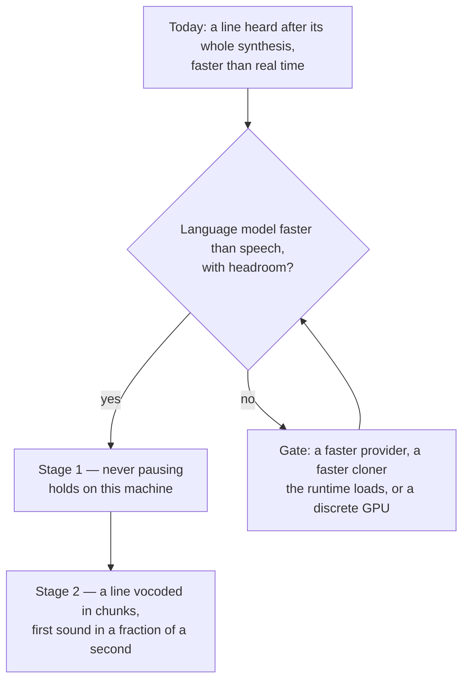

# Seamless spoken replies

Today a reply's spoken lines are read as each is written, every line after its whole synthesis, the engine warmed at the session start ([spoken replies](/docs/infra/claude-interface/spoken-replies)). The engine reads faster than real time on this laptop, so a line's playback never pauses once it starts and the next line is ready before the one before it ends; what remains is the wait before the first sound, which is a line's whole synthesis — a couple of seconds for a short sentence — so a line is heard a beat after the character says it rather than as they do. The goal is a line that sounds the moment it is written, and this page states what that means in measurable terms and what shape reaches it.

## Scope

**Today:** one engine, Chatterbox Nano through the ONNX runtime, its language model on this machine's integrated GPU and its vocoder on the CPU; each line synthesized whole, vocoded once, then played; the `MessageDisplay` hook the trigger, handing a line to the engine as its line break is written; the numbers in the committed bench beside the [reference selection](/docs/infra/claude-interface/reference-selection), `scripts/src/voiceMatch/synthesizer.bench.md`.

**Two stages**, each a property that can be measured rather than a feeling:

1. **Never pausing.** Synthesis faster than playback with headroom — a real-time factor under one — so once a line's first sentence plays, everything after it is ready before the sound before it ends. Nothing about the shape of the reading changes for this stage; it is compute alone, and the bench is the instrument: the stage holds when the short sentence reads in less than its own spoken length. **It holds on this machine** since the engine moved to Nano, whose one-step vocoder took the larger part of a short sentence's cost off the CPU.
2. **First sound within a fraction of a second** of the line being written. The line's whole synthesis is the wait, so this stage streams inside a line: the language model's speech tokens are vocoded a few dozen at a time as they are made and each chunk plays as it lands, the shape of [chatterbox-streaming](https://github.com/davidbrowne17/chatterbox-streaming), the engine's streaming fork. It pays only while stage 1 holds, because every extra vocoder pass re-runs the reference's tokens, so on a machine slower than real time the chunks would arrive later than the whole line would have.

## The shape of stage 2

- **Chunks, not lines.** The synthesizer hands the vocoder the speech tokens made so far every few dozen, each pass over the reference's tokens and the chunk's, and hands each vocoded chunk to the player as it lands. The speech check runs per chunk with the same two thresholds; a chunk that fails moves the device ladder exactly as a line does.
- **A player that takes a stream.** The stock player plays one file; streaming needs either a sequence of files queued back to back or a process reading PCM from a pipe. The choice is the player's per desktop and is made when the first chunk exists to play.
- **The one pending request** keeps its meaning across chunks: a newer reply replaces a reply still waiting, and a reply whose first chunk is playing finishes.
- **The instrument.** The bench gains a time-to-first-sound column beside the whole-line mean, since the stage is measured by the first chunk and not the last.

## What this does not propose

- **Dropping the clone for speed.** A catalogue voice reads faster on any hardware; the persona is the character's own voice or it is nothing.
- **Two lines in flight.** Measured and rejected on the [spoken replies](/docs/infra/claude-interface/spoken-replies) page: the vocoder's threads take every core, so the language model gains nothing from running beside it.
- **A stock line played to cover the wait.** A bark that is not the reply's own line is a fake, and nothing is made ahead: every spoken line is written for its ask, the card's greeting included, which the welcome shows and no reply repeats.

## Key files

| File                                                              | Role                                                                                 |
| :---------------------------------------------------------------- | :----------------------------------------------------------------------------------- |
| `scripts/src/voiceMatch/synthesizer.bench.ts`                     | The instrument: flipped on to read whether stage 1 holds on a machine                |
| `packages/genshin-persona/src/services/createVoiceSynthesizer.ts` | Stage 2 — tokens vocoded in chunks as they are made, the speech check per chunk      |
| `packages/genshin-persona/scripts/voice.ts`                       | Stage 2 — the player fed chunks of a line under the one-turn-pending rule            |
| `packages/genshin-persona/src/services/constants.ts`              | The device ladder and the engine's variants, re-measured on whatever closes the gate |

## Notes

- The [multilingual spoken replies](/docs/proposals/infra/multilingual-spoken-replies) proposal streams by clause to pay for a slower engine; that is stage 2's shape arriving for a different reason, and the two proposals share the player and the synthesizer's chunking when either lands.
- Stage 1 is a property of the machine, not of the code: a slower host reopens its gate, and the page then says which gate stood while the reading stays a line heard after its whole synthesis.
