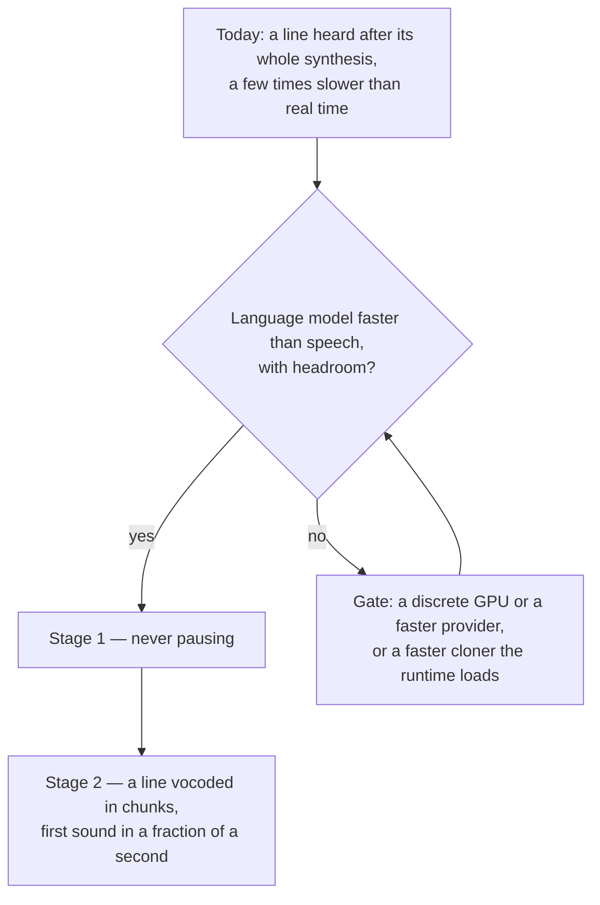

# Seamless spoken replies

Today a reply's spoken lines are read as each is written, every line after its whole synthesis, the engine warmed at the session start ([spoken replies](/docs/infra/claude-interface/spoken-replies)). On this laptop that synthesis is several seconds for a short sentence, a few times longer than the sentence takes to say, so a line is heard while the reply is still streaming rather than as the character says it, and a two-sentence line, or a closing line following an opening one, pauses wherever a sentence takes longer to make than the one before it took to play. The goal is a line that sounds the moment it is written. This page states what that means in measurable terms, why it is out of reach here today, and what would bring it in — so the next session reads the gates rather than timing the engine again.

## Scope

**Today:** one engine, Chatterbox Turbo through the ONNX runtime, its language model on this machine's integrated GPU and its vocoder on the CPU; each line synthesized whole, vocoded once, then played; the `MessageDisplay` hook the trigger, handing a line to the engine as its line break is written; the numbers in the committed bench beside the [reference selection](/docs/infra/claude-interface/reference-selection), `scripts/src/voiceMatch/synthesizer.bench.md`.

**This defines** two stages, each a property that can be measured rather than a feeling:

1. **Never pausing.** Synthesis faster than playback with headroom — a real-time factor well under one, where today's is a few — so once a line's first sentence plays, everything after it is ready before the sound before it ends. Nothing about the shape of the reading changes for this stage; it is compute alone.
2. **First sound within a fraction of a second** of the line being written. The line's whole synthesis is the wait, so this stage streams inside a line: the language model's speech tokens are vocoded a few dozen at a time as they are made and each chunk plays as it lands, the shape of [chatterbox-streaming](https://github.com/davidbrowne17/chatterbox-streaming), the engine's streaming fork, which on a desktop GPU gets first sound out in a fraction of a second. It only pays once stage 1 holds: every extra vocoder pass re-runs the reference's tokens, so on a machine slower than real time the chunks arrive later than the whole line would have.

## The gates

**Compute is the gate on both stages, and it is this machine's.** The language model produces speech tokens at roughly half real time on an integrated GPU through the WebGPU provider — the one provider that reaches an AMD card from Node under Windows, since no CUDA toolchain does and DirectML rejects two of the graph's ops. The bottom rung's CPU language model is slower again, and the vocoder's half-precision GPU variant, the one that would take it off the CPU, costs a tenth to a fifth of the likeness and stands declined. What closes the gate, any one of:

- **A machine whose GPU runs the language model several times faster** — a discrete card through the same provider, or a provider the runtime gains that reaches the card better. The committed bench is the instrument: the stage holds when the short sentence reads in less than its own spoken length.
- **A runtime release that moves the language model's per-token cost by a factor** on WebGPU — the runtime's WebGPU path was rewritten once already for that kind of gain.
- **A faster cloner the runtime loads.** The voice is the point, so a fast engine that does not clone is not a candidate; a smaller or distilled cloner with a Transformers.js class is, measured the way the engine's variants were, by likeness on a few characters before it stands.

**The trigger is no gate.** Reading a line while the reply is still being written was the third stage of this proposal until it was measured: the tool's `MessageDisplay` hook hands a script every displayed piece of a reply, split where its lines break, and the session transcript grows one line per content block as each completes — so the hook is the trigger, built, and what remains between a line's being written and its being heard is the engine alone.

## What this does not propose

- **Dropping the clone for speed.** A catalogue voice reads faster on any hardware; the persona is the character's own voice or it is nothing.
- **Streaming inside a line before stage 1 holds.** Measured here, every extra vocoder pass would cost seconds; the shape moves the pause rather than removing it.
- **Two lines in flight.** Measured and rejected on the [spoken replies](/docs/infra/claude-interface/spoken-replies) page: the vocoder's threads take every core, so the language model gains nothing from running beside it.
- **A stock line played to cover the wait.** A bark that is not the reply's own line is a fake, and nothing is made ahead: every spoken line is written for its ask, the card's greeting included, which the welcome shows and no reply repeats.

## Key files

| File                                                              | Role                                                                                 |
| :---------------------------------------------------------------- | :----------------------------------------------------------------------------------- |
| `scripts/src/voiceMatch/synthesizer.bench.ts`                     | The instrument: flipped on to read whether stage 1 holds on a machine                |
| `packages/genshin-persona/src/services/createVoiceSynthesizer.ts` | Stage 2 — tokens vocoded in chunks as they are made, the speech check per chunk      |
| `packages/genshin-persona/scripts/voice.ts`                       | Stage 2 — the player fed chunks of a line under the one-turn-pending rule            |
| `packages/genshin-persona/src/services/constants.ts`              | The device ladder and the engine's variants, re-measured on whatever closes the gate |

## Notes

- The [multilingual spoken replies](/docs/proposals/infra/multilingual-spoken-replies) proposal streams by clause to pay for a slower engine; that is stage 2's shape arriving for a different reason, and the two proposals share the player and the synthesizer's chunking when either lands.
- "Seamless" on a laptop with an integrated GPU may never hold for this engine, and that is a result: the page then says which gate stood, and the reading stays what it is — a line heard a few seconds after it is written — rather than a shape tuned for hardware nobody here has.
