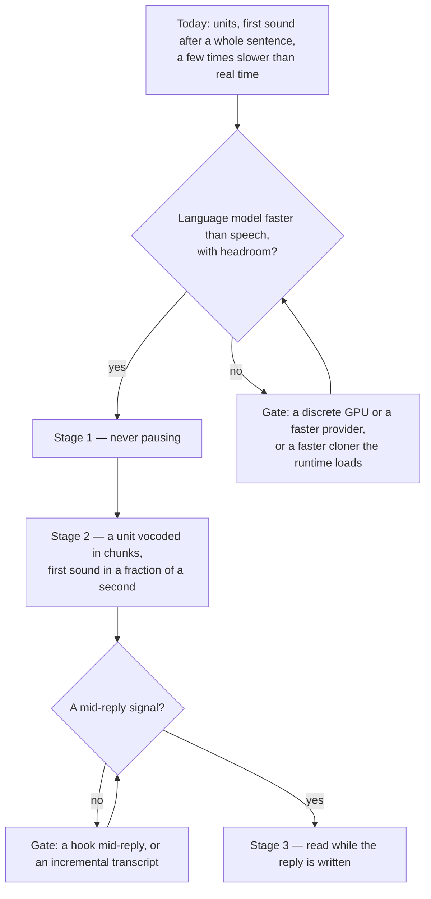

# Seamless spoken replies

Today a reply is read in units — the first sentence alone, then a few at a time — with the first sound arriving after that sentence's whole synthesis and the reading pausing wherever a unit takes longer to make than the one before it took to play ([spoken replies](/docs/infra/claude-interface/spoken-replies)). On this laptop that is a wait of tens of seconds before the first word and a reading a few times slower than the speech itself. The goal is a reading that feels like the character talking as the reply lands. This page states what that means in measurable terms, why it is out of reach here today, and what would bring it back in — so the next session reads the gates rather than timing the engine again.

## Scope

**Today:** one engine, Chatterbox Turbo through the ONNX runtime, its language model on this machine's integrated GPU and its vocoder on the CPU; each unit synthesized whole, vocoded once, then played; the Stop hook the only trigger, firing once the reply is complete; the numbers in the committed bench beside the [reference selection](/docs/infra/claude-interface/reference-selection), `scripts/src/voiceMatch/synthesizer.bench.md`.

**This defines** three stages, each a property that can be measured rather than a feeling:

1. **Never pausing.** Synthesis faster than playback with headroom — a real-time factor well under one, where today's is a few — so once the first unit plays, every unit after it is ready before the one before it ends. Nothing about the shape of the reading changes for this stage; it is compute alone.
2. **First sound within a fraction of a second** of the reply ending. The first unit's whole synthesis is the wait, so this stage streams inside a unit: the language model's speech tokens are vocoded a few dozen at a time as they are made and each chunk plays as it lands, the shape the [streaming fork of the engine](https://github.com/davidbrowne17/chatterbox-streaming) has, which reaches well under a second to first sound on a desktop GPU. It only pays once stage 1 holds: every extra vocoder pass re-runs the reference's tokens, so on a machine slower than real time the chunks arrive later than the whole unit would have.
3. **Reading while the reply is still being written.** The hook that speaks fires when the turn ends, so nothing can be read before the last word is generated, however fast the engine. This stage needs a signal mid-reply — a hook the tool does not offer, or the session's transcript read as it grows if the tool writes it incrementally, which is unverified — and is independent of the engine entirely.

## The gates

**Compute is the gate on stages 1 and 2, and it is this machine's.** The language model makes speech tokens at about half the rate they are spoken at, on an integrated GPU through the WebGPU provider — the one provider that reaches an AMD card from Node under Windows, since no CUDA toolchain does and DirectML rejects two of the graph's ops. The bottom rung's CPU language model is slower again, and the vocoder's half-precision GPU variant, the one that would take it off the CPU, costs a tenth to a fifth of the likeness and stands declined. What closes the gate, any one of:

- **A machine whose GPU runs the language model several times faster** — a discrete card through the same provider, or a provider the runtime gains that reaches the card better. The committed bench is the instrument: the stage holds when the short sentence reads in less than its own spoken length.
- **A runtime release that moves the language model's per-token cost by a factor** on WebGPU — the runtime's WebGPU path was rewritten once already for that kind of gain.
- **A faster cloner the runtime loads.** The voice is the point, so a fast engine that does not clone is not a candidate; a smaller or distilled cloner with a Transformers.js class is, measured the way the engine's variants were, by likeness on a few characters before it stands.

**The trigger is the gate on stage 3**, and nothing about the engine moves it. The tool's hooks fire at the turn's boundaries, and a reading that starts mid-reply needs either a hook the tool adds or the transcript the Stop hook already names — read as it grows, if it grows per message rather than at the end, which nobody has measured.

## What this does not propose

- **Dropping the clone for speed.** A catalogue voice reads faster on any hardware and was the first thing this feature replaced; the persona is the character's own voice or it is nothing.
- **Streaming inside a unit before stage 1 holds.** Measured here, every extra vocoder pass would cost seconds; the shape moves the pause rather than removing it.
- **Two units in flight.** Measured and rejected on the [spoken replies](/docs/infra/claude-interface/spoken-replies) page: the vocoder's threads take every core, so the language model gains nothing from running beside it.

## Key files

The existing files the work touches, with the role each plays after the change.

| File                                                              | Role                                                                                    |
| :---------------------------------------------------------------- | :-------------------------------------------------------------------------------------- |
| `scripts/src/voiceMatch/synthesizer.bench.ts`                     | The instrument: flipped on to read whether stage 1 holds on a machine                   |
| `packages/genshin-persona/src/services/createVoiceSynthesizer.ts` | Stage 2 — tokens vocoded in chunks as they are made, the speech check per chunk         |
| `packages/genshin-persona/src/services/getSpeechUnits.ts`         | Stage 2 — units give way to chunks of a unit once the first sound no longer waits on it |
| `packages/genshin-persona/scripts/voice.ts`                       | Stage 2 — the player fed chunks under the one-pending-request rule                      |
| `packages/genshin-persona/scripts/speak.ts`                       | Stage 3 — a trigger mid-reply, whatever the tool offers                                 |
| `packages/genshin-persona/src/services/constants.ts`              | The device ladder and the engine's variants, re-measured on whatever closes the gate    |

## Notes

- The [multilingual spoken replies](/docs/proposals/infra/multilingual-spoken-replies) proposal streams by clause to pay for a slower engine; that is stage 2's shape arriving for a different reason, and the two proposals share the player and the synthesizer's chunking when either lands.
- "Seamless" on a laptop with an integrated GPU may never hold for this engine, and that is a result: the page then says which gate stood, and the reading stays what it is — a first sentence, then units — rather than a shape tuned for hardware nobody here has.
