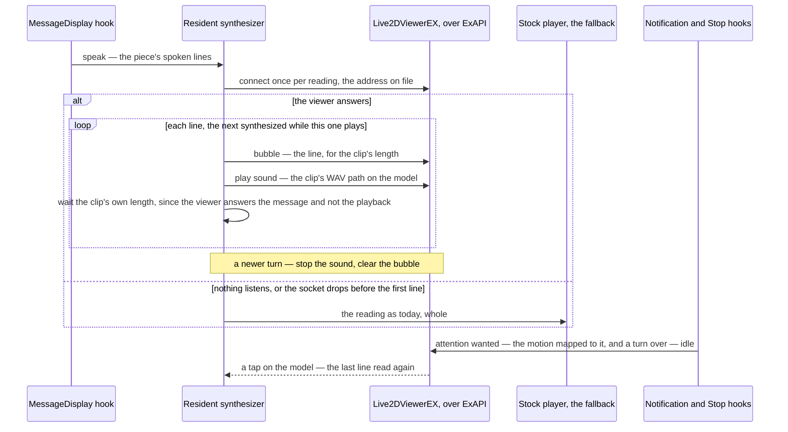

# The viewer as the stage

Today a reply's spoken lines are read by the resident synthesizer through each desktop's stock audio player, and the terminal's status line is as much of the character as the screen shows ([spoken replies](/docs/infra/claude-interface/spoken-replies), [character animation](/docs/infra/rejected/character-animation)). The wish behind the desktop stage was a companion on the desktop — a face, a speech bubble, a body that reacts — and every open-source companion answers it by building a window: a renderer, a model loader, a voice, a tray icon. None of that needs building here. Live2DViewerEX, the desktop pet the person already runs on Windows with their own Genshin models loaded, is that window: transparent, always on top, over every other app, and it exposes **ExAPI**, a WebSocket on the loopback that takes a text bubble, a sound played on a model, a motion, an expression, and pushes back a tap. So the stage is the viewer, and the plugin's whole job is a second sink beside the player.

## Scope

**Today:** one resident synthesizer per machine, holding the loaded engine; per line it synthesizes a clip, applies the volume as a gain, writes a WAV to a temp file and hands the path to one player process spawned per reading; a reply that lands while another is read supersedes it; a session-start warm pays the load ahead of the first reply. The plugin's hooks are the session start and the message display, both reading state files under the plugin's state directory.

**This adds three things, all optional and all gated on one file:**

1. **A viewer sink in the synthesizer.** With a viewer address on file, each line is also a bubble on the model and a sound played on it, and the stock player is the fallback when no viewer listens.
2. **Reactions.** The tool's notification hook — which fires when the session wants attention, a permission or an idle prompt — and its stop hook map to a motion or expression on the model, so the character turns to you when the terminal does.
3. **A `viewer` verb** that writes the address and the model's motion map, proves the connection with one bubble, and is undone by `teardown` like everything else the plugin writes.

Nothing changes on a machine with no viewer: the file is absent, the sink is never tried, and the reading is what it is today.

## How it works



**The sink.** The synthesizer already has everything the viewer wants at the moment it wants it: the line's text, the clip as samples at a known rate, and the WAV it writes for the player. Per line it sends two messages — the bubble, with the line as its text and a duration of the clip's length plus a beat so the words outlast the sound, and the sound, with the WAV's path on the model's channel at full volume, since the gain was already applied to the samples. ExAPI answers a message when it is received rather than when the sound ends, so the pacing the player gave for free — one line back per clip played — is the synthesizer's own here: it holds the samples and the rate, so it waits the clip's length before the next line, the same shape as today with a clock in place of the player's answer. A reading is tried on the viewer once, at its start: if the connection is refused the whole reading goes to the stock player, and a socket that drops mid-reading finishes on the player from the next line — a reply is never split across two speakers by design, only by a viewer that quit under it. A superseding turn stops the sound on the channel and clears the bubble with an empty one, so a reply replaced mid-line does not leave its words on screen.

**Lip sync is the viewer's, and it is the first probe.** The viewer drives a model's mouth from the sound it plays when the model is set to sync from audio; whether that follows a sound sent over the socket, and whether the sound may be a WAV path rather than the compressed formats its documentation recommends for the inline form, are two facts one message answers on the person's install before anything is written. If the path form wants a compressed clip, the fallback is the stock player for the sound and the viewer for the bubble alone — a face with words and no mouth — because the plugin's runtime carries a decoder and no encoder, and adding one for a codec is not worth the bytes until the probe says it is.

**Reactions.** The tool fires a notification hook when the session wants the person — a permission to grant, a question, an idle prompt — and a stop hook when a turn ends. Each becomes one ExAPI message: a motion for attention wanted, an expression cleared for a turn over. Which motion is not the plugin's to know — the models are fan-made and each names its groups its own way — so the map is the person's, written by the verb, and a moment with no mapping sends nothing. The hooks are in the plugin's hook manifest, behind the same file gate as the sink, so a machine with no viewer runs a node start for nothing on neither.

**A tap.** The viewer pushes a tap on a hit area to whoever listens, and the synthesizer, which holds the connection, is the listener. A tap cannot ask the model anything — that is a turn, and a turn is the terminal's — but it can play the line the character said last, and that is enough of an answer to a poke. Nothing is synthesized again for it, and nothing accumulates either: the stock player deletes each line's temporary WAV the moment the player answers for it, which the sink cannot do, since the viewer answers the message rather than the playback — so the sink keeps the clip it last sent and deletes it when the next line's clip takes its place, or when the synthesizer exits on its idle timeout. One WAV of a reading is on disk at a time, and it is the one a tap sends again.

**The verb.** `viewer <address>` writes the address and the model's id to a state file, sends one bubble in the interface language to prove it, and reports; `viewer` with no argument reports what is on file; `viewer motions <moment> <group:motion>` fills the map one moment at a time. `teardown` removes the file with the rest.

```text
packages/genshin-persona/
  scripts/
    react.ts                       ← the notification and stop hooks: one ExAPI message each, behind the file gate
  src/services/
    connectViewer.ts               ← the WebSocket to ExAPI, one per reading, the answers matched by message id
    createViewerPlayer.ts          ← the sink with the player's own interface: a clip in, the pacing by its length
    readViewerConfiguration.ts     ← the gate: the address, the model id and the motion map, or nothing
```

## What this does not propose

- **A window of our own.** A renderer, a model loader and a tray icon are the [own Live2D renderer](/docs/infra/deferred/own-live2d-renderer), deferred until the viewer's socket cannot do something the stage needs.
- **Driving the session from the model.** A tap replays a line; it never sends a turn. Text into the session is [chat into the session](/docs/proposals/infra/channel-chat), and a session of the companion's own is [rejected](/docs/infra/rejected/sdk-driven-companion).
- **Shipping a model.** The models are fan-made and the person's, loaded in their viewer; the plugin sends messages to whatever is on screen and carries nothing of the game, exactly as the [reference clips](/docs/infra/claude-interface/per-character-voices) are fetched and never shipped.
- **A dependency on the viewer.** The sink is one file's presence; absent, nothing is tried and nothing is slower.

## Key files

| File                                                         | Role                                                                                        |
| :----------------------------------------------------------- | :------------------------------------------------------------------------------------------ |
| `packages/genshin-persona/scripts/voice.ts`                  | The resident synthesizer: the per-line loop the viewer sink joins, and the supersede signal |
| `packages/genshin-persona/src/services/createAudioPlayer.ts` | The stock player, which stays the fallback; the interface the viewer sink implements        |
| `packages/genshin-persona/scripts/genshin.ts`                | The verbs; `viewer` is added here and `teardown` extended                                   |
| `packages/genshin-persona/hooks/hooks.json`                  | The plugin's hooks; the notification and stop hooks are registered here                     |
| `packages/genshin-persona/src/services/constants.ts`         | The state directory's paths; the viewer's file is one more                                  |

## Notes

- ExAPI has been stable for years and is versioned by message number; the four messages this uses are among its oldest, so the sink is not a surface a viewer update rewrites.
- The viewer runs on Windows and on phones, not on every desktop the plugin does; the sink is loopback JSON, so a viewer elsewhere that speaks the same messages is the same sink, and a machine with none is the machine today.
- The interface language decides the bubble's text as it decides the reply's, and the bubble's colours are the character's own from the nameplate's palette — the one place outside the terminal the element colour shows.
