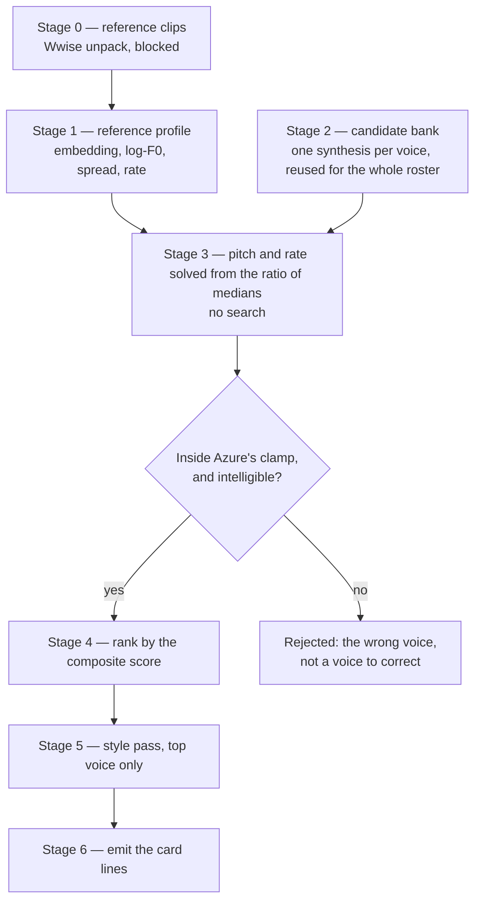

# Voice Match Benchmark

[Per-character voices](/docs/infra/claude-interface/per-character-voices) ships a voice, a pitch and a rate for every character in the roster, and every one of those values was **judged** — inferred from the game's metadata and the published catalogue, with nothing listened to and nothing measured. The question it answers by taste ("which catalogue voice is closest to this character?") has an objective form, and speech synthesis research has standard metrics for exactly it.

This proposal is the measurement that replaces the taste, and the honest limits of doing so.

## What the field measures

Two metric families, standard and complementary, answering different questions. Both are needed; neither is sufficient.

**Timbre and identity — speaker embedding cosine similarity.** A speaker encoder maps an utterance to a fixed-length vector; the cosine between two vectors is the similarity score. It is the metric every voice-cloning paper reports, usually from Resemblyzer, ECAPA-TDNN or a WavLM-based verification model. Crucially for us, **it is applied across languages on purpose**: cross-lingual synthesis work scores an English synthesis against a reference in the speaker's own language, which is precisely the shape here — a Japanese performance as the target, an English candidate to rank. That is what makes "match the Japanese voice while speaking English" a well-posed question rather than a wish.

**Prosody — fundamental frequency and duration statistics.** Log-F0 RMSE is the most frequently used prosody metric in the literature. Its standard form aligns frames by dynamic time warping against _the same words_ spoken twice, which does not exist here, so this benchmark uses the **distributional** form instead: median log-F0, log-F0 standard deviation as a pitch range in semitones, and speaking rate in syllables per second. Averaged over enough speech these are content-independent, and they are exactly the two levers a card already spends.

**Mel-cepstral distortion has no place here.** It is the other metric one reaches for by reflex, and it requires parallel content. Reaching for it against non-parallel clips produces a number that means nothing.

## What the field says about trusting them

A 2025 analysis of speaker-similarity assessment documents the failure modes, and they all apply to this setup:

- Embeddings encode **spectral** traits — pitch range, timbre — and neglect rhythm and articulation, so a high score does not mean the delivery matches.
- They are confounded by **clip duration**: same-speaker utterances grouped by length score as different speakers far more often than chance.
- They are confounded by **noise and equalization**: a low signal-to-noise ratio, or a spectral tilt difference between two corpora, moves the score on its own.

The consequences are design constraints, not caveats to note and ignore:

| Constraint                                                   | Why                                                     |
| :----------------------------------------------------------- | :------------------------------------------------------ |
| Match reference and candidate clip durations                 | Duration alone discriminates                            |
| Measure signal-to-noise on both corpora before scoring       | Game audio is mastered; TTS output is clean             |
| Average the reference over several clips, never one          | A single clip scores its own recording conditions       |
| Rank on the composite, never on the embedding score alone    | Rhythm is invisible to the embedding                    |
| Validate the whole metric against the ear before applying it | Below — this is the step that makes the rest legitimate |

## The pipeline

**Stage 2 is what makes this affordable.** The candidate bank is one synthesis per voice of a fixed carrier sentence at neutral settings, and it is measured once and **reused for every character in the roster** — the bank describes the voices, not the characters.

**Stage 3 is what makes it cheap.** Pitch and rate need no search: the required shift is a ratio of two measured medians, converted to the percentage or semitone form the markup takes. A voice whose required shift falls outside Azure's clamp — half to one and a half times for pitch, half to twice for rate — is **the wrong voice rather than a voice to clamp**, and the range is a filter at this stage, not a correction.

**Which voices are candidates** is the "every language?" question, and the answer is split. Search for timbre over the whole catalogue, because speaker embeddings are largely language-independent; but the eligible pool is the English voices together with the multilingual ones, since a Japanese-locale voice reading English is unintelligible while a multilingual voice carries non-English voice talent that does speak English properly. Do not trust the naming to enforce that — **gate on measured intelligibility**, transcribing each candidate's carrier synthesis with an ASR model and rejecting on word error rate. That single gate covers every locale the catalogue may add later.

## What it costs

Stage 2 is a hundred-odd voices against a carrier sentence: tens of thousands of characters, once, ever. Stage 5 is the only per-character synthesis — the roster against its chosen voice's declared styles — on the order of a hundred thousand characters. Both sit inside the monthly allowance the [spoken replies](/docs/infra/claude-interface/spoken-replies) account already has, which is the whole reason this is worth running rather than admiring.

A naive grid search is what this design exists to avoid: every voice against every pitch step against every rate step, per character, is millions of characters and buys nothing that stage 3 does not compute exactly.

## The number to tune

**Mean composite score across the roster** is the headline, and the thing a weighting change is judged by. Two diagnostics have to be reported beside it, because the mean hides both failure modes:

- **The count below a floor** — the characters the benchmark could not fit, which are the ones that still need the ear.
- **The spread of chosen voices** — a run that lands most of the roster on a handful of voices has found a degenerate optimum, not a fit, and the mean will look fine while it does.

## Validating the benchmark before trusting it

Non-optional, and standard practice: a metric is only worth its ranking if the ranking agrees with a person. Take a sample of characters, synthesize the top three candidates for each, rank them by ear, and compute the rank correlation against the composite score. Agreement is the licence to apply the benchmark to the rest of the roster. Disagreement means the weights are wrong — and the weights are then tuned **on that sample only**, never on the whole roster, which would be fitting the metric to its own output.

## What this needs that the repo does not have

A Python environment with a speaker encoder, an F0 analyser, and an ASR model for the gate, plus the Wwise extractor stage 0 waits on. **None of it becomes a dependency of this repository.** It is an offline one-shot whose entire output is a file of card lines, run on one machine by one person; the extracted audio is never committed, which is the same rule the [character voice](/docs/infra/deferred/character-voice) stage rests on.

## Key files

| File                                                             | Change                                             |
| :--------------------------------------------------------------- | :------------------------------------------------- |
| `packages/genshin-persona/cards/`                                | The `- Voice:` line each run rewrites              |
| `packages/genshin-persona/src/services/getSpeechVoiceFinding.ts` | Still the check that a written line is well-formed |

## Notes

- The benchmark does not remove the ear from the loop; it changes what the ear is asked to do, from auditioning a hundred-odd voices per character to confirming three.
- Stage 0 is shared with the deferred character-voice stage, and this proposal is the cheaper half of it: choosing a catalogue voice needs no inference engine, only the reference audio, so it opens on the extraction gate alone.
- An agent can build and run every stage except two: the listening in the validation step, and the judgement of whether a degenerate spread is acceptable. Both are the person's.
