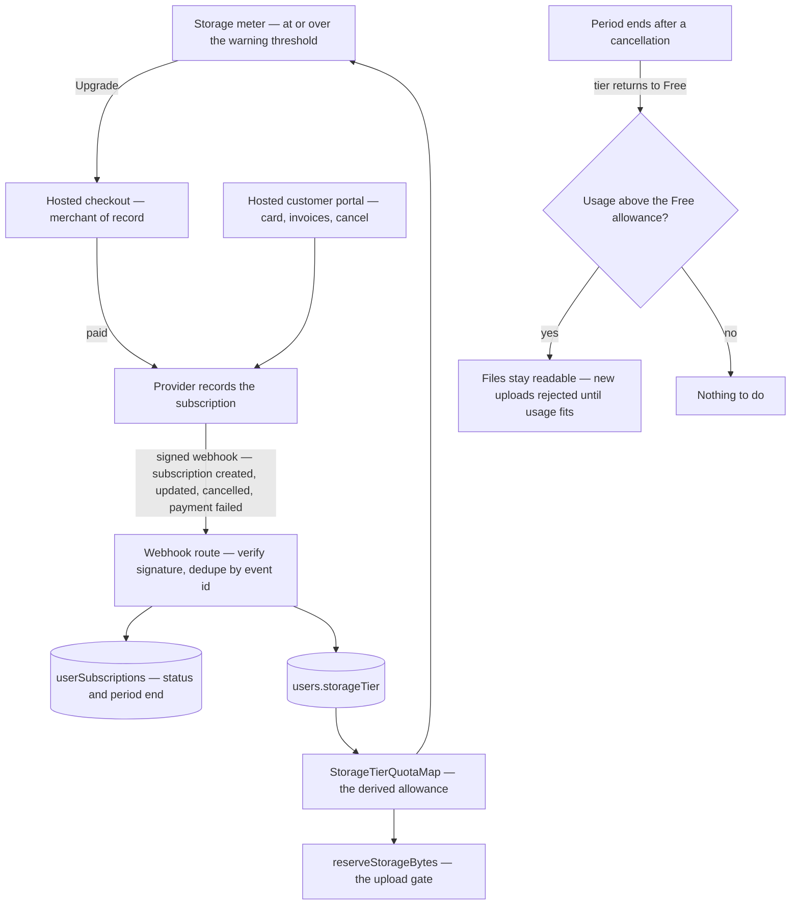

# Paid Storage Tiers

Sell a bigger allowance. Every user is on a Free tier with a fixed allowance today, and the quota mechanism was deliberately built so that a paid tier is a **value added to a map** rather than a schema change ([storage quotas](/docs/platform/storage-quotas)): the limit is derived from the tier on every read, so moving a user between tiers changes what the gate enforces and what the meter shows in the same instant, with nothing to backfill.

That is the whole of the storage half. Everything hard about this proposal is the money.

## Scope

**Today** the tier enum holds one value, the quota map holds one entry, `reserveStorageBytes` reads the tier behind the user row's lock and rejects an upload that would exceed it, and the explorer header renders a usage meter whose warning thresholds are percentages precisely so they hold for any tier. There is **no billing anywhere in the repo** — no provider, no customer id, no webhook, no price.

**This adds** tier values, a subscription record, a hosted checkout, and one webhook that maps a subscription's state onto the tier column.

### The provider decision is the proposal

Take payments through a **merchant of record** (Paddle, Lemon Squeezy) rather than a payment processor (Stripe) unless there is a reason not to. The difference is not fees, it is liability: a processor leaves us the seller, which means registering for and remitting consumption tax in every jurisdiction a buyer happens to live in, and consumer digital goods are taxed at the buyer's location almost everywhere. A merchant of record **is** the seller — it collects, remits, and is audited for that, and it invoices in its own name.

For a platform selling a small recurring add-on to consumers anywhere, that is the difference between a feature and a tax-compliance programme. A processor is the right answer only if the customers are known to be domestic, or a business already exists to carry the obligation.

Either way the integration shape is the same and is chosen to keep card data and billing UI out of this codebase entirely: a **hosted checkout** the user is redirected to, and a **hosted customer portal** for changing the card, seeing invoices, and cancelling. No payment form, no invoice storage, no dunning logic. Card data never reaches this codebase, which is what puts the integration in the smallest merchant category the provider's PCI DSS responsibility matrix defines — a scope the provider states, not one this page may declare away.

### Data

One row per subscriber — `userSubscriptions`, keyed by `userId`, carrying the provider's customer and subscription ids, the subscription status, and the current period end. The **tier column stays the only thing the quota gate reads**: this table records why a user is on a tier, never what their allowance is. Two sources of allowance is exactly the failure the derived-quota design exists to prevent.

New tier values land in the enum and the quota map together, and every allowance stays a pure function of the tier.

### The flow

### The webhook is the only integration point

The provider's event stream is authoritative and our own UI is not: a checkout redirect can be abandoned after payment, a card can fail three weeks later, and a cancellation can happen in the portal. So **nothing sets a tier except the webhook handler** — the redirect back from checkout only navigates.

The handler verifies the signature, is idempotent on the provider's event id (redelivery is normal, not exceptional), and writes the subscription row and the tier in one transaction. Failure handling is the provider's retry schedule plus our own standard: a failed handling retries on the event with an attempt cap and a quarantine, never a manual fix-up ([no manual recovery](/docs/architecture/no-manual-recovery)).

Three properties the handler has to hold, each of which is a way of getting the wrong user on the wrong tier:

- **Which user an event belongs to is decided before checkout, never afterwards.** The session that opens checkout is authenticated, so the provider's customer id is bound to that `userId` server-side at that moment and the binding is what every later event resolves through. Nothing derives identity from a return url, a query parameter, or an email address in the payload.
- **An event is applied only if it is newer than what the row already holds.** Providers redeliver and reorder, so the subscription row stores the provider's own ordering field (Paddle's `occurred_at`) and an event carrying an older one is acknowledged and dropped. Event-id idempotency stops a duplicate; this stops a stale update reinstating a cancelled subscription.
- **A quarantined event still resolves.** The quarantine is a queue with a drain, not a dead end: a periodic reconciliation reads the provider's current subscription state for every affected user and writes the tier from that. The provider is authoritative, so replay is never required to be in order — a cancelled subscription can never stay paid because the handler ran out of attempts.

Two status decisions worth stating rather than discovering:

- **A failed payment does not downgrade immediately.** The provider runs dunning for its retry window; the tier holds while the subscription is past due and drops when the provider finally cancels it. Downgrading on the first failure punishes an expired card.
- **A cancellation downgrades at period end**, not on the click, because the period is paid for.

### Being over quota is a legal state

A downgraded user can hold more bytes than their new allowance. Nothing deletes their files — the gate already rejects **new** uploads while usage exceeds the allowance, and that is the entire behaviour: existing content stays readable and the state resolves as the user deletes. The meter renders it as its error state past 100% rather than as a clamped bar.

This is the one place where a paid feature must not become a hostage mechanism, and the design gets there by doing nothing special.

### What a tier may and may not buy

**Capacity and cosmetics only.** A tier may raise a numeric allowance — storage bytes, the per-room custom emoji count ([custom emoji](/docs/esbabbler/custom-emoji)), the number of call-background slots ([virtual backgrounds](/docs/esbabbler/calls/virtual-backgrounds)) — or unlock a cosmetic, which is the shape Discord's Nitro takes and the reason it is uncontroversial.

**A tier may never gate behaviour, moderation, or safety.** The moment a room's rules, a permission, or an abuse control depends on who paid, the platform's trust model becomes tier-dependent and every moderation guarantee acquires an asterisk. Allowances are per-user and derived from one map; that is the mechanism, and it is deliberately incapable of expressing anything else.

## Consequences beyond the feature

Taking money changes obligations that are currently deferred on the grounds that nobody external is here yet. A paying user is unambiguously an external user, so **account deletion** and **data export** stop being someday-items and become the price of admission ([account deletion](/docs/users/deferred/account-deletion), [data export](/docs/users/deferred/data-export)). Refunds, published terms and privacy information, and receipts are the merchant of record's to serve, which is most of why it is the recommended shape.

Ship this only alongside those, or not at all — a paid tier without a way out is the worst version of this feature.

## Key files

| File                                                          | Change                                             |
| :------------------------------------------------------------ | :------------------------------------------------- |
| `packages/db-schema/src/models/user/StorageTier.ts`           | the paid tier values                               |
| `packages/app/shared/services/storage/StorageTierQuotaMap.ts` | one allowance entry per tier                       |
| `packages/db-schema/src/schema/`                              | the subscription table, registered in the schema   |
| `packages/app/server/api/`                                    | the signed, idempotent provider webhook route      |
| `packages/app/app/components/Resource/StorageMeter.vue`       | the upgrade affordance and the over-quota state    |
| `packages/infra/src/`                                         | the provider secret, wherever secrets are declared |

## Notes

Price and packaging are not settled here and should not be: the mechanism is one map from tier to allowance, so the number of tiers and what each holds is a product decision that costs one line each to change.

The provider secret is the first credential in the repo whose leak has a direct financial consequence, which makes it a keyless-auth-shaped concern rather than an ordinary env var ([keyless auth hardening](/docs/proposals/infra/keyless-auth-hardening)).
