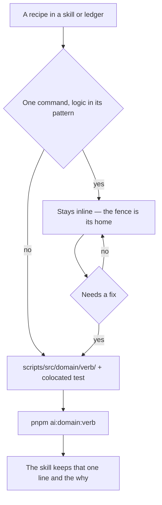

# Agent Scripts

The skills under `.agents/skills` carry programs disguised as documentation. The `coderabbit` skill alone embeds a forty-line `node -e` that reads two GitHub endpoints and filters their bodies, a bash polling loop with a deadline, and a frontier calculation with a fallback branch — each pasted into a Markdown fence where nothing typechecks, lints, formats or runs it. The `sweeps` skill hit the same wall first and answered it for its own domain: a grep stays in the ledger, anything with control flow becomes a tested script under `scripts/src/sweeps/` wired as `pnpm sweep:<scan>`. That answer was right and it stopped one skill short.

This proposal makes the sweeps rule the repo rule, gives the resulting scripts one audience-marking name, and migrates the `coderabbit` recipes as its first application.

## What works today vs what this adds

Today, `scripts/` is the workspace's own tooling and already holds agent-run scans beside human-run ones: `sweep:*` sits next to `graph:gen` and `outdated:dependencies` with nothing in the name saying who types which. The `sweeps` skill's `references/find-recipes.md` states the inline-vs-script line, but as a sweeps rule — a recipe in any other skill has no rule to break. The `coderabbit` skill's recipes have been fixed by three of the last four commits touching it, which is the shape of a program nothing runs: each fix was found by an agent whose run failed, never by a test.

This adds three things:

- **A standard for where a recipe lives**, owned by the `skill-authoring` skill because it is a rule about what a skill page may embed. The sweeps page keeps the traps specific to a scan and points up for the rule.
- **The `ai:` prefix** on every pnpm script whose only caller is an agent — a rename of the `sweep:*` scripts and the naming rule for the new ones — so the root manifest answers "who runs this" by name.
- **The `coderabbit` recipes as scripts**: feedback reading, the review probe, and window measurement, each with the tests that pin the ways the inline versions have already been wrong.

## The standard

A recipe is **inline** while it is one command whose whole logic is its pattern or its query: a grep, a single `gh api … --jq` selection, a `git diff --name-only … | wc -l`. It is read at a glance and it fails loudly or not at all.

A recipe **migrates** to `scripts/` the moment either of two things happens:

- **It gains control flow** — a loop, a branch, a second process aggregating the first's output, a fallback. That is the `sweeps` line, unchanged.
- **It needs a fix.** A fix to a code block is proof that nothing runs it between fixes, and the trap the fix closes becomes a test case rather than a paragraph explaining the trap. This is the trigger the sweeps rule lacked, and it is the one that would have moved the `coderabbit` reader after its first repair instead of its fourth.

Length is not a trigger. A ten-line `--jq` expression that is still one selection stays; a three-line `if` does not.



What the skill page keeps after a migration is the invocation and the reasons — why the script is not a grep, what its output means, which of its silences are lies. What it loses is the body and every paragraph that existed to explain a trap in the body; those paragraphs become the tests. A page describing the output of `pnpm ai:coderabbit:feedback` has nothing to say about emoji-prefix stripping, because a test named for the bucket that would otherwise be swallowed says it better and fails when it stops being true.

### Where the script lives

`scripts/src/<domain>/<verb>/index.ts`, with the pure functions beside it as `get*`/`check*` files and their tests colocated — the shape every sweep already has. The domain folder is named for **what** the tooling is about (`sweeps/`, `coderabbit/`), never for who runs it: the audience is carried by the pnpm name, and moving `scripts/src/sweeps/` under an `ai/` folder would touch every `#src/sweeps/…` import to say something the manifest already says.

Nothing in `.agents/` is executable. The `sweeps` skill records the attempt — a vitest project over `.agents/**/*.test.ts` — and why it went: the tree is the rules an agent reads, and an executable in it makes "rule or tool" unanswerable from the path.

### The `ai:` prefix

A pnpm script an agent runs and a human never types is named `ai:<domain>:<verb>`. The prefix is decided by audience, not by what the script does or where it lives:

| Script today                                                   | After                              | Why                                                                                      |
| :------------------------------------------------------------- | :--------------------------------- | :--------------------------------------------------------------------------------------- |
| `sweep:constant-scope`                                         | `ai:sweep:constant-scope`          | A ledger's find recipe; a pass is run by an agent per the `sweeps` skill                 |
| `sweep:repeated-list-items`                                    | `ai:sweep:repeated-list-items`     | same                                                                                     |
| `sweep:shared-export-consumers`                                | `ai:sweep:shared-export-consumers` | same                                                                                     |
| `sweep:skill-docs`                                             | `ai:sweep:skill-docs`              | same                                                                                     |
| `sweep:unterminated-results`                                   | `ai:sweep:unterminated-results`    | same                                                                                     |
| —                                                              | `ai:coderabbit:feedback`           | New; reads a PR's review feedback for the reply loop                                     |
| —                                                              | `ai:coderabbit:probe`              | New; retriggers a review and waits for the bot's answer                                  |
| —                                                              | `ai:coderabbit:window`             | New; measures the unreviewed backlog from the last reviewed sha                          |
| `graph:gen`, `outdated:dependencies`, `update:node`, `crossOS` | unchanged                          | A person types these — a graph regenerates after a manifest edit, a node bump is a chore |

Both manifests rename together: the `scripts` package declares the `tsx` command and the root delegates with `pnpm -C scripts run <same name>`, as every existing root entry does (`package-scripts` skill). The prefix is not a folder and not a filter — `pnpm -r --filter` never selects by script name — so it costs nothing beyond the rename and buys the one thing a name can: a reader of the root manifest, or of a `pnpm run` listing, sees which entries are not for them.

## The `coderabbit` scripts

Three scripts, each replacing one block in `.agents/skills/coderabbit/references/`. The shared plumbing — one `gh` invocation wrapper, the bot-login filter, the newest-by-`updated_at` selection — sits in `scripts/src/coderabbit/services/`, because every one of the three reads the same endpoints and the sweeps tree already keeps its shared `getSweepFilePaths` beside its scans for the same reason.

```md
scripts/src/coderabbit/
models/
GitHubComment.ts id, body, updated_at, user.login — the fields every endpoint shares
GitHubReview.ts GitHubComment plus commit_id and submitted_at
ReviewThread.ts the GraphQL thread shape: isResolved, path, line, first comment's databaseId and body
StatedCounts.ts actionable, nitpick, outsideDiff — the three numbers a review body states
services/
runGh.ts execFileSync("gh", …) with the maxBuffer a paginated slurp needs
readBotEntries.ts paginate + slurp one REST endpoint, flatten pages, keep coderabbitai[bot]
getNewestByUpdatedAt.ts the in-place-edited walkthrough sorts by updated_at, id as the tie-breaker
feedback/
index.ts ai:coderabbit:feedback <pr>
getFindingLines.ts the boilerplate-suppressing body filter (today's printBody)
getMarkedBlock.ts slice a walkthrough between <!-- marker_start --> and <!-- marker_end -->
getStatedCounts.ts parse "Actionable comments posted: N" and the counted bucket headings
readUnresolvedThreads.ts the paginated GraphQL reviewThreads query, filtered to the bot's open threads
probe/
index.ts ai:coderabbit:probe <pr>
checkIsCheckpointMoved.ts compares two "<id> <updated_at>" readings, a failed read never counting
window/
index.ts ai:coderabbit:window <pr>
getLastReviewedSha.ts the last "between <sha> and <sha>" a review body names, across every page
```

### `ai:coderabbit:feedback <pr>`

Replaces the `node -e` block in `review-feedback.md` § "One call for every bodied finding" and the GraphQL count in § "Counting open findings", and folds them into one report so the reconciliation the skill asks for by hand happens in the script:

1. Newest review body, filtered through `getFindingLines` — the stated `Actionable comments posted: N` first, then every counted bucket (nitpicks, outside-diff, and any bucket nobody has named yet, since the filter suppresses known boilerplate rather than selecting known categories).
2. The review's own commit sha and submission time, so "does this cover the head" is one comparison against `git rev-parse origin/develop`.
3. Every unresolved thread the bot opened: `databaseId path:line` and the first line of the finding — the id is what the reply call needs.
4. The reconciliation line: threads fetched against the stated actionable count. A shortfall is printed as such, which is the `Inline review comments failed to post` case surfacing without anyone reading a caution block.
5. The walkthrough's `final_review_risk` and `pre_merge_checks_walkthrough` blocks by marker, and a `REVIEW IN PROGRESS — do not push` line when the walkthrough carries the in-progress marker.

Tests pin the ways the inline version has been wrong, each as a fixture body:

- A bucket carrying a boilerplate emoji (`🤖 New findings (2)`) is printed, not swallowed — the emoji is stripped before the match, never listed as an alternative.
- The walkthrough's `📒 Files selected for processing (4)` does not latch `isBoilerplate` past the merge-risk section — a markdown heading reopens the filter.
- Fenced blocks are dropped and the `Prompt for AI Agents` sections with them.
- `getStatedCounts` reads all three counts and reports zero, not `undefined`, for an absent bucket.
- `getNewestByUpdatedAt` picks the edited-in-place comment over a newer id whose `updated_at` is older.
- `readUnresolvedThreads` follows `pageInfo.endCursor` — a fixture with two pages returns both, so the `first: 100` cliff the skill warns about is a failing test rather than a warning.

### `ai:coderabbit:probe <pr>`

Replaces the `crLatest` loop. Reads the bot's newest issue comment as `<id> <updated_at>`, posts `@coderabbitai review`, and re-reads until the reading changes or ten minutes pass, then prints the body of the comment that moved. The loop is a CLI waiting on remote state the harness cannot push, which is the one place the repo's no-polling standard does not reach; the interval and deadline are `Temporal.Duration` constants beside the script, never raw milliseconds.

The pure part is `checkIsCheckpointMoved(before, after)`, and its tests are the two ways the inline loop could end wrongly: a read that failed (empty string) never counts as movement, and a comment whose `updated_at` moved while its `id` did not — the walkthrough edit — does. The deadline path exits non-zero with the message the skill already prescribes, so a stalled probe is a finding rather than a hang.

### `ai:coderabbit:window <pr>`

Replaces the frontier block in `measuring-the-window.md`. It reads the PR's head and base branches from `gh pr view --json headRefName,baseRefName` rather than taking them as arguments — the three `<branch>` placeholders are what made the block unrunnable as pasted — then prints the last reviewed sha, the pushed-but-unreviewed file count (`<sha>..origin/<head>`), and the count the next push would carry (`<sha>..HEAD`). When no review body names a range it substitutes the merge base and says so, because that is the first-review case and never zero. The union count for a first review — committed plus working-tree paths as a set — is the same script's fourth line.

`getLastReviewedSha(bodies)` is the tested part: it returns the **last** match across every body handed to it, so the per-page `--jq` trap the skill spends a paragraph on is a fixture with two pages of bodies; and it returns `undefined` for no match, never the string `null` a `jq` `last` would emit.

### What stays inline

The reply call (`gh api …/replies -f body=…`), the check read (`gh pr checks --json … --jq`), the review-body fetch used to illustrate the three endpoints, and the `config-editing.md` PUT sequence — each is one command or a straight line of them with no branch, and quoting the placeholder was the whole fix they needed.

## Order of work

One window, in this order, so every commit leaves the tree runnable:

1. **The standard.** `skill-authoring/SKILL.md` gains the rule and the `ai:` naming; `sweeps/references/find-recipes.md` drops its copy of the rule and keeps the scan-specific traps, citing up. `package-scripts/SKILL.md` gains the prefix rule beside its table. `architecture/agent-configuration.md` gets the one paragraph that says agent-run scripts are named `ai:` and live in `scripts/` — the standing fact, since this proposal is deleted on shipping.
2. **The rename.** `sweep:*` → `ai:sweep:*` in both manifests, `scripts/README.md`, the `package-scripts` table, every ledger's Find recipe line, and the `sweeps` skill's prose. A grep for `sweep:` across `.agents`, `scripts`, `package.json` and `content/docs` is the done-check; it must return only the `ai:sweep:` forms.
3. **The coderabbit scripts**, one commit each in the order above — feedback, probe, window — each landing its script, its tests, both manifest entries, its `scripts/README.md` row and its `package-scripts` table row together.
4. **The skill pages.** Each `coderabbit` reference block is replaced by its one-line invocation and the prose that survives (what the output means, what its silences mean). The `skill-docs` sweep runs afterwards, since the pages shrink and their cross-citations move.
5. **Delete this page** and its entry in the proposals index; the shipped-log line goes in the `architecture/index.md` log, since a refactor has no area.

## Key files

| File                                                           | Role after the change                                                                       |
| :------------------------------------------------------------- | :------------------------------------------------------------------------------------------ |
| `.agents/skills/skill-authoring/SKILL.md`                      | Owns the inline-vs-script rule and the `ai:` naming for anything a skill embeds             |
| `.agents/skills/sweeps/references/find-recipes.md`             | Keeps the scan-specific traps; cites `skill-authoring` for the rule                         |
| `.agents/skills/package-scripts/SKILL.md`                      | Root script table with the `ai:` rows and the prefix rule                                   |
| `.agents/skills/coderabbit/references/review-feedback.md`      | Cites `ai:coderabbit:feedback` and `ai:coderabbit:probe`; keeps the reply call and the whys |
| `.agents/skills/coderabbit/references/measuring-the-window.md` | Cites `ai:coderabbit:window`; keeps what the two counts mean                                |
| `scripts/package.json`                                         | Declares every `ai:*` command under `tsx`                                                   |
| `package.json`                                                 | Delegates every `ai:*` name to `pnpm -C scripts run`                                        |
| `scripts/README.md`                                            | Folder table gains the `coderabbit/` row                                                    |
| `scripts/src/sweeps/getSweepFilePaths.ts`                      | The shape the `coderabbit/services/` helpers follow — shared plumbing beside the scans      |
| `apps/web/content/docs/architecture/agent-configuration.md`    | The standing paragraph on agent-run scripts once this page is gone                          |

## Notes

- **Not a harness.** `scripts/` is already in every typecheck, lint, format and test glob; a migrated recipe gets all of it for the price of a folder. Nothing here adds a runner, a project or a config entry, and a proposal that did would be the DIY tooling the repo has already removed once.
- **The `ai:` prefix is a name, not a guard.** A human can run `pnpm ai:sweep:skill-docs` and nothing stops them; the prefix answers who the script is _for_, which is the question a manifest reader has. A guard would be a feature nobody asked for.
- **Skill pages get shorter, not emptier.** The rule takes the body and the trap prose; it leaves what a reader needs to interpret output, and that has never been the long part.
