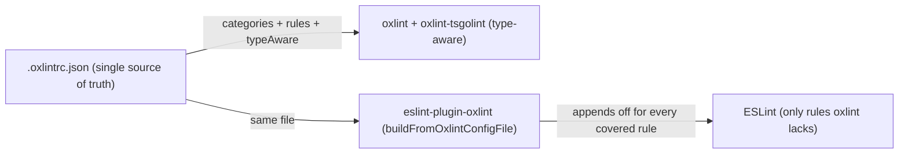
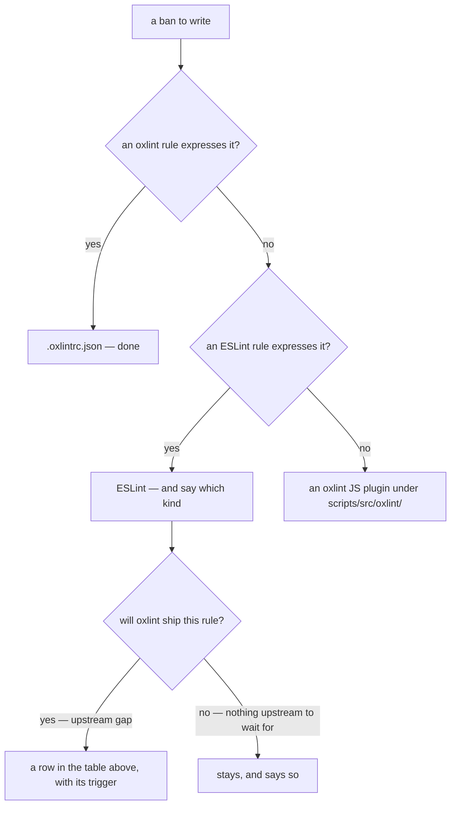

# ESLint → oxlint Migration

Move lint rules from ESLint to oxlint whenever oxlint gains coverage, prioritized by what actually costs time in the ESLint pass. Oxlint clears the whole repo in seconds; ESLint is the slower half by an order of magnitude, and its cost is concentrated in a handful of rules rather than spread across the set. Since the type-aware rules left (`neverthrow/must-use-result` dropped, `typescript-eslint` removed), the remaining pass is short enough to run on every change — `lint` is no longer near CI's critical path, which belongs to `build app`.

## What works today

- One root `.oxlintrc.json` runs oxlint repo-wide with `typeAware: true` — `oxlint-tsgolint` executes the type-aware `typescript/*` rules (`no-floating-promises`, `await-thenable`, `no-duplicate-type-constituents`, …) natively.
- `eslint-plugin-oxlint` (`packages/configuration/eslint/oxlint.js`) reads the same `.oxlintrc.json` via `buildFromOxlintConfigFile` and appends `"off"` entries for every ESLint rule oxlint already covers. It is appended **last** in both flat configs, so its disables win.
- **Every category oxlint runs must be listed explicitly in `.oxlintrc.json`, `correctness` included.** Oxlint keeps `correctness` on by default even when other categories are configured, but `eslint-plugin-oxlint` **replaces** its defaults with whatever the file names — so a category left implicit reads to the plugin as off, and it leaves the ESLint twin of every rule in that category enabled. ESLint then re-runs the type-aware rules oxlint already checked, which is where most of its time goes.
- The whole `typescript-eslint` `strictTypeChecked` + `stylisticTypeChecked` rule set is now covered by oxlint's 110 `typescript/*` rules. `packages/configuration/eslint/typescriptRules.js` no longer spreads those configs (and the `typescript-eslint` package has been removed) — it holds only `no-restricted-syntax`, the one rule oxlint cannot express yet (no AST-selector rule). `prefer-optional-chain`, `no-restricted-imports` (the `randomUUID` ban), `no-restricted-types` (the `Omit` → `Except` ban), and `no-unused-expressions` were moved into `.oxlintrc.json`.
- **A migrated ban must be _configured_ in oxlint, not merely un-deleted from ESLint.** `eslint-plugin-oxlint` disables the ESLint twin of any rule oxlint _runs_ (e.g. `no-restricted-imports`, `no-restricted-types`, `no-unused-expressions`) — every rule in an enabled category, whether or not the repo configures it. The one exception is a rule the repo sets to `"off"`: the plugin drops that rule's disable again, so an ESLint-side `"off"` beside it is load-bearing rather than redundant. So an ESLint-side ban for such a rule is silently dead the moment oxlint ships the rule name — the ban only lives if it is written into `.oxlintrc.json`. Verify with `eslint --print-config <file>` (the rule should read `[0]`/off) plus a planted violation run through oxlint.

## What remains in ESLint and why

The remaining expensive rules, in descending cost order, and the trigger for migrating each:

| Rule                   | Share of rule time | Blocker                                | Migrate when                                                                               |
| ---------------------- | ------------------ | -------------------------------------- | ------------------------------------------------------------------------------------------ |
| `vue/no-child-content` | ~two thirds        | Not implemented in oxlint's vue plugin | upstream implements it (check `eslint-plugin-oxlint`'s generated rule maps after upgrades) |
| `perfectionist/sort-*` | ~a sixth, combined | oxlint has no sorting rules            | upstream implements sorting                                                                |
| `no-restricted-syntax` | negligible         | oxlint has no AST-selector rule        | per ban, not per rule — the ladder and the standing list are below                         |

Once the type-aware rules were gone, `vue/no-child-content` became the pass — it alone is worth more than everything else combined, so it is the only migration here that would move the number.

**`neverthrow/must-use-result` was dropped, not migrated.** It was the single most expensive rule (~a third of rule time) because it is the only one that needed `parserOptions.projectService`, and type-aware parsing dominates the whole ESLint pass rather than just that rule's share. Deleting it — plugin file, config entry and `@ninoseki/eslint-plugin-neverthrow` dependency — is what makes `pnpm lint` fast enough to run on every change. The cost is real and accepted: an unterminated `Result` chain is now caught only by review, and it fails silently (the call still runs, but the `Err` it returns is never read, so no error surfaces). Re-adding any type-aware ESLint plugin gives back the same multiplier, so the answer to "this convention needs types" is a review rule or a runtime assertion, never a rule here.

Everything else in the ESLint pass is either Nuxt/Vue-specific (`vue/*` SFC rules, `nuxt/*`) or a plugin oxlint has not implemented (`perfectionist/*`, `pinia/*`, `unocss/*`, `jsonc/*`, `link-checker/*` — oxlint reads no JSON at all); apart from the `perfectionist/sort-*` family none of them individually costs meaningful time, and the whole tail together is worth a fraction of `vue/no-child-content`. `typescript/naming-convention` is parked as a commented-out block in `typescriptRules.js` — it was too expensive under typescript-eslint to ever ship, and is waiting on oxlint to support it.

## Ongoing process

On every oxlint / `eslint-plugin-oxlint` catalog bump:

1. Re-measure with `TIMING=10` on the app ESLint run to see which rules now dominate.
2. Check whether the top ESLint rules appear in `eslint-plugin-oxlint`'s generated rule maps (`dist/generated/rules-by-category.*` — including the `*TypeAwareRules` sets). If a rule is newly covered, it disappears from ESLint automatically via the appended config — verify with `eslint --print-config` on a sample file rather than editing anything.
3. For custom rules (`no-restricted-syntax` selectors), evaluate oxlint's JS-plugin support as it matures — non-type-aware custom rules can move as soon as oxlint's plugin API supports the needed AST surface for `.vue` and `.ts` files. A selector can also retire without oxlint gaining a selector rule at all, when a **plugin** rule turns out to express the same ban — so read a bump's new plugin rules against the selector list too, and confirm the two agree against planted cases before deleting the entry.
4. Remove ESLint-side manual `"off"` entries that only existed to duplicate oxlint coverage (they are dead weight once `eslint-plugin-oxlint` disables the rule).

## Where a ban is written

A ban goes to the first of these that can express it, and the step is chosen by running a planted violation
through `oxlint -c` with the candidate rule configured — never by reading a rule list. `oxlint --rules` prints
nothing in the shipped binary, and `id-denylist` was already shipping when a selector and then a JS plugin were
written for the same ban, which is what this order exists to stop happening again.

**An ESLint entry has to say which of the two it is**, because they age in opposite directions. One waiting on an
upstream gap — a rule oxlint will plausibly ship, or a context it will plausibly reach — is temporary, and earns
a row in the table above so a bump is read against it. One expressing something no linter will ever ship a rule
for is permanent, and a note saying so is what stops the next audit re-deriving it. A JS plugin is the last step
rather than the second: it is surface this repo then owns, tests and maintains, so it is only right when nothing
else can express the ban at all.

**What has moved, and what has not.** `expect.any`, the polling ban, `JSON.parse` and `useRoute` are now
`no-restricted-properties` and `no-restricted-globals` in `.oxlintrc.json`; the sites that disable them spell the
directive `oxlint-disable-next-line` with the reporting rule's name. `useRoute` also takes a
`no-restricted-imports` entry, because `no-restricted-globals` sees the auto-imported form and not an explicit
`vue-router` import.

What stays in ESLint, and why:

| Ban                                                                                                                                                         | Why it stays                                                                                                                                                                          | Kind         |
| ----------------------------------------------------------------------------------------------------------------------------------------------------------- | ------------------------------------------------------------------------------------------------------------------------------------------------------------------------------------- | ------------ |
| `window.localStorage`, `stopImmediatePropagation`, `splice`                                                                                                 | `no-restricted-properties` expresses all three, but oxlint reads an SFC's `<script>` and not its template, where these also apply through `vue/no-restricted-syntax`                  | upstream gap |
| `.then`/`.catch`/`.finally`                                                                                                                                 | `promise/prefer-await-to-then` is off for the reasons the `oxlint` skill's `references/lint-configuration.md` states                                                                  | upstream gap |
| `try`/`catch`, the `A`-prefix interface, the lookup-name and `can`/`should` bans, `field: T \| undefined`, the `*Store` member read, the template-only bans | each needs a syntax predicate; `typescript/naming-convention` and `camelcase` are not implemented in oxlint, and `id-match` is one repo-wide regex rather than a per-construct format | upstream gap |
| the TypeScript `private` keyword ban                                                                                                                        | no linter ships it; it is this repo's own preference for `#`                                                                                                                          | permanent    |

## Key files

| File                                                                | Role                                                                                                        |
| ------------------------------------------------------------------- | ----------------------------------------------------------------------------------------------------------- |
| `.oxlintrc.json`                                                    | Single source of truth: categories (list `correctness` explicitly), per-rule overrides, `typeAware`         |
| `packages/configuration/eslint/oxlint.js`                           | Builds the ESLint disable config from `.oxlintrc.json`                                                      |
| `packages/configuration/eslint/index.typescript.js`, `index.vue.js` | Append the oxlint disables last so they win                                                                 |
| `packages/configuration/eslint/typescriptRules.js`                  | ESLint-only rules oxlint cannot express — just `no-restricted-syntax` (plus the parked `naming-convention`) |

## Notes

- Never remove `correctness` from the explicit category list — oxlint would still run those rules (its own default), but `eslint-plugin-oxlint` would silently re-enable their ESLint twins and double-lint them.
- Coverage parity is verified, not assumed: before relying on oxlint for a migrated rule, reproduce a violation in a scratch file and confirm oxlint reports it (tsgolint rules included).
