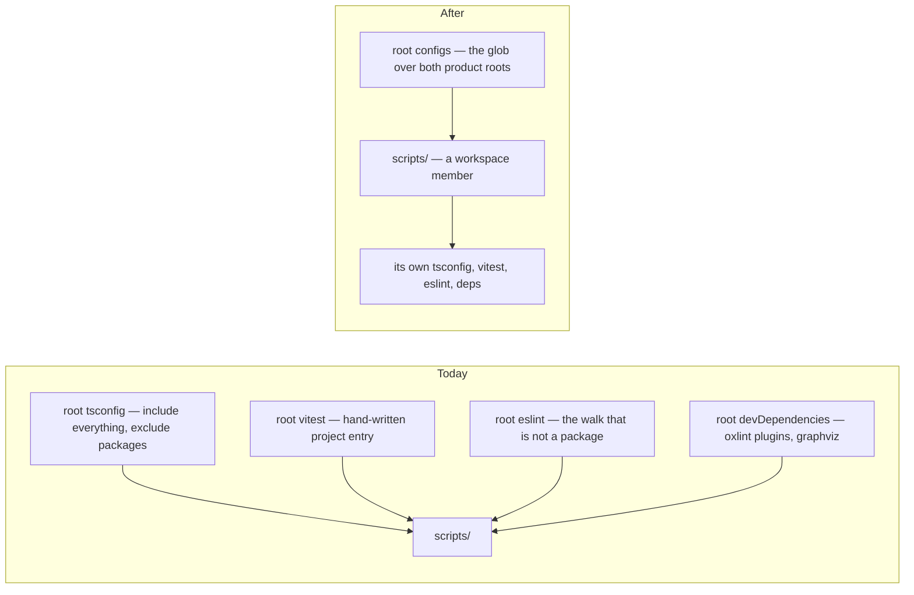

# The Scripts Package

`scripts/` holds the repository's own tooling — the dependency graph, the outdated-dependency report, the custom oxlint plugins, the sweep scans, the cross-platform launcher. It is real, tested TypeScript with real dependencies, and it is not a workspace member. Everything that has to reach it therefore reaches it from the root, as the leftovers of a walk aimed at something else.

That costs four special cases, and none of them is visible from the tree:

- **The root Vitest config carries a hand-written project entry for it**, and that entry has to scope both `include` and `benchmark.include` by hand — the default `**/*.bench.ts` would otherwise pull every package's benchmarks into the tooling project.
- **The root manifest declares a repo-wide `#scripts/*` subpath**, so an alias serving one directory is resolvable from every file in the repository that is not inside a package.
- **The root TypeScript program is defined by subtraction** — `include: ["**/*.ts"]` with `packages` excluded — so its actual subject is whatever is left over, which is this tree plus a handful of root config files.
- **Root devDependencies exist only for it.** The oxlint plugin API and the Graphviz WASM build are imported by nothing outside `scripts/`, and sit in the root manifest as though they were repo-wide tooling.

It also has no `lint`, `typecheck` or `test` script of its own, because the root's own commands happen to cover it — which is the same subtraction in a third form.

## The change

`scripts/` becomes `@esposter/scripts`: a private workspace member listed in `pnpm-workspace.yaml` beside the two product roots, with the ordinary shape every other member has — `src/`, a `#src/*` subpath, a tsconfig extending the shared node base, a one-line ESLint re-export, a Vitest config from the shared factory, and its own `lint`, `typecheck` and `test` scripts. Its sources move into `src/` in the same mechanical way the apps move, and the root scripts that ran `tsx scripts/…` delegate to it by filter, as they already do for the app.

It stays at the repository root rather than under either product root, because it is not part of the product: `apps/` and `packages/` are what the repo ships, and this is the workspace's own machinery, a sibling of `.github/` and `.agents/`. The alternative — filing it under `apps/` on the grounds that it is run rather than imported — is technically consistent and reads wrong, since nothing here is an application.

The root TypeScript program does not disappear; it shrinks to what it should always have been — the root config files themselves, `vitest.config.ts`, `typedoc.config.js` and `virrun.config.ts` among them — compiled by a program that names them rather than one defined by what it excludes.

## What it retires

| Special case                                 | After                                                                          |
| -------------------------------------------- | ------------------------------------------------------------------------------ |
| The hand-written Vitest project entry        | A glob entry, `scripts`, beside the two product-root globs                     |
| The repo-wide `#scripts/*` subpath           | A `#src/*` subpath declared by the package that owns it, scoped to it          |
| The root program defined by subtraction      | A root program over the root config files, and a package program over the rest |
| Root devDependencies serving one directory   | Declared by the package that imports them                                      |
| No lint, typecheck or test script of its own | The same five scripts every other member declares                              |

## What it costs

Two things, both small and both worth stating. Versioning is fixed across the workspace, so a new member gets version bumps and a changelog like every other private one — noise, not risk. And the oxlint plugin paths in `.oxlintrc.json` move with the sources, which is a config the linter reads before anything is resolved, so a wrong path there fails the lint pass by name rather than silently.

Nothing about the tooling's behaviour changes: the same files run under the same runner against the same tests.

## Key files

| File                                          | Role after the change                                                          |
| --------------------------------------------- | ------------------------------------------------------------------------------ |
| `pnpm-workspace.yaml`                         | Lists `scripts` beside the product roots                                       |
| `tsconfig.json`                               | The root program, narrowed to the root config files                            |
| `vitest.config.ts`                            | Projects as three globs, with no inline project definition                     |
| `.oxlintrc.json`                              | `jsPlugins` paths, which move with the sources they name                       |
| `scripts/src/oxlint/setupPluginSuite.test.ts` | The plugin suite that proves the moved plugin paths still load                 |
| `package.json`                                | Root manifest, losing the subpath and the devDependencies it held for one tree |
