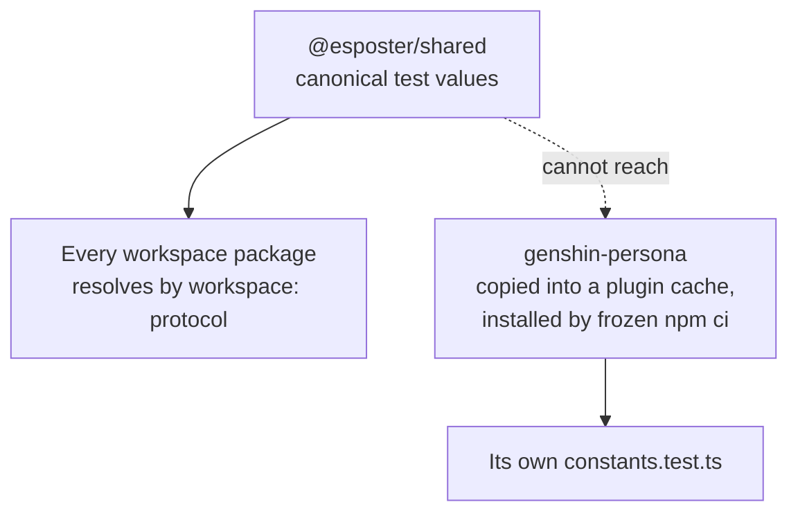

# Shared test values

[test-values](https://github.com/Esposter/Esposter/blob/main/.agents/skills/test-values/SKILL.md) states every rule a test literal follows, and states them only in prose. A suite obeys it when whoever wrote the suite had read it. This proposal asks which of those rules should stop being prose, and finds that the answer is narrower than "export them all".

## The gap that prompted it

The skill's date rule is absolute — **every date is computed from the epoch; none is typed** — and for `Date` the computed form is `new Date(0)`, short enough that nobody reaches for a literal instead. Temporal has no such spelling. The epoch as a plain date is:

```ts
Temporal.Instant.fromEpochMilliseconds(0).toZonedDateTimeISO("UTC").toPlainDate();
```

Long enough that the next person writes `Temporal.PlainDate.from("1970-01-01")` and the rule quietly stops holding. One package already carries a local `TEST_EPOCH_DATE` for exactly this reason, and every package that moves to Temporal will need the same constant. That is a real shared value: one spelling, verbose, absolutely prescribed.

## What a shared package can and cannot reach



`genshin-persona` declares no devDependencies on purpose: `claude plugin install` copies the plugin directory out of the repository and runs a frozen `npm ci` inside that copy, where there is no workspace and npm does not understand the `workspace:` protocol ([persona plugin](/docs/infra/claude-interface/persona-plugin)). So a shared package reaches every package **except** the one whose Temporal migration surfaced the need, and that package keeps a local copy either way. This is not a reason to abandon the idea — it is a reason not to claim the constants are universal.

## Which half is enforceable

An enforcer whose exceptions are a list of paths, names or suffixes is rejected here ([oxlint](https://github.com/Esposter/Esposter/blob/main/.agents/skills/oxlint/SKILL.md)). That test sorts this proposal cleanly in two:

| Rule                                  | Exceptions a rule would need                                                                             | Verdict        |
| :------------------------------------ | :------------------------------------------------------------------------------------------------------- | :------------- |
| No typed date literal in a test file  | None. The skill's one exception — a date read by its shape — is still computed from the epoch            | **Lintable**   |
| No non-canonical string, number or id | The value under test, a format table's expected output, an imported production constant, a snapshot body | Needs a roster |

So the date half is a rule a linter can hold, and the rest stays prose that a review reads.

## Why not a `TEST_STRING` vocabulary

Naming the canonical scalars reads as the natural extension and is the part to decline:

- **The canonical strings are a pair.** `""` is the base value and `" "` the one that differs by a single step; the pair is the mechanism, and one constant cannot express it.
- **Entity fields are prescribed as their own name** — `const name = "name"` — which is what makes a fixture self-describing. `TEST_STRING` erases which field is being stood up.
- **The literal is already the shortest true statement.** `expect(f("")).toBe(0)` needs no indirection, and a name the reader has to chase is one more thing to hold, not one fewer ([over-engineering](https://github.com/Esposter/Esposter/blob/main/.agents/skills/over-engineering/SKILL.md)).

## Proposed shape

1. Export the computed epoch in its `Date`, `Temporal.Instant` and `Temporal.PlainDate` spellings from `@esposter/shared`, and nothing else.
2. Add the typed-date lint rule, rolled out from the violation list it produces on its first run.
3. Open a ledger for the sweep, scoped to dates only, one behaviour-preserving unit per commit.
4. Leave `genshin-persona` its local constant, and say in the skill that it is the one package a shared import cannot reach.

## What would change the answer

A second value turning out to be both verbose and absolutely prescribed — the way the Temporal epoch is — is the trigger to widen step 1. A count of suites that got a scalar wrong is not: the scalars are short, the rule is in the skill, and nothing in the record says that half is drifting.
