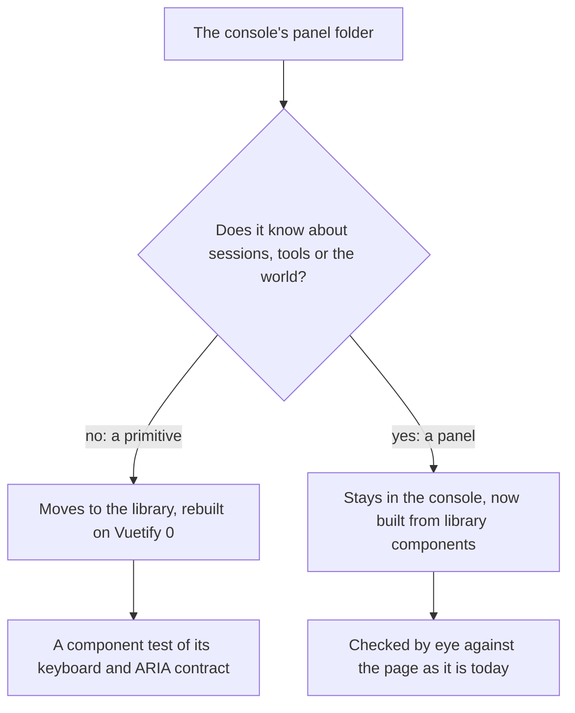

# Agent Console

The console already draws the look by hand, and it has no Vuetify to coexist with. That makes it the cheapest page to prove the library on: moving it changes how its primitives are built and nothing about how they look. The gain is behaviour. The console's menus, selects and popovers get the full keyboard and screen-reader contract of a real listbox, where today they have arrow keys and nothing else.

## What moves

The console's panel folder holds two kinds of component. The primitives are generic and become the library's. The panels are the console's own and stay.

| Today in the console | In the library                                                                                                                 |
| :------------------- | :----------------------------------------------------------------------------------------------------------------------------- |
| Frame                | the frame surface, unchanged in look                                                                                           |
| Button               | the button, on Vuetify 0's button, keeping its active and danger variants as the library's variants                            |
| Popover              | the popover, on Vuetify 0's, which uses the browser's own anchor positioning and its Floating UI adapter where that is missing |
| Menu                 | the menu, on the popover with roving focus: typeahead, Home and End, and the active option announced                           |
| Select               | the select, on Vuetify 0's select, with the menu as its list                                                                   |
| Spinner              | the spinner, as the library's progress in its indeterminate form                                                               |
| Copy button          | an icon button with its copied state, reading the clipboard store as it does now                                               |
| Loading              | the page loading bar, which the [app shell](/docs/proposals/refactors/ui-library/shell) reuses for every route                 |

Conversation, composer, permission, sessions, timeline, changes, usage, the heads-up display and the working line stay under the console, and each is rebuilt from the library's components where it used a primitive.

## What else changes

- **The palette splits.** The console's palette map already takes its interface colours from the app's dusk theme ([UI library](/docs/architecture/ui-library)); in this stage they leave it, and the panels read the tokens instead of the console's own custom properties. The world's materials stay in the console's map, and the world keeps reading both as vertex colours, so a panel and the room behind it still agree.
- **The page's global rules move out.** The console's root sets the font on every element beneath it, sinks every field, draws every focus ring through deep selectors, and colours its own scrollbars, which the document chrome now does for every page. Those rules become the library's components and the document's chrome, and the console's root keeps only its layout. What it looked like does not change, because the tokens are the same colours.
- **The theme interface keeps its palette slot.** The [themes proposal](/docs/proposals/infra/agent-console/themes) lets a theme set the console's palette. That slot now sets the tokens inside the console's root, which is the same scoping Vuetify 0's scoped theme context provides, so a Genshin theme dresses the console without reaching the rest of the app.

## Checking it

- **The library components' tests** hold the keyboard contract: a menu is walked by arrows, jumped by Home and End and by typing a title's first letters, closed by Escape with focus back on its trigger, and its selected option is announced.
- **By eye**, against the page before the change, every state the voxel world page lists: loading, pairing, the conversation with a tool call open, a pending permission request, the slash palette, the model and mode selects, and a panel open over the world. Nothing should look different; anything that does is a finding.
- **The console's existing tests** are kept where they test the console and deleted where they test a primitive the library now owns.

## Key files

| File                                                                        | Role after the change                                |
| :-------------------------------------------------------------------------- | :--------------------------------------------------- |
| `apps/web/app/components/AgentConsole/Panel/Frame.vue`                      | Moves to the library                                 |
| `apps/web/app/components/AgentConsole/Panel/Button.vue`                     | Moves to the library                                 |
| `apps/web/app/components/AgentConsole/Panel/Popover.vue`                    | Moves to the library, on Vuetify 0's popover         |
| `apps/web/app/components/AgentConsole/Panel/Menu.vue`                       | Moves to the library, with the full listbox contract |
| `apps/web/app/components/AgentConsole/Panel/Select.vue`                     | Moves to the library, on Vuetify 0's select          |
| `apps/web/app/components/AgentConsole/Panel/Loading.vue`                    | Moves to the library as the page loading bar         |
| `apps/web/app/components/AgentConsole/Index.vue`                            | Keeps its layout and loses its global element rules  |
| `apps/web/app/services/agentConsole/AgentConsolePaletteMap.ts`              | Keeps only the world's materials                     |
| `apps/web/app/models/agentConsole/MenuItem.ts`                              | Becomes the library's menu item type                 |
| `apps/web/content/docs/infra/claude-interface/agent-console/voxel-world.md` | Its panels section names the library's components    |

## Sources

- [Popover](https://0.vuetifyjs.com/components/disclosure/popover), Vuetify 0: the native Popover API, CSS anchor positioning with its position-try fallbacks, and the Floating UI adapter for engines without anchor positioning.
- [Roving focus](https://0.vuetifyjs.com/composables/system/use-roving-focus), Vuetify 0: the composable behind the menu's arrow, Home and End keys.
- [WAI-ARIA Authoring Practices: listbox](https://www.w3.org/WAI/ARIA/apg/patterns/listbox/), W3C: typeahead and the active option a screen reader announces.
