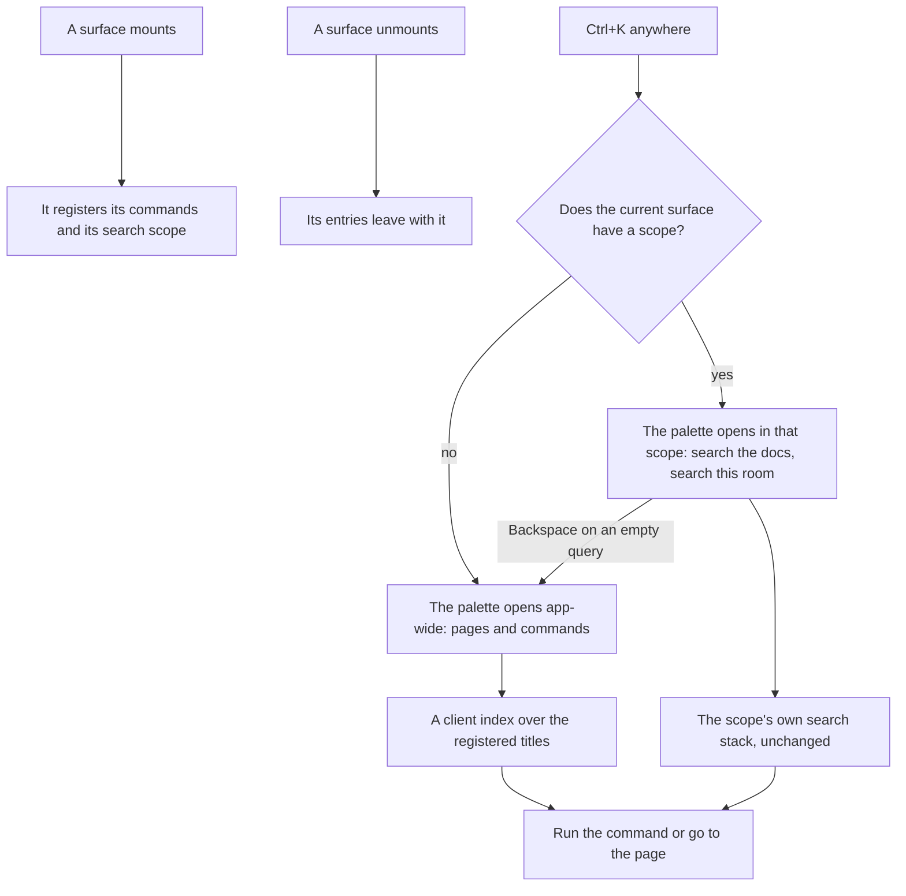

# Command Palette

Ctrl+K opens a different thing on different pages today. On the docs it searches the docs, in a room it searches the room's messages, and everywhere else it does nothing. The [search standard](/docs/architecture/search) already names the risk — one shortcut behaving differently depending on which surface is open — and routes every palette through one shell so at least the shell agrees. Keyboard shortcuts have the same shape: the message composer and the resource portal each keep a list of their own and a dialog to show it, and nothing lists the rest.

This page makes Ctrl+K one palette everywhere and makes the shortcuts one list. The [app shell](/docs/architecture/ui-library#app-shell)'s dock gains a button for it in this stage.

## How it works



- **A command is an entry in one registry.** It has a title, an icon, an optional shortcut and what it does, and it may be conditional on the reader's session or permissions. A surface registers its commands while it is mounted and they leave with it, so the palette only ever offers what the current page can do. The registry is a Pinia store, and the registration is a composable scoped to the component that calls it.
- **Pages are commands.** Every product and secondary page in the dock and the account menu is registered app-wide from the same link lists, so the palette can reach anything the dock can, by name.
- **A surface's search is a scope, not a second palette.** The docs search and the room searcher keep their search stacks exactly as the search standard describes. What changes is that they register as the current surface's scope instead of registering Ctrl+K themselves, so the palette opens in that scope on that page, and Backspace on an empty query steps out to the app-wide palette. One shortcut, one shell, and the scoped search is still one keystroke away.
- **App-wide search is client-side.** The registered titles are already in memory, so they are searched with MiniSearch, the standard's client branch — no server call and no pending state.

## One list of shortcuts

A command with a shortcut is also the shortcut's registration: the registry binds the key through the hotkey composable while the command is registered, and unbinds it when it leaves. So the list of shortcuts is the registry filtered to entries that have one, and the question mark key opens it as a dialog grouped by surface. The message composer's and the resource portal's separate lists and dialogs become registrations, and their dialogs are the one shortcuts dialog. The resource portal's two-key chords are shortcuts too, and the registry's key type allows a sequence as well as a single chord for them.

## Key files

| File                                                                | Role after the change                                             |
| :------------------------------------------------------------------ | :---------------------------------------------------------------- |
| `apps/web/app/components/Styled/SearchDialog.vue`                   | Becomes the palette's shell, and stops registering its own hotkey |
| `apps/web/app/components/Docs/Search.vue`                           | Registers the docs as its page's scope                            |
| `apps/web/app/components/Message/Model/Room/Searcher.vue`           | Registers the room's messages as its page's scope                 |
| `apps/web/app/services/message/input/KeyboardShortcutList.ts`       | Becomes the composer's registrations                              |
| `apps/web/app/services/resource/ResourceKeyboardShortcutList.ts`    | Becomes the portal's registrations                                |
| `apps/web/app/composables/resource/useResourceKeyboardShortcuts.ts` | Registers its chords as commands                                  |
| `apps/web/app/components/Styled/KeyboardShortcutsDialog.vue`        | Becomes the one shortcuts dialog, over the registry               |
| `apps/web/content/docs/architecture/search.md`                      | The palette section rewritten: one Ctrl+K, scopes inside it       |

```text
apps/web/app/store/ui/command.ts                  the registry: commands, scopes, shortcuts
apps/web/app/composables/ui/useCommands.ts        registers a surface's entries for its lifetime
apps/web/app/components/App/CommandPalette.vue    the palette, app-wide or in a scope
```

## Notes

- The palette opening in the current scope, rather than app-wide, keeps today's behaviour for a reader who already presses Ctrl+K on the docs to search them. Nothing they do now changes; the app-wide palette is one Backspace further.
- A command's condition is evaluated when the palette opens, not when the command registers, so a permission changed mid-session is honoured on the next open.

## Sources

- [Hotkey](https://0.vuetifyjs.com/composables/system/use-hotkey), Vuetify 0: the hotkey composable a shortcut binds through after retirement.
- [MiniSearch](https://lucaong.github.io/minisearch/): the client index the app-wide palette searches, already the search standard's client branch.
