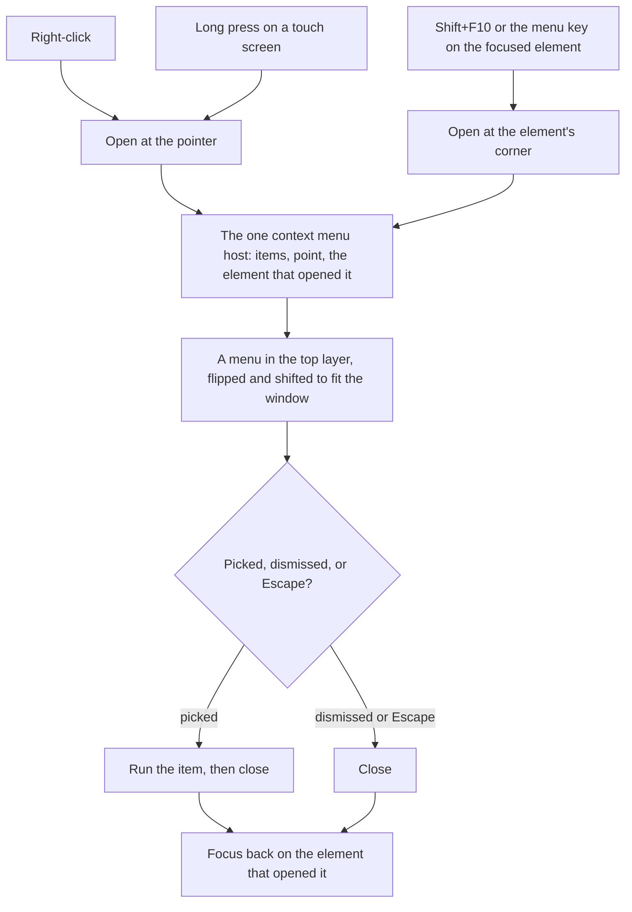

# Context Menus

The surfaces that open a menu on right-click today each built their own. A message stores the pointer's coordinates in its list's state and opens its options menu there. A row of the resource list does the same through the data table's row event, with its own position and id refs. Neither opens from the keyboard or from a long press on a phone, so on a touch screen and for a keyboard reader the context menu does not exist. Every other surface that has actions of its own — a room in the room list, a member, a column of a sheet, a file in a tree — offers them only through a button or not at all.

Vuetify 0 has no context menu. It has the parts: a popover in the top layer, roving focus and a hotkey composable. This page is the design of ours.

## How it works



- **A target declares its items, and nothing else.** A component marks an element as having a context menu and hands it the same list of items its overflow button shows. There is one list of actions per thing, so the right-click menu and the visible "more" button can never disagree, and a new action added to one is in both.
- **One host is mounted, never one menu per row.** The host holds which items are open, where, and which element opened them, as the [singleton dialogs](/docs/architecture/singleton-dialogs) standard does for dialogs, so a list of several thousand messages mounts one menu rather than one per message.
- **Three ways in.** Right-click opens at the pointer. A long press on a coarse pointer opens at the finger, and cancels if the finger moves, so a scroll never opens a menu. Shift+F10 or the menu key opens at the focused element's corner, which is the platform's own keyboard gesture for a context menu.
- **The browser's menu stays where ours adds nothing.** Only an element that declares items prevents the browser's own menu. Over plain text, links, images and inputs the browser's menu, with copy, open in a new tab and spell-check, still appears. Holding Shift while right-clicking always gives the browser's menu, so nothing the browser offers is lost to the app.
- **The menu is the library's menu.** It has the same keyboard contract — arrows, Home and End, typeahead, Escape — and the same items, with an icon, a title, a shortcut hint and a danger variant. A destructive item opens the [destructive confirmation](/docs/architecture/destructive-confirmation) dialog as its button does now.

## Where it goes

| Surface                 | Today                                    | Its items                                                                                     |
| :---------------------- | :--------------------------------------- | :-------------------------------------------------------------------------------------------- |
| A message               | right-click only, its own position state | the message options menu's items, unchanged                                                   |
| A resource list row     | right-click only, the data table's event | the row's actions, unchanged                                                                  |
| A room in the room list | none                                     | the room's settings, invite, mute, leave                                                      |
| A member                | none                                     | the member's profile, message, the role and moderation actions the reader's permissions allow |
| A sheet column header   | none                                     | the column's edit, sort, hide and delete                                                      |
| A resource in a tree    | none                                     | the resource's open, rename, move and delete                                                  |

The first two rows move onto the host in this stage and delete their own position state. The rest are added as their units migrate in [page migration](/docs/proposals/refactors/ui-library/page-migration), each with the items its overflow button already has, so no row invents an action.

## Checking it

- **A component test of the host**: each of the three ways in opens it at the right place, Escape and a pick return focus to the opener, and a right-click with Shift is left to the browser.
- **By eye** on a phone for the long press, since a component test cannot hold a finger still.

## Key files

| File                                                          | Role after the change                                      |
| :------------------------------------------------------------ | :--------------------------------------------------------- |
| `apps/web/app/components/Message/Model/Message/List/Item.vue` | Declares its message's items instead of positioning a menu |
| `apps/web/app/components/Resource/List/View.vue`              | Declares each row's items instead of positioning a menu    |

```text
apps/web/app/components/Ui/ContextMenu/Host.vue      the one mounted menu
apps/web/app/composables/ui/useContextMenu.ts        marks an element and hands it its items
apps/web/app/store/ui/contextMenu.ts                 what is open, where, and who opened it
```

## Sources

- [The menu button pattern](https://www.w3.org/WAI/ARIA/apg/patterns/menu-button/), WAI-ARIA Authoring Practices: the keyboard contract a menu keeps, and focus returning to what opened it.
- [contextmenu event](https://developer.mozilla.org/en-US/docs/Web/API/Element/contextmenu_event), MDN: the event right-click and the menu key both raise, which the host leaves to the browser when Shift is held.
- [Vuetify 0's popover](https://0.vuetifyjs.com/components/disclosure/popover): the top-layer surface the menu is shown in.
