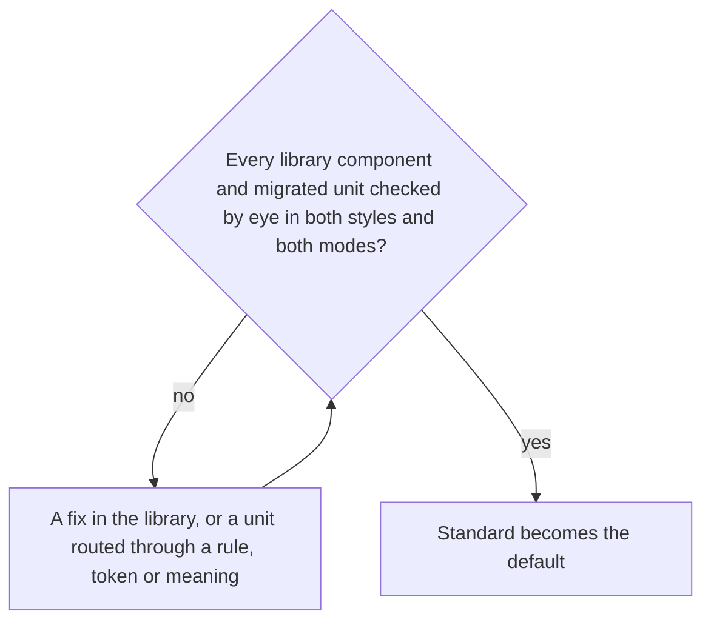

# Design Styles

The voxel look now covers the whole app: the dusk palette, the pixel face, notched frames, raised buttons and pixel icons on every page the library draws. On a page that is a game, or the agent console, it is the right look. On the pages a reader spends a long session in — a room's messages, a sheet, the docs — it reads as a game on every screen, and it tires quickly. What those pages want is the look most shipped products have settled on: neutral surfaces, one accent, hairline borders, rounded corners and a sans face.

Replacing the voxel look outright would throw away the part of the work that was about the look. Nothing else needs to go: every colour in the library is already a token, every surface is one of a handful of rules, and every icon is named by meaning. So this proposal makes the look itself a value. A **design style** is a named set of everything that decides how the interface is drawn, selected per reader the way light and dark are. The voxel look becomes the first style. A second, **standard**, joins it and becomes the default. Everything a style is not allowed to touch — spacing, sizes, placement, behaviour — is shared, which is what lets a unit be checked once and trusted in every style.

## Two tiers

The two tiers have shipped, with voxel as the only style: what exists is the [design styles](/docs/architecture/ui-library#design-styles) section of the UI library page. What this proposal still adds on them:

- **A style is a bundle, not a set of knobs.** Radix Themes exposes radius, scaling and panel background as independent props on its theme; here they travel together, because the voxel look's parts only make sense together — a pixel face on rounded corners is neither style.
- **The standard style's lengths are its own.** A hairline border is not a whole number of steps, and it is still a shadow inset into the box rather than a border, so it takes no room the layout tier sized.

## What each style draws

Standard has shipped beside voxel: what each draws is the [design styles](/docs/architecture/ui-library#design-styles) section of the UI library page.

## How a style is selected

Selection has shipped with voxel as the only style: the cookie, the store, the root attribute, a scope's pinned style, the palette keyed by style, the icon map's rows and Vuetify's colours are the [design styles](/docs/architecture/ui-library#design-styles) section of the UI library page. What standard adds is only a column in each of those maps.

## What makes it safe to switch

The enforcers have shipped: what holds each guarantee is the UI library page's [what keeps a switch safe](/docs/architecture/ui-library#what-keeps-a-switch-safe).

## The stages

The two tiers, selection, the standard style, the enforcers and the style-leak sweep have shipped; the sweep ended as tests rather than a standing ledger, since every leak it looked for is decidable. One stage remains:

- **Standard becomes the default.** Once every library component and every migrated unit has been checked by eye in both styles and both modes, a reader with no cookie gets standard: `DEFAULT_UI_STYLE` in `configuration/UiStyleMap.ts`.

## Rejected

- **Replacing the voxel look outright.** It is the right look for the agent console and the games, it is most of what the library's first stages built, and a second style costs a column of values rather than a rewrite. Keeping it also keeps the tiers honest: with two styles live, a leak shows the day it is written.
- **Adopting Nuxt UI.** It is the reference for the standard style's values, not its implementation. It is built on Tailwind CSS, where every template here is UnoCSS attributify; on Reka UI, a second headless layer beside Vuetify 0; and its components would replace the library's, each with a keyboard contract already tested. It would also be a third look on screen for as long as the migration runs. What it gets right — the semantic token vocabulary, one radius, the neutral scale — is taken as values.
- **A style as a prop on each component**, as a styled library's variants are. Every call site would then know the style, and a feature could pick one per button. A style is the document's, or a scope's.
- **A style as a palette alone.** Colours cannot take the notches off a frame or the pixel face off a heading. The palette is one row of a style, not the style.

## Decided

Each was chosen from a mockup of both styles side by side in dark and light:

- **The standard accent is green**, the app's original Material primary and Nuxt UI's default, which keeps it clear of the info blue that links are drawn in.
- **The standard face is Inter**, self-hosted, as Linear uses it, with a mono beside it for code.
- **The agent console pins voxel** on its existing scope, as the games do.
- **The style is called standard.**

## Key files

| File                                   | Role after the change               |
| :------------------------------------- | :---------------------------------- |
| `apps/web/configuration/UiStyleMap.ts` | `DEFAULT_UI_STYLE` becomes standard |
