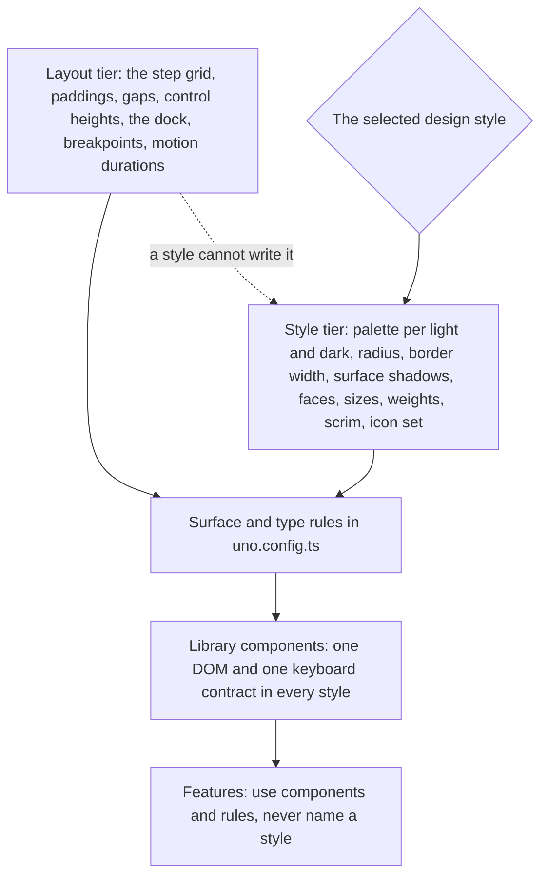
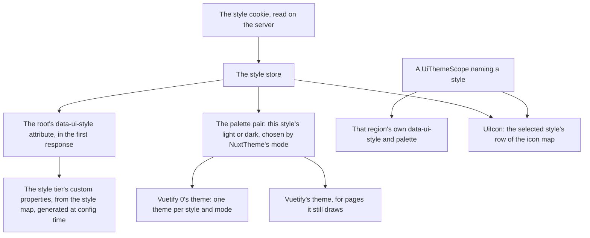
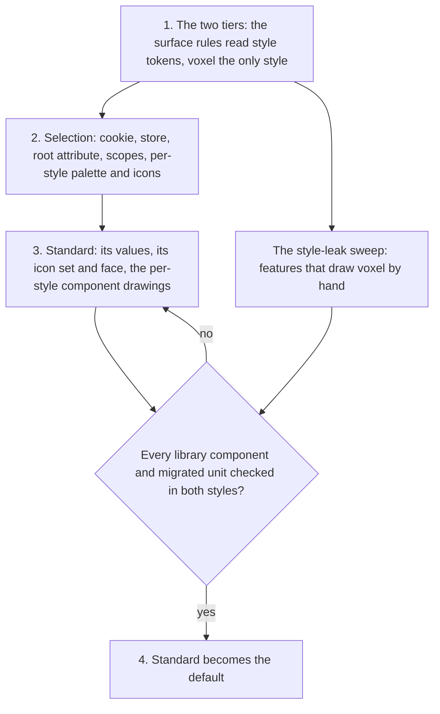

# Design Styles

The voxel look now covers the whole app: the dusk palette, the pixel face, notched frames, raised buttons and pixel icons on every page the library draws. On a page that is a game, or the agent console, it is the right look. On the pages a reader spends a long session in — a room's messages, a sheet, the docs — it reads as a game on every screen, and it tires quickly. What those pages want is the look most shipped products have settled on: neutral surfaces, one accent, hairline borders, rounded corners and a sans face.

Replacing the voxel look outright would throw away the part of the work that was about the look. Nothing else needs to go: every colour in the library is already a token, every surface is one of a handful of rules, and every icon is named by meaning. So this proposal makes the look itself a value. A **design style** is a named set of everything that decides how the interface is drawn, selected per reader the way light and dark are. The voxel look becomes the first style. A second, **standard**, joins it and becomes the default. Everything a style is not allowed to touch — spacing, sizes, placement, behaviour — is shared, which is what lets a unit be checked once and trusted in every style.

## Two tiers

The library's custom properties split into two tiers. The split is the whole design: a style can repaint and reshape anything, and it can move nothing.



- **The layout tier is fixed.** The step (`--ui-step`), every padding, gap and control height written in steps, the dock's breadth, the breakpoints and the motion durations and curve are the same in every style. A button is eight steps tall in voxel and in standard, so a row of controls lines up in both and a unit that fits its region in one fits it in the other.
- **The style tier is everything that is drawing.** The palette in light and dark, the corner radius, the border width, the shadows each surface is drawn with, the pressed and hover treatments, the faces and their sizes and weights, the heading colour, the dialog scrim, the focus ring's shape and the icon set. Its lengths are the style's own — a hairline border is not a whole number of steps — and none of them takes room in the layout: a border is drawn inside the box the layout tier sized, and a shadow outside it.
- **A style is a bundle, not a set of knobs.** Radix Themes exposes radius, scaling and panel background as independent props on its theme; here they travel together, because the voxel look's parts only make sense together — a pixel face on rounded corners is neither style.

## What each style draws

The three surfaces keep their roles from the [design language](/docs/proposals/refactors/ui-library/design-language): a frame holds content, a raised surface is pressed, a sunk one takes input. Each rule stops spelling out the voxel drawing and reads the style tier instead — `ui-frame`'s radius, border and shadow are three custom properties, and so on for each rule — so a style is a column of values, not a second set of rules.

| Part            | Voxel                                                           | Standard                                                                                        |
| :-------------- | :-------------------------------------------------------------- | :---------------------------------------------------------------------------------------------- |
| Palette         | Dusk and dawn, as today                                         | A neutral scale with one accent, dark and light, in the same token names                        |
| Corners         | None; the frame's ring leaves each corner notched               | One radius token, a step as Nuxt UI's default is, and two on a dialog                           |
| Frame           | A one-step ring outside each side, a lit line along the top     | A hairline border in the border token, no shadow; a popover or dialog adds one soft shadow      |
| Raised          | Lit top and left, shaded bottom and right; pressed drops a step | A flat fill with a hairline border; pressed darkens the fill, nothing moves                     |
| Sunk            | Background colour shaded along the bottom                       | The background with a hairline border, turning accent on focus                                  |
| Hover           | Brightness up a notch                                           | An overlay of the text colour at a low opacity                                                  |
| Focus ring      | A solid outline one step wide, one step out                     | The same outline at half the width, rounded with the corner                                     |
| Type            | VT323 for everything, headings in the accent                    | A sans face for the interface, a mono for code, headings in the text colour at a heavier weight |
| Icons           | Pixelarticons, Material where it has no glyph                   | Lucide, which Nuxt UI and shadcn both ship by default                                           |
| Scrim           | A dither of the background colour                               | The background at a translucent opacity                                                         |
| Progress, meter | Separate voxel blocks, filled one at a time                     | The same blocks joined into one rounded track                                                   |
| Spinner         | The terminal's star, a frame at a time                          | A turning ring                                                                                  |
| Skeleton        | A lighter band stepping across the block                        | A lighter band easing across it                                                                 |

The standard column's values are taken, not invented: the token vocabulary and structure from [Nuxt UI's CSS variables](https://ui.nuxt.com/docs/getting-started/theme/css-variables) — background, muted, elevated and accented surfaces, dimmed to highlighted text, a border and its accented form, one radius — and the role of each step of the neutral scale from [Radix Colors](https://www.radix-ui.com/colors/docs/palette-composition/understanding-the-scale): app background, component backgrounds, subtle and strong borders, then low- and high-contrast text. Density and the quiet chrome around the content follow [Linear's interface refresh](https://linear.app/now/behind-the-latest-design-refresh), which dimmed its navigation so the main content leads. Each value still has to pass the palette's contrast test, and a pair that fails is re-picked, as the rule already says of dusk and dawn.

The readable-text setting belongs to the voxel style: it swaps the pixel body face for the system's, and the standard style's body face is already a sans. It shows only while voxel is selected, and it keeps its cookie so switching back restores it.

## How a style is selected



- **The style is a cookie**, read on the server and held in a store, exactly as the readable-text setting is: the first response already renders the reader's style, and a signed-out reader has one. The account menu's commands and the command palette switch it, beside the theme.
- **The style tier is a map in `configuration/`**, keyed by style and then by style token, beside the palette, which becomes keyed by style and then by light or dark. `uno.config.ts` writes each style's tokens as one rule on its `data-ui-style` value, so the tokens are static CSS rather than a runtime stylesheet, and every style's column is type-checked complete.
- **A region can pin a style.** `UiThemeScope` takes a style beside its theme, so a surface that is a game keeps the voxel look whatever the reader chose. The icon component reads the nearest scope's style, which is positional and so is the library's one provide and inject rather than a store.
- **Icons follow the style.** `UiIconMap` gains a row per style, every meaning in every row, each class written whole so the icons preset still sees it. A feature that names an icon set directly — a handful of files name a Pixelarticons class today — moves to a meaning first, since a set named in a feature cannot follow the style.
- **Vuetify follows too.** It registers one theme per style and mode, built from the same map, and the one resolution selects both libraries, so a page not yet migrated still takes the style's colours. Its shapes stay Material's until the page migrates; that mismatch lasts only as long as the page does.

## What makes it safe to switch

A style is only worth having if switching it can never move or break anything. Each guarantee is held by something that fails, not by care:

- **A style cannot write the layout tier.** The style map's type holds only style tokens, so a style that sets a padding does not type-check.
- **Every style is complete.** The style map and the icon map are `satisfies Record<UiStyle, …>`, so a new token or a new meaning without a value in every style fails the typecheck, and the palette test runs over every style and mode.
- **One DOM in every style.** A library component whose drawing differs by style — the spinner, the progress blocks — keys its scoped style on the style attribute and renders the same elements with the same roles in each. Its component test runs once per style, so a contract that holds in one and breaks in the other fails.
- **Features never branch on a style.** A lint rule bans the `data-ui-style` selector and the style composable outside the library's folders, the same override that holds the Vuetify 0 boundary. What a feature needs to differ, the library draws.
- **Checked by eye in each style.** A unit handed over for the eye check is looked at in both styles and both modes, switched from the command palette.

## The stages



1. **The two tiers.** The surface and type rules stop spelling out voxel values and read style tokens, and the voxel style supplies every one of them. Nothing changes on screen, which is the test: the stage is behaviour-preserving, and the snapshots of the resolved UnoCSS config show every rule reading a token rather than a value. The token names move to the vocabulary every system above shares — `PanelEdge` becomes `Border` — while the rename is still cheap.
2. **Selection.** The cookie, the store, the root attribute, the style on a scope, the palette keyed by style, the icon map's per-style rows and Vuetify's per-style themes, with voxel still the only style. The agent console pins voxel on its existing scope.
3. **Standard.** Its column of the style map, its light and dark palettes, Lucide and a self-hosted sans and mono through `@nuxt/fonts`, and the per-style drawings of the spinner, the progress blocks, the skeleton and the scrim.
4. **Standard becomes the default.** Once every library component and every migrated unit has been checked by eye in both styles, a reader with no cookie gets standard.

Beside the ladder, **the style-leak sweep** finds whatever a feature draws in the voxel look by hand instead of through the library — a shadow written in steps, the pixel face named directly, a Pixelarticons class — and routes it through a rule, a token or a meaning. It is a ledger like the page migration's, and the page migration's remaining units are migrated leak-free, which the design pass checks.

## Rejected

- **Replacing the voxel look outright.** It is the right look for the agent console and the games, it is most of what the library's first stages built, and a second style costs a column of values rather than a rewrite. Keeping it also keeps the tiers honest: with two styles live, a leak shows the day it is written.
- **Adopting Nuxt UI.** It is the reference for the standard style's values, not its implementation. It is built on Tailwind CSS, where every template here is UnoCSS attributify; on Reka UI, a second headless layer beside Vuetify 0; and its components would replace the library's, each with a keyboard contract already tested. It would also be a third look on screen for as long as the migration runs. What it gets right — the semantic token vocabulary, one radius, the neutral scale — is taken as values.
- **A style as a prop on each component**, as a styled library's variants are. Every call site would then know the style, and a feature could pick one per button. A style is the document's, or a scope's.
- **A style as a palette alone.** Colours cannot take the notches off a frame or the pixel face off a heading. The palette is one row of a style, not the style.

## Open decisions

Each is a choice of taste, so each is made by the user from a mockup of both styles on a wide screen, as the design pass asks:

- **The standard accent.** The app's original Material primary was Vue's green, which is also Nuxt UI's default primary; an indigo or a blue is the other common choice.
- **The standard face.** Inter, which Linear uses; Public Sans; or the system's own sans, which loads nothing.
- **Whether the agent console pins voxel** or follows the reader's style like every other page.
- **The style's name.** "Standard" says what it is for; a name of its own may read better in a settings menu.

## Key files

| File                                              | Role after the change                                                                      |
| :------------------------------------------------ | :----------------------------------------------------------------------------------------- |
| `apps/web/configuration/UiPaletteMap.ts`          | Keyed by style, then by light or dark                                                      |
| `apps/web/uno.config.ts`                          | The surface and type rules read style tokens; each style's tokens as one rule on its value |
| `apps/web/app/assets/css/globals.scss`            | Keeps the layout tier alone; the pixel face moves into the voxel style                     |
| `apps/web/app/services/ui/UiIconMap.ts`           | One row per style, every meaning in each                                                   |
| `apps/web/app/components/Ui/ThemeScope.vue`       | Takes a style beside its theme                                                             |
| `apps/web/app/composables/ui/useSelectUiTheme.ts` | Selects the palette pair from the style and the mode                                       |
| `apps/web/app/store/ui/readableText.ts`           | Its setting shown only while voxel is selected                                             |
| `apps/web/vuetify.config.ts`                      | One Vuetify theme per style and mode                                                       |

New files, where the conventions put them:

```text
apps/web/app/models/ui/UiStyle.ts          ← the styles: voxel and standard
apps/web/app/models/ui/UiStyleToken.ts     ← the style tier's token names
apps/web/configuration/UiStyleMap.ts       ← each style's value for every style token
apps/web/app/store/ui/style.ts             ← the reader's style, from its cookie
.agents/ledgers/ui-style.md                ← the style-leak sweep
```

## Sources

- [Nuxt UI, CSS variables](https://ui.nuxt.com/docs/getting-started/theme/css-variables) and [design system](https://ui.nuxt.com/docs/getting-started/theme/design-system): the semantic token vocabulary, the one radius, and the neutral scale the standard style's values follow.
- [Radix Colors, understanding the scale](https://www.radix-ui.com/colors/docs/palette-composition/understanding-the-scale): which step of a neutral scale is a background, a component, a border and a text colour.
- [Radix Themes, theme overview](https://www.radix-ui.com/themes/docs/theme/overview): radius, scaling and panel background as theme-level settings, the precedent for a style above the palette.
- [Linear, behind the latest design refresh](https://linear.app/now/behind-the-latest-design-refresh) and [how we redesigned the Linear UI](https://linear.app/now/how-we-redesigned-the-linear-ui): quieter navigation so the content leads, and a theme generated from a few inputs in LCH.
- [Design Tokens Format Module 2025.10](https://www.designtokens.org/tr/drafts/format/): the W3C community group's stable token format, whose split of primitive and semantic tokens the two tiers follow.
- [Lucide](https://lucide.dev/): the standard style's icon set.
