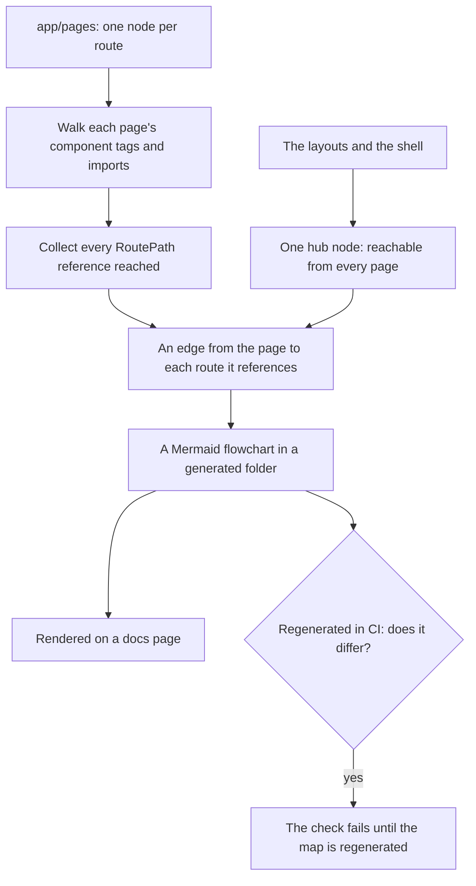

# Flow Map

The [licence to redesign](/docs/proposals/refactors/ui-library#licence-to-redesign) lets a stage move flows across pages, and the [app shell](/docs/proposals/refactors/ui-library/shell) is designed around products linking to each other. Both need one picture that nothing gives today: from each page, where can a reader go, and what reaches it. A hand-drawn diagram of the whole app would answer that for a week and then be wrong, which is the fate of every diagram no test reads. So the map is generated.

## What can be derived, and what cannot

**Navigation can.** Every link in the app names its target through `RoutePath`, since a raw anchor is banned and every target is a `RoutePath` entry ([navigation](/docs/architecture/navigation)). Which page renders which component is also mechanical: a page's template names components by tag, and a tag is its component's folder path, so it resolves to one file. Follow the tags and the imports down from each page, collect every `RoutePath` reference on the way, and the edges of the graph fall out.

**Interaction cannot**, at any cost worth paying. Which dialog a button opens, which menu an item sits in and what state a panel can be in are code paths, not references, and reading them statically is a program analysis project. Those stay where they already are: each migrated unit's flow inventory, in its commit body.

## How it works



- **One script in `scripts/`**, beside the dependency graph generator, which already turns a derived graph into a committed diagram. It needs the Vue compiler to read template tags, and nothing else the repository does not already have.
- **The shell is a hub, not a thousand edges.** A link in the layout or the dock is reachable from every page, so it is drawn once from a hub node rather than once per page, and the map stays readable.
- **A dynamic route is one node.** `RoutePath.Resource(id)` is an edge to the resource route as a pattern, whatever id it is given at runtime.
- **Committed and checked.** It lives where the [generated artifacts](/docs/architecture/generated-artifacts) standard puts any file a script writes, so a change that adds or removes a link shows it in its diff, and a CI step regenerates it and fails when the result differs, so a stale map never misleads a reviewer.

## What it is for

- **Designing the shell.** The pages nothing links to except the product grid are the ones the launcher and the palette must reach. The pages with no way out but the dock are the dead ends that cross-product links should close.
- **Reviewing a redesign.** A unit that moves flows across pages regenerates the map in the same commit, so its diff shows exactly which paths between pages it added, moved or dropped.

## What it does not do

- It does not record interactions within a page. That is the unit inventory's job.
- It does not track what readers actually do. Navigation telemetry would need analytics the app does not run, and the question here is what the design allows, not what is popular.

## Key files

```text
scripts/src/flowMap/                                 the generator
apps/web/generated/flowMap/                          the generated flowchart, read by a docs page
```

## Sources

- [Vue SFC compiler](https://github.com/vuejs/core/tree/main/packages/compiler-sfc): the parser that reads a template's component tags.
- [Mermaid flowcharts](https://mermaid.js.org/syntax/flowchart.html): the format the docs site already renders.
