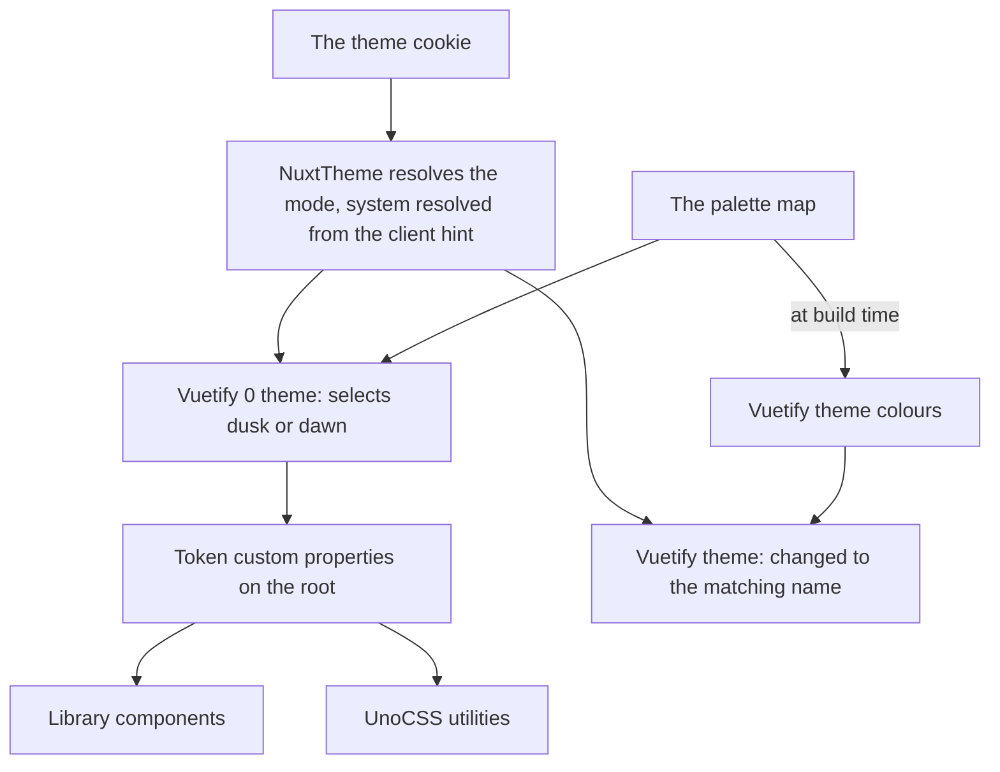

# Foundation

The first stage installs the headless layer and the tokens, and changes no component. It still ships a visible result on the day it lands: the whole app, Vuetify pages included, takes the agent console's dusk palette, its scrollbars, its selection colour and its focus ring. Nothing in a template moves.

## What it installs

- **The package.** "@vuetify/v0" joins the catalog in `pnpm-workspace.yaml` with a caret, and `apps/web` depends on it. The Nuxt build transpiles it, as its [Nuxt guide](https://0.vuetifyjs.com/guide/integration/nuxt) asks. There is no Nuxt module to add: Vuetify 0 is a set of Vue plugins.
- **One plugin file.** A client-and-server plugin installs Vuetify 0's hydration plugin and its theme plugin. The theme plugin uses the Unhead adapter, so the token stylesheet is rendered into the first HTML response and a page never paints in the wrong palette before hydration.
- **No auto-imports.** Vuetify 0 exports several names that collide with VueUse — a storage composable, a media query composable, a click-outside composable — and with the "useV" names Vuetify's module auto-imports today. The library imports from Vuetify 0 by name, and nothing else in the app imports from it at all, so an auto-import would only put the collision in every file.

## One owner per concern

Two component libraries on one page stay coherent only if each concern has exactly one owner at a time, which is Vuetify 0's own [compatibility rule](https://0.vuetifyjs.com/guide/integration/compatibility).



| Concern                 | Owner during the migration                               | Owner after retirement         |
| :---------------------- | :------------------------------------------------------- | :----------------------------- |
| Which theme is selected | `NuxtTheme`, which drives both libraries from one cookie | Vuetify 0's theme              |
| The colour values       | the palette map, read by both themes                     | the palette map                |
| Breakpoints             | Vuetify's display composable, fed by the one scale       | Vuetify 0's breakpoints plugin |
| Validation rules        | Vuetify's rules, as today                                | Vuetify 0's rules              |
| Hotkeys                 | Vuetify's hotkey composable, as today                    | Vuetify 0's hotkey composable  |

Only the theme changes hands in this stage, and only in part: the colours move to the palette map, and the selection stays where it is. The rest move at [retirement](/docs/proposals/refactors/ui-library/retirement), each in one commit, because two breakpoint systems reading one scale is harmless and two reading different scales is exactly the bug the [one scale](/docs/architecture/responsive) exists to prevent.

## The tokens

The palette the console owns today mixes two kinds of colour: interface colours (the surfaces, the text tones, the accent and the status colours) and the world's materials (wood, skin, stone, book, cloth). The interface half becomes the app's palette. The materials stay in the console, because nothing but the world paints with them.

- **Two themes, both authored.** Dusk is the console's palette as it is. Dawn is a light variant, authored beside it rather than computed from it, because the app offers a light mode today and dropping it is a lost flow. Both keep the same token names, so a component never knows which is active. The system mode keeps resolving through the colour-scheme client hint, as it does now.
- **Vuetify is fed from them.** The dark and light entries in `vuetify.config.ts` take their background, surface, text, primary and status colours from the palette map. This is the one line that repaints every page not yet migrated, and it is why the first stage has a visible result.
- **UnoCSS reads them as variables.** `uno.config.ts` stops deriving its theme colours from the Vuetify configuration and maps each token to its custom property instead, so a utility such as a background in the accent colour follows the selected theme at runtime.
- **Beyond colour.** The voxel step, the edge width, the type scale and the motion durations are tokens too, through Vuetify 0's token composable, so the library's components read one number for "one voxel" rather than repeating a quarter rem ([design language](/docs/proposals/refactors/ui-library/design-language)).

## The chrome, app-wide

These are properties of the document rather than of any component, so they ship here and reach every page, Vuetify's included:

- **Scrollbars** in the palette: the thumb in the panel edge colour on the background, thin, set once on the root through the standard scrollbar properties, which every supported browser now honours. The console's own rule moves to the root, and the special case in the default layout that hides the window's bar keeps its reason.
- **Selection** in the accent colour with the background colour for its text.
- **The focus ring** as a solid outline of one edge width in the accent colour, offset by one step, on every focus-visible element.
- **The caret** in the accent colour, and **native controls** (a checkbox, a range, a progress bar not yet replaced) in the accent colour through the standard accent property.
- **The colour scheme** declared on the root to match the theme, so the browser's own form controls and scrollbars on older engines pick the right half.

## The boundary

A lint rule restricts imports of "@vuetify/v0" to the library's own folders — its components, its composables and its services. A feature that needs a behaviour the library lacks adds it to the library, which is the point of having one. The rule is an oxlint restricted-imports entry with an override for those folders, added to `.oxlintrc.json` in this stage so it holds from the first import.

## Agent tooling

Most code in this repository is written by agents, so the headless layer's own agent material is installed with it:

- **Vuetify 0's skill**, added under `.agents/skills/` through the skills installer, run through `pnpm dlx` rather than `npx`. It carries Vuetify 0's decision trees — which composable answers which requirement — and its anti-patterns. It sits beside the repository's own skills as the other installed third-party skills do ([agent configuration](/docs/architecture/agent-configuration)).
- **The Vuetify MCP**, already used for Vuetify's API, answers Vuetify 0's as well. A prop is looked up rather than guessed.
- **A repository skill for the library**, "ui-library", owns our conventions on top: the three layers, the boundary, which component to reach for, and the parity inventory [page migration](/docs/proposals/refactors/ui-library/page-migration) asks for. The `styling` skill's section on an immersive page owning its look is inverted in the same change: the look is now the app's.

## Exit and kill conditions

- **Exit.** The tokens are live in both themes, every page renders in the palette, the chrome is app-wide, the boundary rule is in place, and a hydration of each layout shows no theme mismatch.
- **Kill.** If Vuetify 0's theme or hydration plugins cannot render the first response in the right palette under Nuxt's server rendering, the stage stops before any component is built on them, and the tokens stay as plain custom properties set by `NuxtTheme`. The rest of the ladder survives that: only the theme plugin is lost.

## Key files

| File                                                           | Role after the change                                                         |
| :------------------------------------------------------------- | :---------------------------------------------------------------------------- |
| `apps/web/vuetify.config.ts`                                   | Its theme colours read the palette map                                        |
| `apps/web/uno.config.ts`                                       | Its theme colours are the tokens' custom properties                           |
| `apps/web/app/components/Nuxt/Theme.vue`                       | Resolves the mode once and selects it in both libraries                       |
| `apps/web/app/services/agentConsole/AgentConsolePaletteMap.ts` | Loses its interface colours to the app palette and keeps the world's          |
| `apps/web/app/assets/css/globals.scss`                         | Holds the document chrome: scrollbars, selection, focus, caret, colour scheme |
| `.oxlintrc.json`                                               | The import boundary                                                           |
| `.agents/skills/styling/SKILL.md`                              | Its immersive-page section inverted                                           |

```text
apps/web/app/plugins/ui.ts                 hydration and theme plugins
apps/web/app/services/ui/UiPaletteMap.ts   dusk and dawn, one entry per token
apps/web/app/models/ui/UiToken.ts          the token names
.agents/skills/ui-library/SKILL.md         the library's conventions
```

## Sources

- [Nuxt integration](https://0.vuetifyjs.com/guide/integration/nuxt), Vuetify 0: the transpile entry, the Unhead theme adapter that renders the tokens into the first response, the hydration plugin, and the cookie that carries the theme to the server.
- [Theming](https://0.vuetifyjs.com/guide/features/theming), Vuetify 0: themes as custom properties, the on-colour convention, and the token composable for values beyond colour.
- [AI tools](https://0.vuetifyjs.com/guide/tooling/ai-tools), Vuetify 0: the skill, the MCP server and the markdown twin of every docs page.
- [scrollbar-color](https://developer.mozilla.org/en-US/docs/Web/CSS/scrollbar-color), MDN: the standard scrollbar properties that replace the vendor pseudo-elements.
