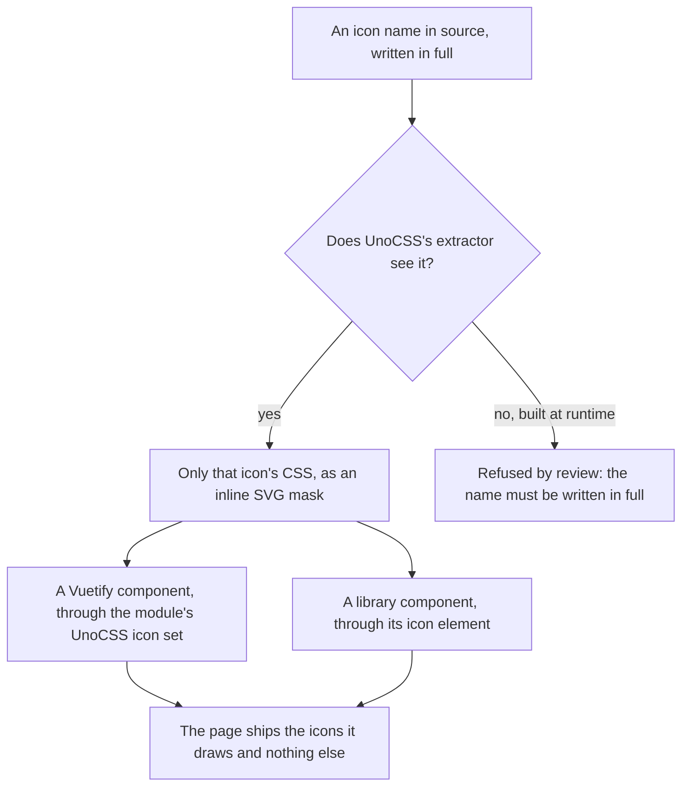

# Icons

Every page loads the Material Design Icons web font and its stylesheet today: several thousand glyphs, and a class for each, to draw the few dozen the app uses. The icon names are strings, hundreds of them, passed to Vuetify's icon props and held in maps. This stage moves icons to CSS generated only for the icons the source names, which is a gain on every page on the day it lands, and then moves the library's icons to a pixel set that matches the look.

It depends only on the [foundation](/docs/proposals/refactors/ui-library/foundation), and runs beside any other stage.

## How it works



- **The engine.** UnoCSS's icons preset turns a class naming an Iconify icon into a rule that draws its SVG as a mask in the current colour, so an icon takes the text colour like a glyph did. The Material Design Icons set comes from its Iconify JSON package, which is read at build time and never shipped.
- **Names written in full.** The preset generates only what its extractor finds in source, so an icon name must appear whole in a file — never assembled from a prefix and a variable. The names the app holds in maps already do this; the sweep that renames them from the font's form to the class form keeps it true, and a name built at runtime is a review finding.
- **Vuetify during coexistence.** The Vuetify Nuxt module has a UnoCSS icon set, "unocss-mdi", so a Vuetify component given an icon name draws it through the same generated CSS. Vuetify's own internal icons — the select's arrow, the checkbox's mark, a dialog's close — are aliases that set maps to named icons, which are safelisted because no source file names them.
- **The custom icons** that are Vue components today, the anime and dungeon gate marks, stay components, and the custom set that registers them stays until retirement.

## The pixel set

Once the library draws its own components, its icons move to a pixel icon set — Pixelarticons, a few hundred icons drawn on a pixel grid under the MIT licence, available as an Iconify set like the first. A pixel icon on a voxel surface is the look; a smooth Material glyph beside a pixel face is the seam this proposal is removing.

- **One map from meaning to icon.** The library's icon element takes a name for what the icon means — close, add, delete, more — and a map resolves it to a class. So swapping sets is one map edit, and a feature never names a set.
- **Material Design Icons stays as the fallback.** The pixel set is small, and the app draws things it has no glyph for — a game controller, a spreadsheet column type, a brand. The map resolves those to the Material set, whose icons draw at the same size in the same colour. A fallback is a row in the map rather than a decision at the call site.
- **Pixel icons render at whole multiples of their grid**, so a sixteen-cell icon is drawn at one of a few sizes that keep each cell a whole number of device pixels. Anything else blurs the grid.

## What it deletes

- The Material Design Icons font package, its stylesheet import, and the font file every first visit downloads.

## Key files

| File                                                | Role after the change                                          |
| :-------------------------------------------------- | :------------------------------------------------------------- |
| `apps/web/uno.config.ts`                            | Adds the icons preset and safelists Vuetify's internal aliases |
| `apps/web/configuration/vuetify.ts`                 | Selects the module's UnoCSS icon set                           |
| `apps/web/app/services/vuetify/IconComponentMap.ts` | Keeps the custom component icons until retirement              |

```text
apps/web/app/components/Ui/Icon.vue          the icon element, by meaning
apps/web/app/services/ui/UiIconMap.ts        meaning to class, pixel set first, Material set as fallback
```

## Sources

- [UnoCSS icons preset](https://unocss.dev/presets/icons): icons as generated CSS masks from Iconify JSON, emitted only for the names the extractor finds.
- [Vuetify Nuxt module](https://nuxt.vuetifyjs.com/): its icons option, whose "unocss-mdi" set draws Vuetify's icons and its internal aliases through UnoCSS.
- [Pixelarticons](https://pixelarticons.com/): the pixel icon set and its licence.
- [Iconify](https://icon-sets.iconify.design/): the JSON sets both icon families are read from.
