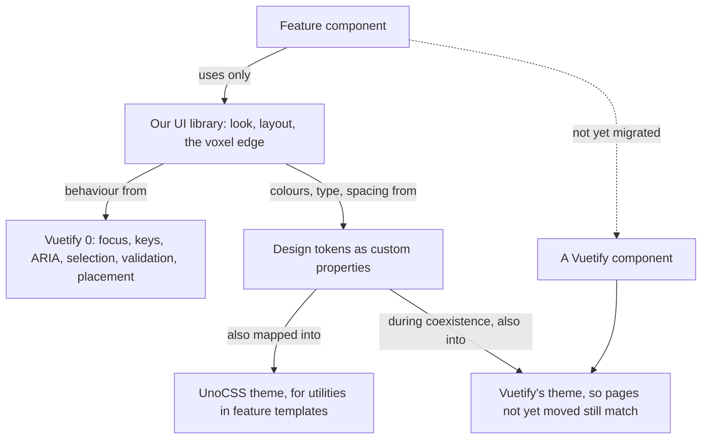
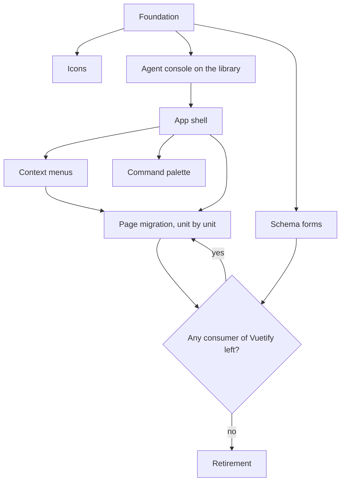

# UI Library

The [agent console](/docs/infra/claude-interface/agent-console) is the one page in the app that looks like it was designed rather than assembled. It has a palette of its own, one pixel font, panels with a notched voxel edge, raised buttons and sunk fields, and it draws no Vuetify component at all ([voxel world](/docs/infra/claude-interface/agent-console/voxel-world)). Every other page is Material 3 as Vuetify renders it, with the app's colours laid over the top.

This proposal carries that look across the whole app. It does so with a UI library of our own that lives in `apps/web`, whose behaviour comes from [Vuetify 0](https://0.vuetifyjs.com/introduction/why-vuetify0) and whose look is entirely ours. Vuetify 0 (the package "@vuetify/v0") is Vuetify's headless layer: components and composables that own focus, keyboard handling, ARIA, selection, validation and positioning, and paint nothing. The migration runs as a ladder of stages. Each stage ships something a user or a contributor feels on the day it lands, and no stage waits for the last one to pay off. The icon font goes early, in a stage of its own, and the last stage removes Vuetify and its Nuxt module once nothing imports them.

The migration is also the chance to fix the layout, not only to repaint it. Most of today's surfaces grew one feature at a time inside Vuetify's app-bar-and-drawer frame. Where a surface has a better arrangement, the stage that restyles it takes that arrangement. What no stage may do is lose a flow: every unit is migrated against a written inventory of what it does today, and a flow missing from the new version is a failed unit, not a trade-off.

## The decision

**Build our own component library on Vuetify 0's primitives, in `apps/web`, and move the app onto it one unit at a time.** Three layers, each with one job:



- **A feature never imports Vuetify 0.** It uses the library, and only the library imports Vuetify 0. This keeps the headless layer replaceable and keeps every accessibility decision in one folder. A lint rule holds the boundary ([foundation](/docs/proposals/refactors/ui-library/foundation)).
- **The look is tokens, not components.** The palette, the type, the voxel step and the edges are custom properties. A component reads tokens and never holds a colour. So the palette can change, or gain a light variant, without a component edit.
- **Vuetify keeps working until it has no consumer.** The two libraries coexist on one page for as long as the migration takes. They agree because Vuetify's theme is fed from the same tokens from the first stage on.
- **The library stays in the app.** It moves into a package of its own only when a second app consumes it, which is the repository's rule for any shared code. Until then a package would be a build, a manifest and a publish step guarding nothing.

## The stages

| Stage                                                                   | What ships                                                                                    | What anyone feels on the day                                                                             |
| :---------------------------------------------------------------------- | :-------------------------------------------------------------------------------------------- | :------------------------------------------------------------------------------------------------------- |
| [Foundation](/docs/proposals/refactors/ui-library/foundation)           | Vuetify 0 installed, the tokens, the global chrome, the agent skill and MCP                   | The whole app takes the dusk palette, the pixel scrollbars, the selection and the focus ring at once     |
| [Icons](/docs/proposals/refactors/ui-library/icons)                     | Icons as tree-shaken CSS instead of a font, then the pixel icon set                           | Every page stops downloading a font of several thousand icons to draw a few dozen                        |
| [Agent console](/docs/proposals/refactors/ui-library/agent-console)     | The console's bespoke panels become the library's first components, rebuilt on Vuetify 0      | Typeahead, roving focus and proper listbox semantics in every console menu; the library proven on a page |
| [App shell](/docs/proposals/refactors/ui-library/shell)                 | The frame every page sits in, redesigned: navigation, notifications, account, alerts, dialogs | Every page gets the new frame, and more room for its own content                                         |
| [Context menus](/docs/proposals/refactors/ui-library/context-menus)     | One context menu primitive, opened by right-click, long-press or the keyboard                 | The hand-rolled context menus become one, and the rest of the app gains them where they belong           |
| [Command palette](/docs/proposals/refactors/ui-library/command-palette) | One palette for navigation and actions, fed by one shortcut registry                          | Anywhere is a keystroke away, and every shortcut in the app is listed in one place                       |
| [Page migration](/docs/proposals/refactors/ui-library/page-migration)   | Every product area moved onto the library, one unit per commit, tracked as a ledger           | Each area gets the look, a layout rethought for it, and a smaller bundle, the day its unit lands         |
| [Schema forms](/docs/proposals/refactors/ui-library/schema-forms)       | Our own renderer for the Zod-generated JSON Schema forms that vjsf draws today                | The sheet column and dashboard dialogs match the rest of the app, and the last Vuetify-bound engine goes |
| [Retirement](/docs/proposals/refactors/ui-library/retirement)           | Vuetify, its Nuxt module and its UnoCSS preset removed, and their config with them            | A smaller install, a smaller bundle, and one way to build a control                                      |

The design itself — the tokens, what each surface looks like, and the full list of details that make a UI feel finished — is in [design language](/docs/proposals/refactors/ui-library/design-language). The catalogue of components, each with the Vuetify 0 primitive under it and the Vuetify components it replaces, is in [components](/docs/proposals/refactors/ui-library/components).



Icons and schema forms hang off nothing but the foundation, so they can run beside any other stage. Page migration is the long stage, and it is a sweep: once the library settles, moving a page onto it changes how the page is built without deciding anything new, so it is tracked as a ledger in `.agents/ledgers/` that ordinary work drains.

## Why this and not another way

- **Restyling Vuetify instead.** Vuetify's theme and SASS variables change colours, radii and density. They cannot change the shape of what it renders: the ripple, the elevation shadows, the field outline with its floating label, the list item's structure. The voxel edge is a stepped ring of box shadows around our own DOM, and a sunk field has no label floating in its outline. Every override fights a structure the next Vuetify release is free to change, and the defaults block in `vuetify.config.ts` shows how far that already goes.
- **Another headless library.** Reka UI is the mature choice in the Vue ecosystem and would work. Vuetify 0 is chosen for three reasons that are particular to this repository. Its composables replace the Vuetify ones the app calls today almost name for name: rules, display breakpoints, theme, hotkeys, date. That turns retirement into a rename rather than a rewrite. Its popover is built on the browser's own Popover API and CSS anchor positioning, which is what the console's menus already do by hand. And it ships an agent skill and an MCP server, which matter in a repository most of whose code is written by agents.
- **A styled library.** Nuxt UI, PrimeVue and their kind are a different look to fight, which is the problem this proposal exists to leave behind.
- **Writing the behaviour ourselves.** The console did, for its one listbox, and it has arrow keys and nothing else: no typeahead, no Home and End, no active descendant for a screen reader. [Dependency admission](/docs/architecture/dependency-admission) puts the component framework on its stop list as accessibility-shaped, and this proposal keeps it there. What it takes back is the layer that decided the look, which is the precedent's own rule: keep the hard part, take back the layer that decided behaviour we have an opinion about.

## What it does not buy

- **No new behaviour for free.** Vuetify 0 has no context menu, no command palette and no schema form renderer. Each is a design of ours, and each has its own page.
- **No faster pages until the retirement.** While both libraries are on a page, both are in its bundle. The gains before the last stage are the icon font, the per-page chunks that stop importing Vuetify components, and the look itself.
- **No second app.** The library is not extracted into a package, and nothing here plans for one.

## Key files

| File                                                           | Role after the change                                                             |
| :------------------------------------------------------------- | :-------------------------------------------------------------------------------- |
| `apps/web/app/components/AgentConsole/Panel/Frame.vue`         | The voxel edge the library's frame is lifted from                                 |
| `apps/web/app/services/agentConsole/AgentConsolePaletteMap.ts` | The palette the app's tokens are lifted from; it keeps only the world's materials |
| `apps/web/vuetify.config.ts`                                   | Fed from the tokens during coexistence, deleted at retirement                     |
| `apps/web/uno.config.ts`                                       | Its theme colours read the tokens instead of Vuetify's config                     |
| `apps/web/app/components/Styled/Dialog.vue`                    | The dialog shell, rebuilt on the library and kept as the one shell                |
| `apps/web/app/App.vue`                                         | Loses its Vuetify app root at retirement                                          |

```text
apps/web/app/components/Ui/         the library's components, one folder level per compound part
apps/web/app/composables/ui/        the library's composables over Vuetify 0's
apps/web/app/services/ui/           tokens and the maps the library reads
apps/web/app/models/ui/             the library's types
```

## Notes

- The immersive layout keeps its meaning — a page with no app frame — but it stops meaning a page with a look of its own. Once the tokens are the app's, the console is dressed like everything else, and its world keeps only the colours that are materials (wood, skin, stone) rather than interface.
- The library takes the name "Ui" as its component prefix and folder, which is neutral on purpose: the tokens carry the aesthetic, so a later change of look renames nothing.

## Sources

- [Why Vuetify 0](https://0.vuetifyjs.com/introduction/why-vuetify0): the headless layer's scope, and its standing as the foundation Vuetify's next major is being built on.
- [Building frameworks](https://0.vuetifyjs.com/guide/fundamentals/building-frameworks): the wrapper pattern this library follows — Vuetify 0 owns behaviour and ARIA, the wrapper owns the look, state reaches the style through data attributes.
- [Compatibility](https://0.vuetifyjs.com/guide/integration/compatibility): coexisting with a styled library, and the rule that each concern (theme, locale, breakpoints) has exactly one owner at a time.
- [Reka UI](https://reka-ui.com/): the alternative headless library weighed and not taken.
