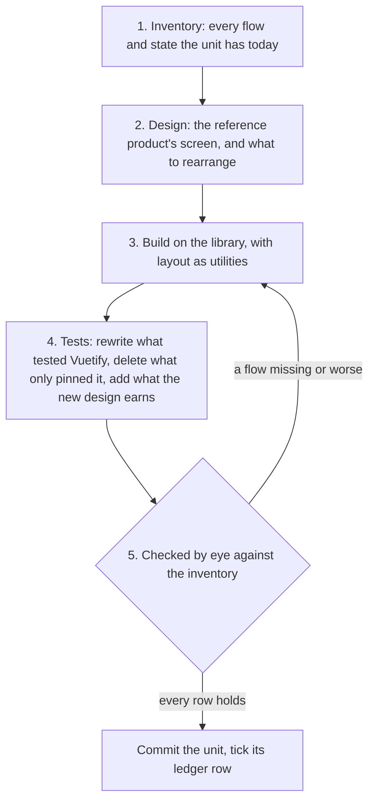

# Page Migration

Now that the [app shell](/docs/architecture/ui-library#app-shell) is on the library, every page sits in the new frame and still draws its own content with Vuetify. This stage moves that content, one unit at a time. It is the long stage, and it is built so that it never has to finish in one go: each unit is complete when it lands, the app works with any mix of migrated and unmigrated units, and each unit's gain is felt the day it merges.

## The unit

A unit is one product area's component tree — the same grain the styling ledger already sweeps — small enough to check by eye in one sitting. Each unit goes through the same five steps, in order:

1. **Inventory first.** Before a template is touched, the unit's flows and states are written down: each thing a reader can do, and each state the unit can be in — empty, loading, error, full, narrow, signed out, lacking a permission. The inventory goes in the commit body, and it is the checklist step five reads. It is what stops a restyle from quietly dropping a flow nobody remembered was there.
2. **Design, not repaint.** The unit is laid out as it should be, not as Vuetify's components happened to arrange it, and it may cross page boundaries to get there ([licence to redesign](/docs/proposals/refactors/ui-library#licence-to-redesign)). A unit that merges, splits or moves pages covers every page it touches, redirects each old route, and regenerates the flow map in the same commit. The reference product's own screen is looked up first, as the `ux` skill asks, and the rules in its visual design sources — no everything-boxed, no chips as labels, readable width for prose, controls not competing with content — are applied while the template is open anyway. A rearrangement is allowed, and a rearrangement that loses a flow is not.
3. **Build.** Vuetify components become library components. Vuetify's grid becomes flex and grid utilities. Every hover wrapper, spacer and divider goes, as [components](/docs/proposals/refactors/ui-library/components) lists. A behaviour the library lacks is added to the library in its own commit first, never written inline in the unit.
4. **Tests.** A test that found a Vuetify component by its type, or asserted a Vuetify prop, is rewritten to find the element by its role and name, which is what a reader and a screen reader do. A test that only pinned Vuetify's rendering is deleted with it. A test is added only where the new design introduced behaviour of its own, by the `testing` skill's criterion; the library's components already test their keyboard and ARIA contracts, so a unit never re-tests them.
5. **Checked by eye.** The unit is handed to the user with its inventory and the states to look at, in both [design styles](/docs/architecture/ui-library#design-styles) and both modes, per the `run-app` skill: no browser driven by an agent, and no screenshot suite. Every inventory row must hold. A row that fails sends the unit back to step three, not forward with a note.

## The ledger

Moving a unit onto the library changes how it is built without deciding anything the library has not already decided, which is the definition of a sweep. So the stage opens a ledger, "ui-library", under `.agents/ledgers/`, with one row per unit, run by the `sweeps` skill. Two consequences follow from that:

- **Ordinary work drains it.** A change that edits a file in an unmigrated unit migrates that unit first, in its own commit ahead of the change, as `AGENTS.md` asks of every open ledger. The migration then advances whenever the product does, not only when someone schedules it.
- **A repeated finding goes to an enforcer.** Once a Vuetify component has no consumer left, a lint rule bans its tag, so it cannot come back. The ban list grows with the migration and is what [retirement](/docs/proposals/refactors/ui-library/retirement) reads to know it is done.

## The order

The first units are chosen to settle the library, the later ones to reach the most readers:

| Order | Units                                                         | Why here                                                                      |
| :---- | :------------------------------------------------------------ | :---------------------------------------------------------------------------- |
| 1     | About, privacy policy, login                                  | Small and static: they settle type, frame and button without any hard control |
| 2     | User settings and profile, achievements                       | The first forms, switches and lists, and the pixel-art badges                 |
| 3     | The docs                                                      | Long-form reading: prose width, headings, code, the readable-text setting     |
| 4     | Posts, and the landing page, which is the post feed           | Feeds, cards, the rich text editor's chrome                                   |
| 5     | The resource explorer, its lists, blades and per-type editors | The data table, trees, the context menus, the dense command bars              |
| 6     | Esbabbler: rooms, messages, members, settings, calls          | The largest and most used area, done once the library has met every control   |
| 7     | Games and toys: clicker, dungeons, the fluid simulator, anime | Their Vue overlays and menus; the game canvases are untouched                 |

## Third-party editors

Several units embed an engine with its own interface: the page builder, the survey creator, the flowchart editor, the rich text editor and the charts. None is rebuilt. Each gets a stylesheet that maps its own theme variables or classes to the tokens, so its panels take the palette, the face and the flat, hard-edged surfaces, and its behaviour stays the engine's. That is the [dependency admission](/docs/architecture/dependency-admission) rule for engines: keep the engine, and theme it from outside.

## Key files

| File                              | Role after the change                                              |
| :-------------------------------- | :----------------------------------------------------------------- |
| `.agents/ledgers/README.md`       | Lists the "ui-library" ledger                                      |
| `.agents/ledgers/styling.md`      | Its Vuetify rules retire as units migrate, its layout rules remain |
| `.agents/skills/vuetify/SKILL.md` | Shrinks with each unit, and is deleted at retirement               |

## Notes

- The migration is a revamp of the design system, not a repaint. Every unit walks the `ui-library` skill's design pass before it is built and before it is handed over.
- A unit's bundle gain is real on the day it lands: Vuetify's components are imported per use, so a page chunk that no longer names one stops carrying it, even while other pages still do.
- The inventory lives in the commit body rather than in a docs page because it describes the unit before the change, which is history, and git is where history goes. What the unit does afterwards is its feature page's to say.
