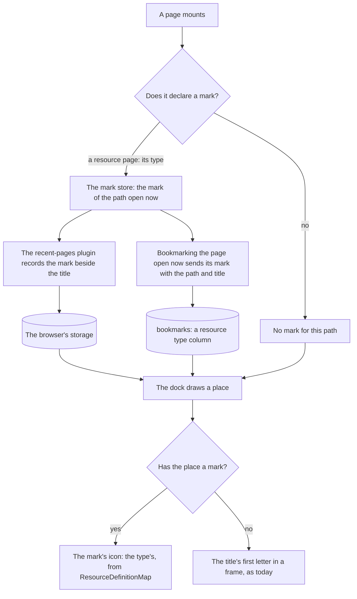

# Place Marks

The dock's places — the pages a reader bookmarked and the ones they come back to most — are drawn by their icon when the dock knows one, and by their title's first letter in a frame when it does not ([app shell](/docs/architecture/ui-library#app-shell)). It knows one only for a product's own page, a page of the account menu, the settings and a docs section, because those are found by their path alone. A resource is not: `/resource-explorer/<id>` says nothing about whether it is a to-do list, a sheet or a note, so a reader who keeps three resources on the dock sees three letters where the rest of the explorer shows three type icons. This proposal lets a page say what it is when it is visited, so the dock can draw the matching mark.

## Scope

What works today, and stays:

- A place is a path and a title. Recent pages are kept in the browser's storage and ranked by frecency; bookmarks are rows of `bookmarks`, capped per reader.
- The title is read off the page's head each time it renders, so a name that arrives after the page's first paint is still picked up.
- A place with no known icon draws its title's first letter in a frame, which keeps two of them apart.

What this adds:

- **A page can declare a mark**, the kind of thing it is, while it is mounted. A resource's page declares its type. Nothing else declares one yet.
- **A place remembers the mark it was last visited with**, beside its title: a recent page in the browser's storage, and a bookmark in a new column.
- **The dock draws a mark's icon** — a resource type's from `ResourceDefinitionMap`, the one map every other resource surface reads — and falls back to the first letter exactly as today when a place has none.

What it does not add: a room's picture, a profile's avatar, or a mark on a page the reader has not visited since the change. Each is a later member of the same mark (see Notes).

## How it works

A mark is data, not an icon class. It names what the place is — `{ type: resource, resourceType }` — and the icon is resolved when the dock draws it. A stored class would go stale the day an icon changes and would let a client write any string the server then hands back; a resource type is an enum the server can refuse outside, and its icon follows the map.



- **Declaring.** One composable, called in a page's setup with a getter, registers the mark for the page's path and clears it when the page unmounts, as `useCommands` registers a surface's commands. The resource page calls it with the loaded resource's type. A page that declares nothing costs nothing.
- **Recording.** The recent-pages plugin already writes the title when the head renders; it writes the mark of that path beside it. A recent page recorded before the change has no mark and draws its letter until its next visit.
- **Bookmarking.** The bookmark button acts on the page open now, so it reads that page's mark from the same store and sends it with the path and title. `bookmark.toggleBookmark` validates it against the resource type enum, and an existing bookmark keeps the mark it was saved with until it is toggled again.
- **Drawing.** `AppDockPageLink` asks one function for a place's icon: the path-based lookup it has today first, then the mark, then nothing, in which case it draws the letter. A resource type's icon is a whole class in `ResourceDefinitionMap`, which UnoCSS already scans.

## Data model

`bookmarks` gains one column, the resource type of the page when it was bookmarked, in the existing resource type enum. It is empty for a bookmark of any other page, spelled as the `drizzle` skill says an absent value is. There is no backfill: the app is not in production, and a bookmark without a mark draws its letter as it does now. The migration is generated with `db:gen` from `packages/db-schema` and applied at startup.

## Procedures

| Procedure                 | Auth   | Input                                       | Purpose                                            |
| :------------------------ | :----- | :------------------------------------------ | :------------------------------------------------- |
| `bookmark.toggleBookmark` | authed | `path`, `title`, and now an optional `mark` | Saves the place with its mark, or removes it       |
| `bookmark.readBookmarks`  | authed | —                                           | Returns each bookmark's mark beside its path/title |

## Key files

| File                                                      | Role after the change                                               |
| :-------------------------------------------------------- | :------------------------------------------------------------------ |
| `apps/web/app/models/app/PageLink.ts`                     | A place: its path, its title, and the mark it was last visited with |
| `apps/web/app/plugins/recentPages.client.ts`              | Records the mark of the path open now beside its title              |
| `apps/web/app/store/recentPage.ts`                        | Keeps each recent page's mark with it in the browser's storage      |
| `apps/web/app/store/bookmark.ts`                          | Sends the page's mark with a new bookmark                           |
| `apps/web/app/services/app/getPageIcon.ts`                | The path's own icon first, then the mark's, then none               |
| `apps/web/app/components/App/Dock/PageLink.vue`           | Draws the icon it is given, or the letter                           |
| `apps/web/app/pages/resource-explorer/[id]/[[blade]].vue` | Declares the resource's type as the page's mark                     |
| `packages/db-schema/src/schema/bookmarks.ts`              | The resource type column                                            |
| `apps/web/server/trpc/routers/bookmark.ts`                | Validates and stores the mark                                       |

New files, in the tree the conventions put them:

```text
apps/web/app/models/app/PageMark.ts            ← the mark: a discriminated union, one member (a resource type) for now
apps/web/app/composables/app/usePageMark.ts    ← declares the mark of the page open now while it is mounted
apps/web/app/store/app/pageMark.ts             ← the mark of each path open now, which the plugin and the bookmark read
```

## Notes

- **A room is the next member**, and the reason the mark is a union rather than a resource type column alone. A room's mark would name the room, and the dock would draw its picture through `UiAvatar`, which already falls back to a letter; its picture can change, so the mark stores the room, never an image address. It is left out here because a room's picture is read through the room store, which the dock does not mount.
- **The mark is the page's claim about itself, so the server trusts only its shape.** A client can bookmark a path under the wrong type; the cost is a wrong icon on that reader's own dock, which is the same trust the title already has.
- **The command palette's app-wide places read the same `PageLink`**, so they gain the icon for free; nothing there changes.
