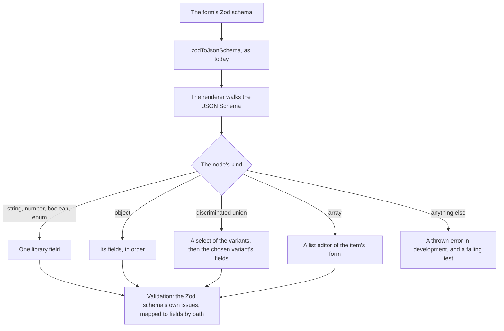

# Schema Forms

The sheet editor's column dialogs, its settings and the dashboard's visual editor render their forms from a Zod schema: `zodToJsonSchema` turns the form schema into JSON Schema, and vjsf renders that with Vuetify components. It is the one engine in the app whose whole interface is Vuetify's, so theming it from outside, as [page migration](/docs/proposals/refactors/ui-library/page-migration) does for the other editors, is not possible: its fields are Vuetify fields. As long as it stays, Vuetify stays.

It is also where a good part of the repository's form workarounds live. The `vjsf` skill records them: a literal discriminant that only works with a read-only marker, an enum discriminant that breaks with one, a cross-field check that must be an ajv keyword because the renderer validates with ajv rather than with the Zod schema the form came from, and item lists supplied as JavaScript expression strings evaluated against a context object. Each is a cost of rendering through an engine that does not know the schema started as Zod.

This stage depends only on the [foundation](/docs/proposals/refactors/ui-library/foundation) and the library's form components, so it can run beside page migration once those exist.

## How it works



- **JSON Schema is the shape it walks.** It is a public, stable format that the app already generates and already snapshot-tests, where the internals of a Zod schema are neither. Nothing about how form schemas are written changes for this reason.
- **The Zod schema is what it validates with.** Every edit runs the form's Zod schema, and each issue is shown on the field its path names. A cross-field rule — a column name unique among its siblings — becomes a refinement on the schema, typed and tested like any other, instead of an ajv keyword wired through the renderer's options.
- **A variant is detected from its discriminant.** A discriminated union's variants each fix their discriminant to one value, and the renderer picks the variant whose value the data carries, so the read-only marker the `vjsf` skill requires on a literal discriminant, and forbids on an enum one, stops mattering.
- **Layout meta is typed data, not code.** A field that wants a textarea, or items from the dialog's context, says so in its meta as a component name and the name of a context key, both typed, rather than as an expression string evaluated at runtime. The context is a typed object the dialog passes, so a missing key is a type error.
- **Only the kinds the app uses.** The renderer supports what the app's form schemas contain and throws on anything else. A test renders every registered form schema, so a new schema using an unsupported kind fails the suite rather than a user.

## What it deletes

- vjsf and its Vuetify-bound field set.
- The ajv keyword definitions, which become Zod refinements.
- The expression strings in form schema meta, which become typed keys.
- The `vjsf` skill, whose surviving rules — a form schema separate from the entity schema, variant titles, the typed context — move into the "ui-library" skill as its schema forms section.

## Key files

| File                                                                   | Role after the change                              |
| :--------------------------------------------------------------------- | :------------------------------------------------- |
| `apps/web/app/services/jsonSchema/zodToJsonSchema.ts`                  | Unchanged: the renderer's input                    |
| `apps/web/app/services/jsonSchema/processAnyOf.ts`                     | Read by the renderer for union variants            |
| `apps/web/app/models/vjsf/VjsfOptions.ts`                              | Replaced by the renderer's typed context           |
| `apps/web/app/models/resource/sheet/column/ColumnFormVjsfContext.ts`   | Becomes the column dialogs' typed context          |
| `apps/web/app/composables/resource/sheet/useColumnFormOptions.ts`      | Supplies the typed context instead of vjsf options |
| `apps/web/app/components/Resource/Sheet/Column/EditDialog.vue`         | Renders through the library's schema form          |
| `apps/web/app/components/Resource/Sheet/Column/CreateDialogButton.vue` | Renders through the library's schema form          |
| `apps/web/app/components/Resource/Sheet/Settings.vue`                  | Renders through the library's schema form          |
| `apps/web/app/components/Dashboard/Visual/Preview/EditFormDialog.vue`  | Renders through the library's schema form          |
| `.agents/skills/vjsf/SKILL.md`                                         | Deleted, its surviving rules moved                 |

```text
apps/web/app/components/Ui/SchemaForm/Index.vue     the renderer's root
apps/web/app/components/Ui/SchemaForm/Node.vue      one node, by kind
apps/web/app/services/ui/schemaForm/                 the walk, the variant detection, issue-to-field mapping
```

## Notes

- The renderer is scoped to one app's schemas on purpose. A general JSON Schema form library is a much larger thing, and this one only needs to be as general as the forms the app has.

## Sources

- [vjsf](https://koumoul-dev.github.io/vuetify-jsonschema-form/latest/): the renderer replaced, and the layout vocabulary the typed meta keeps the useful half of.
- [JSON Schema in Zod](https://zod.dev/json-schema): the conversion the renderer's input comes from.
